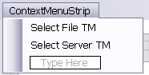
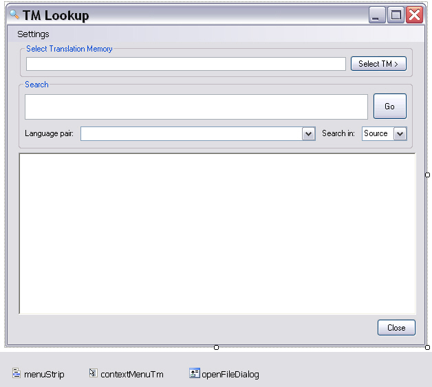

# Adding the Main GUI

This page describes how to set up the main application form for entering search strings and displaying search results.

## Add the Main Application Form

In addition to the main application form, you need forms for selecting the TM and configuring search settings. Add a folder named **GUI** to your project to hold the application forms. Then add a form named `frmLookup`, which users will use to enter search strings and view results.

Add the following elements to the form:

- **txtSearch**: The text box where users enter search strings. Set the **Multiline** property to `True`.
- **txtTmPath**: Displays the TM file name and path or the server URI and TM name, depending on whether the user selected a file TM or a server TM. Make this text box read-only so users cannot change it after selection. Set the control's *Modifiers* property to *Public*.
- **btnSelectTm**: Button for selecting the TM to use for the search. It opens a context menu, described below, that lets users choose between file and server TMs.
- **contextMenuTm**: Context menu opened by the **Select TM** button. It includes the *Select File TM* and *Select Server TM* commands.



- **comboIndex**: Combo box that lets users choose whether the search runs in the source or target language. Add the values **Source** and **Target** to the list, and set the `Text` property to **Source** so it becomes the default value.
- **btnSearch**: Button that triggers the concordance search.
- **richTextBox**: Rich text control used to display the search results.
- **menuStrip**: Application **Settings** menu that lets users fine-tune the search options.
- **btnClose**: Button that closes the main window and exits the application.
- **comboLanguagePairs**: Combo box that contains the language directions available in the selected TM. File-based TMs offer only one language direction, whereas server TMs can contain multiple language pairs. Set the *Modifiers* property to *Public*.
- **openFileDialog**: Dialog box for selecting the file TM. Set the *Filter* property to `Translation Memories (*.sdltm)|*.sdltm`.

The form should look like this:



## Implement the GUI Functionality

### Menu Functions

Clicking the menu items should open the corresponding form, such as the form for configuring the search settings:
# [C#](#tab/tabid-1)
```cs
private void searchOptionsToolStripMenuItem_Click(object sender, EventArgs e)
{
    settings.Show();
}
```
***

### Closing the Application

Clicking the **Close** button exits the application:
# [C#](#tab/tabid-2)
```cs
private void btnClose_Click(object sender, EventArgs e)
{
    Application.Exit();
}
```
***

### Selecting the File-based TM

When users click the corresponding command in the context menu, show the open file dialog so they can select the file TM. Then enter the full file name and the TM language direction in the main form:
# [C#](#tab/tabid-3)
```cs
private void selectFileTMToolStripMenuItem_Click(object sender, EventArgs e)
{
        // Show the open file dialog.
    this.openFileDialog.Title = "Select Translation Memory File";
    this.openFileDialog.Filter = "Translation memories (*.sdltm)|*.sdltm";

        // Check whether an .sdltm file was selected.
    if (this.openFileDialog.ShowDialog() == DialogResult.OK)
    {
            // Create a new connector object to connect to the file TM.
        Connector fileConnect = new Connector();
        fileConnect.SelectFileTm(this.openFileDialog.FileName);
        this.txtTmPath.Text = this.openFileDialog.FileName;

            // File TMs have only one language direction, which is displayed
            // in the language pair list.
        string srcLang = Connector.fileTm.LanguageDirection.SourceLanguage.DisplayName.ToString();
        string trgLang = Connector.fileTm.LanguageDirection.TargetLanguage.DisplayName.ToString();

        this.comboLanguagePairs.Items.Clear();
        this.comboLanguagePairs.Text =  srcLang + " -> " + trgLang;
    }
}
```
***

### Raising the Form for Server TM Selection

Selecting a server TM requires users to enter more than a file name and path. The second context menu command therefore opens a separate form where users enter the server URI and credentials:
# [C#](#tab/tabid-4)
```cs
private void selectServerTMToolStripMenuItem_Click(object sender, EventArgs e)
{
    frmSelectTM selectTm = new frmSelectTM();
    selectTm.Show();
}
```
***

### Initializing the Default Search Settings

When the application starts, initialize the search settings form with default values. In this implementation, use the same settings as Var:ProductName: 70% as the minimum fuzzy match value and 30 as the maximum number of results returned by a concordance search. Both settings can affect search speed.
# [C#](#tab/tabid-5)
```cs
// Initialize the form with default search settings.
public frmLookup()
{
    InitializeComponent();
    frmSettings.maxHits = 30;
    frmSettings.minFuzzy = 70;
}
```
***

### Executing the Search

Clicking the Search button should call the corresponding method in the `Search` class, which you implement later. The method requires the search string entered in `txtSearch`, the source/target flag selected in `comboIndex`, and the language pair index provided by `comboLanguagePairs`, because server TMs can contain multiple language pairs:
# [C#](#tab/tabid-6)
```cs
private void btnSearch_Click(object sender, EventArgs e)
{            
        try
        {
            Search search = new Search();

            // Determine whether to run the concordance search in the
            // source or target language.
            bool searchTarget;
            if (this.comboIndex.Text == "Target")
                searchTarget = true;
            else
                searchTarget = false;

            // Display the search result.
            this.lblHitCount.Text = search.DoConcordanceSearch(this.txtSearch.Text, searchTarget,
                comboLanguagePairs.SelectedIndex);
        }
        catch (Exception ex)
        {
            MessageBox.Show("No TM selected." + ex.Message);
        }
}
```
***

## See Also

- [Adding the Server TM Selection Form](adding_the_server_tm_selection_form.md)
- [Adding the Search Settings Form](adding_the_search_settings_form.md)
- [Adding the Connector Class](adding_the_connector_class.md)
- [Implementing the Search Functionality](implementing_the_search_functionality.md)
