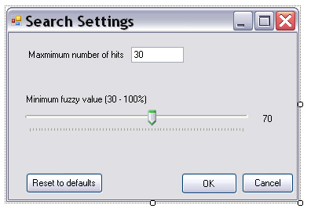

# Adding the Search Settings Form

This page explains how to implement the user interface for configuring search settings. The sample application lets users set the maximum number of search results and the minimum fuzziness value.

## Add the Form Control Elements

The search settings form needs the following controls:

- **txtMaxHits**: Text box for entering the maximum number of hits. Set the *MaxLength* property to `2` so users can enter values up to 99. This simplified application does not validate whether the input is numeric.
- **trackFuzzy**: Slider for setting the fuzziness value between 30 and 100. Set the minimum value to 30, the maximum value to 100, and the default value to 70.
- **lblFuzzyValue**: Label that displays the fuzziness value selected by the slider.
- **btnDefaults**: Restores the default settings.
- **btnOK**: Closes the form and applies the settings.
- **btnCancel**: Closes the form without applying the settings.



## Implement the GUI Functionality

### Setting the Fuzziness Value

Users can set the minimum fuzziness value between 30 and 100 by moving the slider. When the slider position changes, update the value in the label:
# [C#](#tab/tabid-1)
```cs
private void trackFuzzy_Scroll(object sender, EventArgs e)
{
    this.lblFuzzyValue.Text = this.trackFuzzy.Value.ToString();
}
```
***

### Resetting to Default Values

Click the corresponding button to restore the default settings:
# [C#](#tab/tabid-2)
```cs
// Reset the control elements to their default values.
private void btnDefaults_Click(object sender, EventArgs e)
{
    this.trackFuzzy.Value = 70;
    this.lblFuzzyValue.Text = "70";
    this.txtMaxHits.Text = "30";
}
```
***

### Applying the Settings

Add two public properties that represent the search settings:

# [C#](#tab/tabid-3)
```cs
// Property for setting the minimum fuzzy match value
// used during the search.
public static int minFuzzy
{
    get;
    set;
}
```
***

# [C#](#tab/tabid-4)
```cs
// Property for setting the maximum number of hits to return
// from the TM.
public static int maxHits
{
    get;
    set;
}
```
***

Clicking **OK** should hide the form and apply the settings.

# [C#](#tab/tabid-5)
```cs
// Apply the setting values from the form.
private void btnOK_Click(object sender, EventArgs e)
{
    maxHits = Convert.ToInt32(this.txtMaxHits.Text.ToString());
    minFuzzy = this.trackFuzzy.Value;

    this.Hide();
}
```
***

### Cancelling

Clicking **Cancel** should hide the form without applying the settings.

# [C#](#tab/tabid-6)
```cs
private void btnCancel_Click(object sender, EventArgs e)
{
    this.Hide();
}
```
***

## See Also

- [Adding the Connector Class](adding_the_connector_class.md)
- [Implementing the Search Functionality](implementing_the_search_functionality.md)
