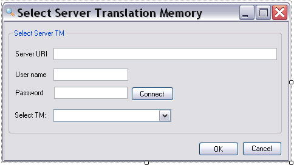

# Adding the Server TM Selection Form

This page explains how to create the form for selecting the translation memory used for a concordance search. Users can select either a file-based TM or a server-based TM.

## Add the Form Control Elements

The TM selection form needs the following controls:

- **groupBoxServerTM**: Group box that contains the following controls.
- **txtServerUri**: Text box for entering the server URI.
- **txtUserName**: Text box for entering the user name.
- **txtPassword**: Text box for entering the password. Set the *PasswordChar* property to `*`.
- **btnConnect**: Connects to the TM Server. When the connection succeeds, the combo box below becomes enabled and displays the TM names.
- **comboServerTMs**: Drop-down list that displays the server TM names after a successful server connection. It is disabled by default and becomes enabled after the user clicks **Connect** and the server connection succeeds.
- **btnOK**: Closes the form, connects to the TM Server, selects the TM, and fills the available language pairs into the corresponding combo box in the main TM lookup form. This button is disabled by default and becomes enabled after the available server TM names are loaded.
- **btnCancel**: Closes the form without selecting a TM.

Your form should look like this:



## Implement the GUI Functionality

When the user clicks **Cancel**, close the form:
# [C#](#tab/tabid-1)
```cs
private void btnCancel_Click(object sender, EventArgs e)
{
    this.Close();
}
```
***

### Connecting to the TM Server and Retrieving the TM Names

When the user clicks **btnConnect**, establish an initial connection to the server. Use that connection to populate **comboServerTMs** with the server TM names and enable the list. Select the first TM by default.
# [C#](#tab/tabid-2)
```cs
// Clicking the Connect button establishes a connection with the TM Server.
// This fills the drop-down list with server TM names, enables the list,
// and enables the OK button.
private void btnConnect_Click(object sender, EventArgs e)
{
    Connector connection = new Connector();
    connection.Connect(this.txtServerUri.Text, this.txtUserName.Text, 
        this.txtPassword.Text, this.comboServerTMs);

    this.btnOK.Enabled = true;
}
```
***
> [!NOTE]
>
> This simple implementation does not handle empty or invalid file names.

### Selecting the TM for the Search

When the user clicks **OK**, the application connects to the TM Server and closes the form. It then writes the TM name to the corresponding text box in the main application form. The TM name combines the server URI and the actual TM name. Server TMs can contain more than one language direction. Use the [LanguageDirections](../../api/translationmemory/Sdl.LanguagePlatform.TranslationMemoryApi.ServerBasedTranslationMemory.yml#Sdl_LanguagePlatform_TranslationMemoryApi_ServerBasedTranslationMemory_LanguageDirections) property to enumerate the available language directions and add the language pairs to the corresponding list in the main application form. Select the first available language direction by default.

# [C#](#tab/tabid-3)
```cs
// Clicking OK connects to the server-based TM through the Connector class.
// The TM language directions are added to the corresponding list in frmLookup.
private void btnOK_Click(object sender, EventArgs e)
{
    // Establish a connection to the TM Server.
    Connector connect = new Connector();

    connect.SelectServerTm(this.comboServerTMs.Text, this.txtServerUri.Text,
            this.txtUserName.Text, this.txtPassword.Text);

    // Enter the TM URI and TM name into the main application form.
    frmLookup lookupFrm = new frmLookup();
    lookupFrm.txtTmPath.Text = Connector.serverTM.Uri.ToString();            

    // Loop through the available language directions of the selected TM and
    // add them to the corresponding list in the main application form.
    lookupFrm.comboLanguagePairs.Items.Clear();
    for (int i = 0; i < Connector.serverTM.LanguageDirections.Count; i++)
    {
        string srcLang = Connector.serverTM.LanguageDirections[i].SourceLanguage.DisplayName;
        string trgLang = Connector.serverTM.LanguageDirections[i].TargetLanguage.DisplayName;
        lookupFrm.comboLanguagePairs.Items.Add(srcLang + " -> " + trgLang);
    }

    // Select the first available language direction.
    string currentSrcLang = Connector.serverTM.LanguageDirections[0].SourceLanguage.DisplayName;
    string currentTrgLang = Connector.serverTM.LanguageDirections[0].TargetLanguage.DisplayName;
    lookupFrm.comboLanguagePairs.Text = currentSrcLang + " -> " + currentTrgLang;

    lookupFrm.Show();
    this.Close();
}
```
***

## See Also

- [Adding the Search Settings Form](adding_the_search_settings_form.md)
- [Adding the Connector Class](adding_the_connector_class.md)
- [Implementing the Search Functionality](implementing_the_search_functionality.md)
