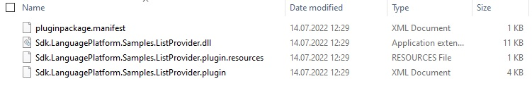
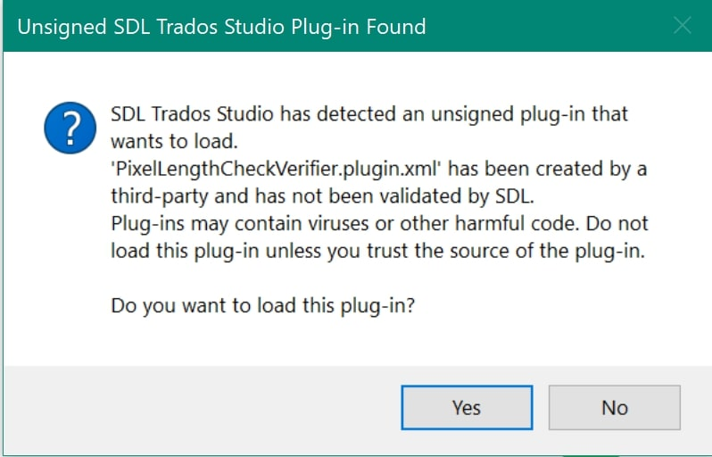
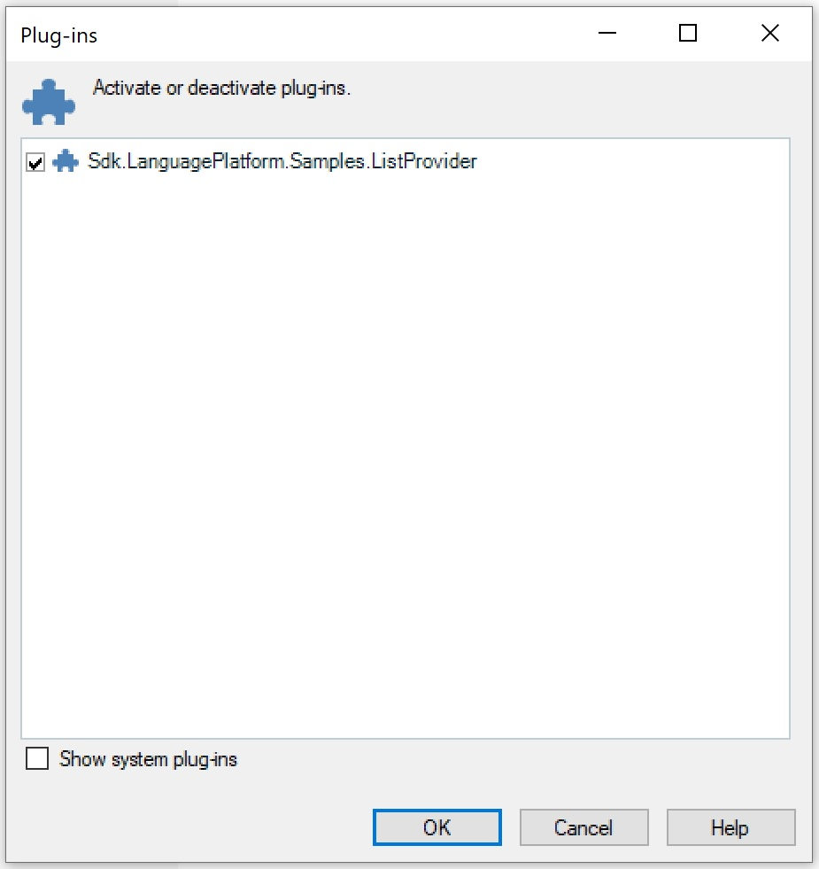
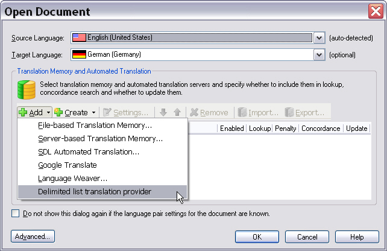

# Building the Plug-in

At this point, you can build the project, although it does not yet provide any functionality. This chapter explains how the plug-in build and deployment process works and which requirements you must meet so that Var:ProductName recognizes the plug-in.

Building the project generates a *.sdlplugin* file, for example *Sdl.Sdk.LanguagePlatform.Samples.ListProvider.csproj.sdlplugin*, in the build output path. The *.sdlplugin* file is a ZIP archive that contains the required plug-in components, such as the plug-in binary (*.dll), the resources file, and the manifest. In this example, the **.sdlplugin** file contains the following:

* The plug-in assembly, for example **Sdk.LanguagePlatform.Samples.ListProvider.dll**
* The plug-in manifest, for example **Sdk.LanguagePlatform.Samples.ListProvider.plugin.xml**. The manifest lists the extension classes that the plug-in contains. During the build process, it declares the assembly and the corresponding extension classes to Var:ProductName. If you delete this **.xml** file, you deactivate the plug-in and hide it from the application.
* The plug-in resources file, for example **Sdk.LanguagePlatform.Samples.ListProvider.plugin.resources**. This file contains all localizable strings and images referenced in the plug-in manifest, and it is compiled from **PluginResources.resx**. See also [The Resources File](the_resources_file.md).

To let Var:ProductName pick up and extract the plug-in package, the following folders must be available on your hard drive:

Var:PluginPackedPath

and

Var:PluginUnpackedPath

Place the **.sdlplugin** file in the **Packages** subfolder and start Var:ProductName. During start-up, Var:ProductName automatically extracts the package content to the *Unpacked* subfolder, as shown below:

At start-up, Var:ProductName loads the unpacked plug-in and shows the following message. Select **Yes** to load the plug-in. This message appears when you load plug-ins that have not been certified by RWS, which could be unsafe. You can avoid the message by submitting your plug-in to RWS for certification.

After you load the plug-in in Var:ProductName, open the corresponding dialog box through **Tools > Plug-ins**. The **Plug-ins** dialog box should list the name of your newly created plug-in:

When you open a document for translation, your plug-in should also appear under the available translation providers:

> [!NOTE]
> 
> If a user selects **No** when the plug-in security message appears during start-up of Var:ProductName, the plug-in does not appear in the application.

See also [Setting up a Development Machine](../../articles/gettingstarted/setting_up_a_developer_machine.md).

# See Also
[The Plug-in Manifest](the_plugin_manifest.md)
