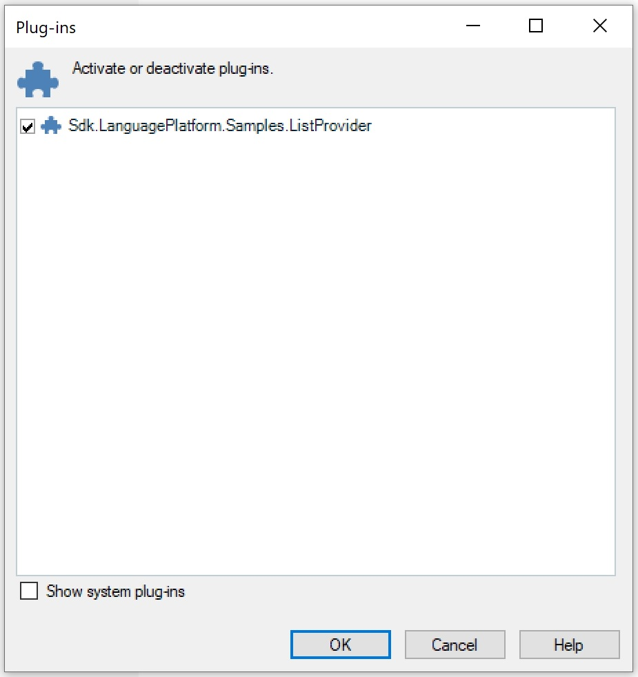

Building the Plug-in
====
At this point, it is already possible to build the project - although, of course, it will not provide any functionality. This chapter contains information on how the build and deployment process of the plug-in works and which requirements need to be fulfilled, so that your plug-in is going to be recognized by SDL Trados Studio 2017>

Building the project will generate a *.sdlplugin* file, in our example *Sdl.Sdk.LanguagePlatform.Samples.ListProvider.csproj.sdlplugin*, which will be placed inside your build output path. The *.sdlplugin* file is technically speaking a ZIP archive that contains the required plug-in components such as the plug-in binary (*.dll itself), the resources file, the manifest etc. For our example, the *.sdlplugin file will contain the following:

* The plug-in assembly, e.g. **Sdl.Sdk.LanguagePlatform.Samples.ListProvider.dll**
* The plug-in manifest, e.g. **Sdl.Sdk.LanguagePlatform.Samples.ListProvider.plugin.xml**. The manifest lists information on any extension classes that the plug-in contains. It is this manifest, which will be created during the build process, that declares the assembly and the corresponding extension classes to SDL Trados Studio 2017. By deleting this manifest *.xml file you would actually deactivate the plug-in and 'hide' it from the application.
* The plug-in resources file, e.g. **Sdl.Sdk.LanguagePlatform.Samples.ListProvider.plugin.resources.** This resources file contains all the localizable strings and images referred to within the plug-in manifest, and is compiled from **PluginResources.resx** (see also The Resources File).

In order for SDL Trados Studio 2017 to pick up the plug-in package and to extract it, the following folders need to be available on your hard drive:

**For Windows XP**:

C:\Documents and Settings\[UserName]\Application Data\SDL\SDL Trados Studio\14\Plugins\Packages

and

C:\Documents and Settings\[UserName]\Application Data\SDL\SDL Trados Studio\14\Plugins\Unpacked

**For Windows Vista/Windows 7/Windows 8**:

C:\Users\[UserName]\AppData\Roaming\SDL\SDL Trados Studio\14\Plugins\Packages

and

C:\Users\[UserName]\AppData\Roaming\SDL\SDL Trados Studio\14\Plugins\Unpacked

Make sure that you place the *.sdlplugin file into the sub-folder Packages and launch Trados Studio 2017. During startup of Trados Studio 2017 the content of the package will be automatically extracted to the Unpacked sub-folder, as illustrated below:

Upon start-up Trados Studio 2017 will load the unpacked plug-in and show the following message, which you can confirm with **Yes**, so that the plug-in gets loaded. This message appears when loading plug-ins that have not been certified by SDL, which could potentially be unsafe. The message can be avoided by submitting your plug-in to SDL for certification.

After loading the plug-in in Trados Studio 2017, you can see the the plug-in by raising the corresponding dialog box through the menu command **Tools -> Plug-ins**. The Plug-ins dialog box should list the name of your newly created plug-in:

Also, when you open a document for translation, your plug-in should now be listed under the available translation providers:

> [!NOTE]
> If a user clicks **No** when the plug-in security message is displayed during start-up of SDL Trados Studio 2017, the plug-in will not be shown in the application.