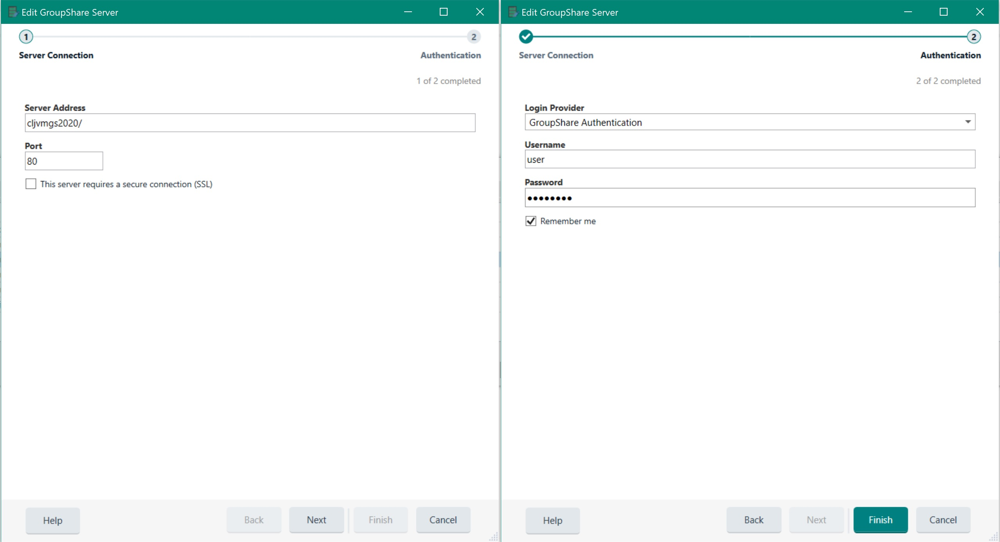
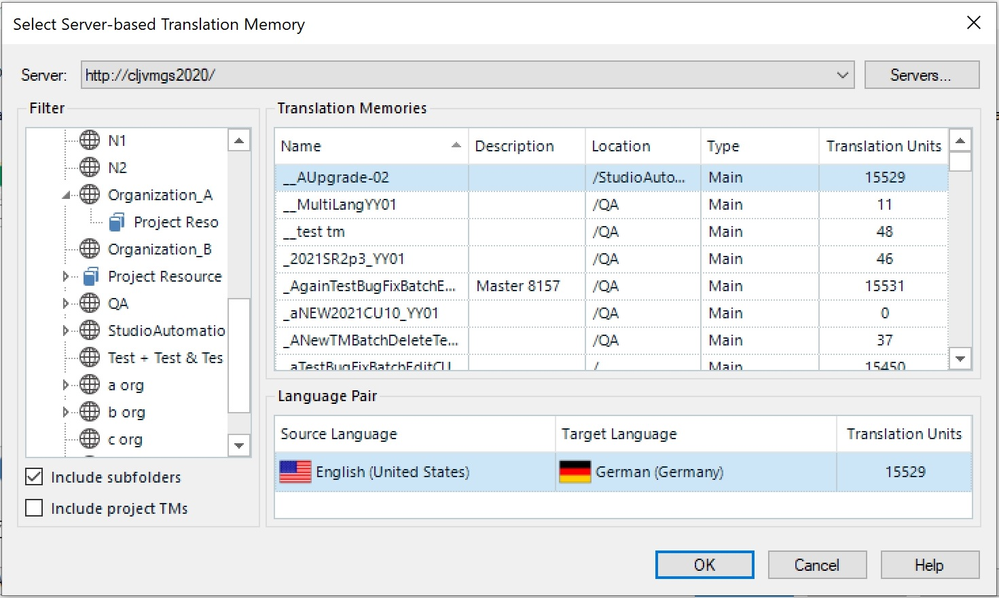

# Introduction

A file-based translation memory consists of a single **.sdltm** file based on SQLite technology. Users access file TMs with a simple File > Open operation, which opens the **.sdltm** file from disk. File-based scenarios usually suit a single user or a very small team, such as two or three translators working on a local area network. They do not scale well for larger groups, such as teams with project managers, translators, editors, and reviewers. They also handle distributed scenarios and real-time access by geographically dispersed users poorly.

# Background Information on TM Server Technology

Server-based TMs support simultaneous access by many users. They also support distributed scenarios in which some translators work in the US while others work in Europe. For example, when a US translator enters a translation, European users can immediately access the newly translated segments. Server TMs can be accessed through TCP on a local network or through HTTP on a wide area network, such as the Internet.

Server TM data resides in a database backend, such as Microsoft SQL Server 2005 or 2008. SQL Express versions are also supported. The TMs are stored in a container database, which keeps the TM data in tables. Users can access server TMs through Var:ProductName or through an API client. A TM Server middleware component sits between the user and the database backend. It manages user access and the retrieval and storage of data in the database system. In the following chapters, you will learn how to develop an API client that performs basic tasks on server TMs.

The screenshot below shows how a user of Var:ProductName can choose between file TMs and server TMs, apart from web-based automatic translation providers such as Google Translate.

The following screenshot shows the information users of Var:ProductName must enter to connect to a TM Server:

Users first enter a **server address**, such as the URI *tmserver.test.corp*. Then they provide the port number, such as 80. For security reasons, HTTP connections can use SSL. Finally, they enter a user name and password. TM Server supports Windows logins for LAN scenarios as well as RWS-specific logins, which work in both LAN and WAN scenarios.

After a successful connection, users can select from the available TMs, as shown below:

Users receive TM access according to their permissions. For example, some users may have read/write privileges and rights to change TM settings, import, and export. Others may have read-only access. TMs can also be grouped into organizations, as shown above. TM Server provides a *Root Organization*; beneath it, you can create additional organizations. Each organization can have its own TMs, users, and user groups. If you create TMs under a specific organization and assign users to that organization, those users can access only the TMs in that organization. Organizations can also contain sub-organizations. For example, if you create an organization called *MyCompany*, you can create sub-organizations such as *Marketing*, *Sales*, and *Production*, and then assign users and TMs to each sub-organization.
