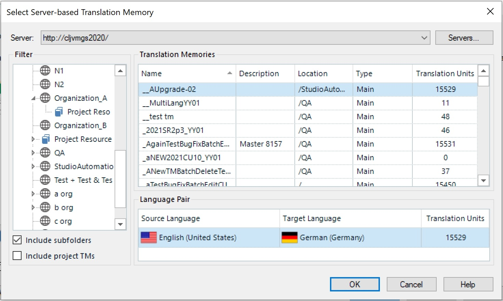

Introduction
=====
A file-based translation memory consists of a single **.sdltm* file, which is based on SQLite technology. Access to file TMs happens with a simple File -> Open operation, which opens an **.sdltm* file from a hard disk. File-based scenarios are typically used for single user access or for access by very small groups of translators and editors, e.g. two or three translators who work in a local area network. File TMs are limited when it comes to supporting larger groups, e.g. a team consisting of several project managers, translators, editors, reviewers, etc. In this case, file TMs do not offer the performance required for simultaneous access by a large number of users. Also, distributed scenarios and real-time access to TMs by geographically dispersed users cannot be handled efficiently.

Server-based TMs, on the other hand, have been designed for simultaneous access by many users. They also support distributed scenarios in which some translators are sitting, e.g. in the US while others are located in Europe. For example, when a US translator enters a translation, the European users have instantaneous, real-time access to any newly translated segments. Server TMs can be accessed through TCP in a local network or through HTTP in a wide area network (i.e. through the Internet).

Background Information on  TM Server Technology
----

In the case of server TMs, the TM data is physically stored in a database backend system, e.g. Microsoft SQL Server 2005 or 2008 (SQL Express versions are also supported). The TMs are stored in a so-called container database, which stores the TM data in tables. Users can access the server TMs like file TMs through Var:ProductName or, of course, through an API client. Between the end user and the database backend there is a TM Server middleware component installed. It negotiates user access and the retrieval/storage of data in the database system. In the following chapters you will learn how to develop an API client to carry out basic tasks on server TMs.

The screenshot below illustrates how a user of Var:ProductName can choose between file TMs and server TMs (apart from Web-based automatic translation providers such as Google Translate).

The following screenshot illustrates what information users of Var:ProductName need to enter in order to connect to a TM Server:

Users first enter a **server address**, e.g. a URI such as *tmserver.test.corp*. Then you provide the port number, e.g. 80. For security reasons HTTP connections can be secured with SSL technology. Last, a user name and a password is required. Note that TM Server supports Windows logins (for LAN scenarios) as well as RWS-specific logins, which can be used both in LAN and in WAN scenarios.

After a connection has been established successfully, users can select the available TMs as illustrated in the example below:

Users are granted TM access according to their access rights. For example, some users may have read/write privileges, they may have the right to change the TM setup, import, export, etc., while others may have read-only access. It is important to note that TMs can be grouped into organizations (see screenshot above). TM Server offers a *Root Organization*. Below this root organizations you may find other organizations. Each organization can be associated with its particular TMs and users as well as user groups. If you create TMs under a particular organization and assign a user to this organization, you can make sure that this user only has access to the TMs that belong to his/her particular organization. An organization can also have sub-organizations. Example: You have created an organization called *MyCompany*. If the organization is very large, you may create sub-organizations called, for example, *Marketing, Sales, Production*, etc., and then assign users and TMs to those sub-organizations.
