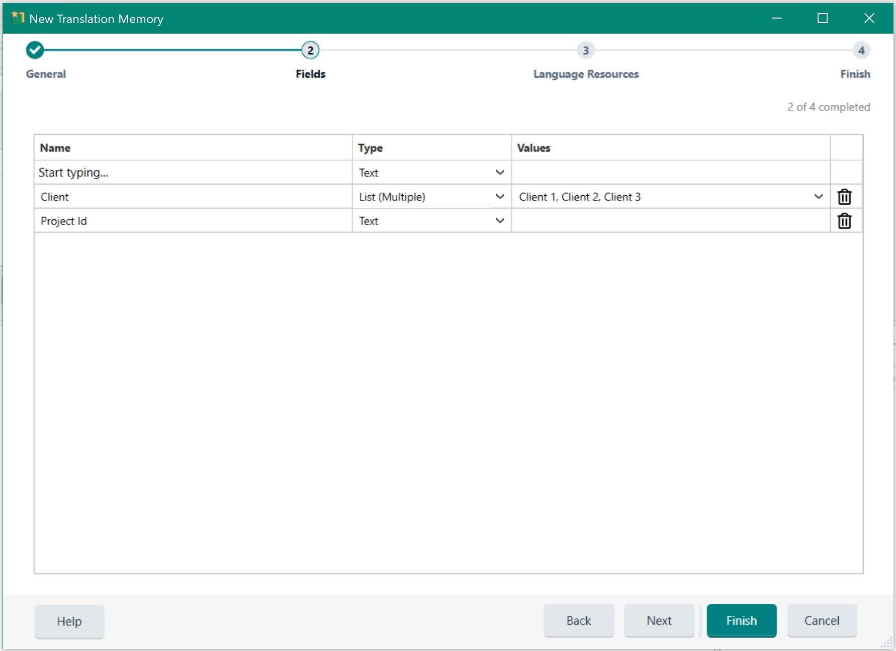
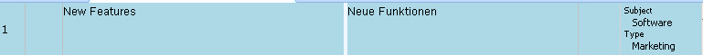
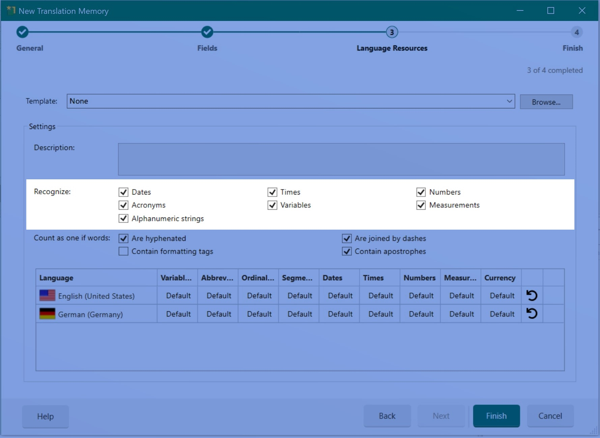
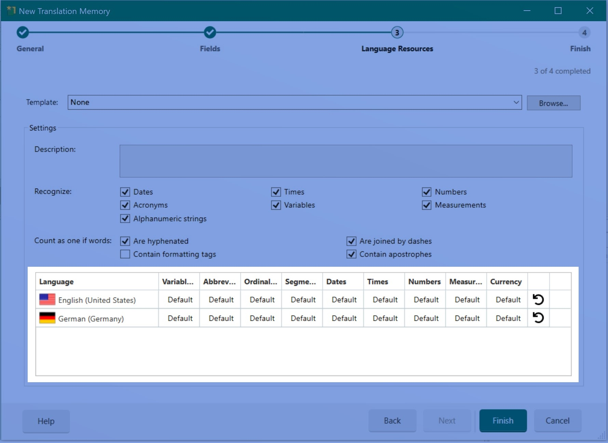
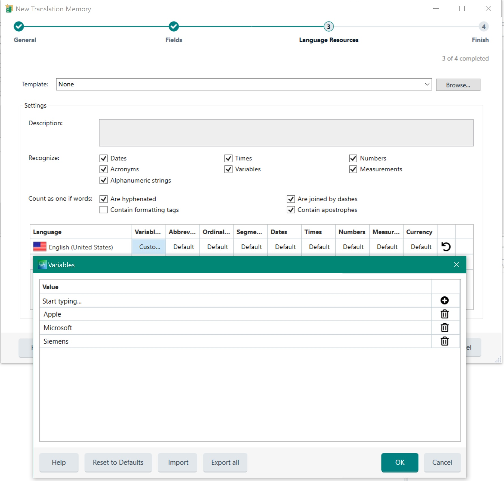

# Configuring Translation Memories
In addition to the TM name and language direction, you can configure several settings for a TM during creation or at any time afterward.

## Translation Memory Fields
A translation memory can include one or more TM fields. These fields let users add descriptive metadata to translation units (TUs), such as subject (for example, medical, general, politics, or science), client information, or project ID. This metadata helps users track the context and customer for each translated segment. Users can also apply TM field values as filters, for example, to limit lookup operations to TUs related to the subject 'science' or to export only TUs that match a specific project ID.

TM fields can store free text, numeric information, boolean values, or pre-defined picklist values that allow single or multiple selection. Based on project requirements, users specify field values throughout the translation project lifecycle. The following example shows a TU associated with two field values.

## Recognition Settings
TMs can recognize specific elements in a segment as placeables, which are strings that are inserted into the target segment without translation. Placeables can include numbers, dates, acronyms, times, measurements, variables, and alphanumeric strings. Variables are user-defined strings that do not need translation, such as product names. When creating a TM, users of `Var:ProductName` can choose whether numbers, dates, and similar elements are recognized as placeables or treated as regular translatable text. By default, recognition is enabled for all these element types.

In the Var:ProductName editor, placeable elements (such as the user-defined variable text shown below) are highlighted with a blue underline:

## Language Resources
A TM can also include language resources. Language resources contain lists of user-defined variables (see above), abbreviations, ordinal followers, custom segmentation rules, dates, times, numbers, measurements, and currency (see image below). Each TM includes default segmentation rules that determine, for example, whether a colon or semicolon acts as a segment delimiter. Users can add new segmentation rules or modify existing ones. This information is stored in a language resource.

For file-based TMs, language resources can also be saved to an external file with the extension **.sdltm.resource**. The resource can then be loaded into an existing TM.

The following example shows a custom variable list defined in the language resources for a TM:

## See Also
[Creating a File-based Translation Memory](creating_a_file_based_translation_memory.md)

[Adding TM Fields](adding_tm_fields.md)

[Adding Language Resources](adding_language_resources.md)

[TM Fields Templates](tm_fields_templates.md)

[Language Resource Templates](language_resource_templates.md)
