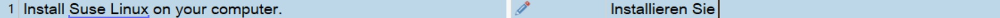

Configuring Translation Memories
=====
Apart from the TM name and the language direction there are additional settings that you may configure for a TM while or after creating it.

Translation Memory Fields
----
A translation memory can have one or several so-called TM fields. Fields allow users to add descriptive meta information to translation units (TUs) such as a subject (e.g. medical, general, politics, science, etc.), information on the client for whom the translation was made, a project id, etc. This information helps users track, for example, in which context, for which customer, etc. a segment was translated. Based on TM field values users can also define filters, for example, to restrict a lookup operation to only TUs that are related to the subject 'science', or to export a specific subset from a TM, e.g. only TUs that have a specific project id.

TM fields can be configured to contain free text, numerical information, boolean values, or they can be associated with pre-defined picklist values(that allow either multiple- or single selection). Based on the project requirements the users can then specify the field values to add during a translation project lifecycle. Below you seen an example of a TU that is associated with two field values.

Recognition Settings
-----
TMs can be configured to recognize certain elements within a segment as so-called placeables, i.e. strings that do not need to be translated, but that are 'placed' inside the target segment. Placeables can be numbers, dates, acronyms, times, measurements, variables and alphanumeric strings. Variables are user-definable strings of elements that do not need or that must not be translated. These can be, for example, product names. Users of <Var:ProductName> can decide during the creation of a TM whether numbers, dates, etc. should be recognized as placeables, or whether they should be treated as 'normal' translatable text. By default, the recognition settings for all these element types are enabled.

In the editor of <Var:ProductName> placeable elements (such as the user-defined variable text below) are highlighted with a blue underline:

Language Resources
-----
A TM can also be configured with language resources. Language resources contain lists of user-defined variables (see above), abbreviations, ordinal followers, custom segmentation rules, dates, times, numbers, measurements and currency (see image below). Each TM is equipped with a set of default segmentation rules that determine, for example, whether a colon or semicolon should be treated as a segment delimiter or not. Users can add new segmentation rules or change the existing ones. Such information is stored in a so-called language resource.

For file-based TMs, language resources can also be saved to an external file with the extension **.sdltm.resource*. The resource can then be loaded into an existing TM.

Below you see an example of a custom variable list, which is defined in the language resources for a TM:

See Also
----------
[Creating a File-based Translation Memory](creating_a_file_based_translation_memory.md)

[Adding TM Fields](adding_tm_fields.md)

[Adding Language Resources](adding_language_resources.md)

[TM Fields Templates](tm_fields_templates.md)

[Language Resource Templates](language_resource_templates.md)