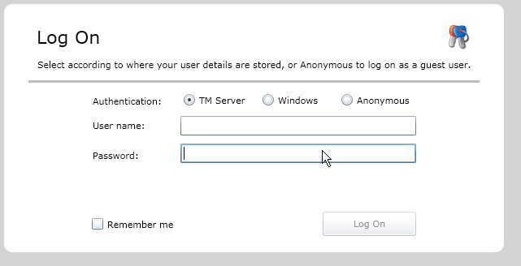

# Connecting to a TM Server

This chapter shows how to establish a connection to a TM Server programmatically.

## Add a New Class

Start by adding a class called `ServerConnector` to your project. Then add a public function called `Connect`. In this function, create a translation service provider object by using the [TranslationProviderServer](../../api/translationmemory/Sdl.LanguagePlatform.TranslationMemoryApi.TranslationProviderServer.yml) class. The method requires the following parameters:

* The server URI, for example `http://tmserv`
* A Boolean flag that indicates whether the user who is logging in is a Windows user, that is, a user from Active Directory
* The user name
* The password

Example:
# [C#](#tab/tabid-1)
```cs
/// <summary>
/// Connects to TranslationProviderServer.
/// </summary>
public TranslationProviderServer Connect()
{
    return new TranslationProviderServer(this.GetUri(), false, _userName, _password);
}
```

In the example above, we provide the credentials of a custom user, not an Active Directory user. TM Server supports Windows users, that is, users from Active Directory or LDAP, as well as custom users. Custom users are not derived from an existing LDAP source; they are created specifically for use in TM Server or MultiTerm Server. You can also allow anonymous access by configuring organizations in TM Server for anonymous access, so users do not need to enter a login.

The image below shows the logon screen of the GroupShare Web UI:



## Create a URI Helper

Finally, create a function that returns the TM Server URI. The example below connects to a TM test server:

# [C#](#tab/tabid-2)
```cs
/// <summary>
/// Gets the address of a test server to connect to.
/// </summary>
/// <returns>The address of the test server.</returns>
private Uri GetUri()
{
    return new Uri(_serverUri);
}
```
