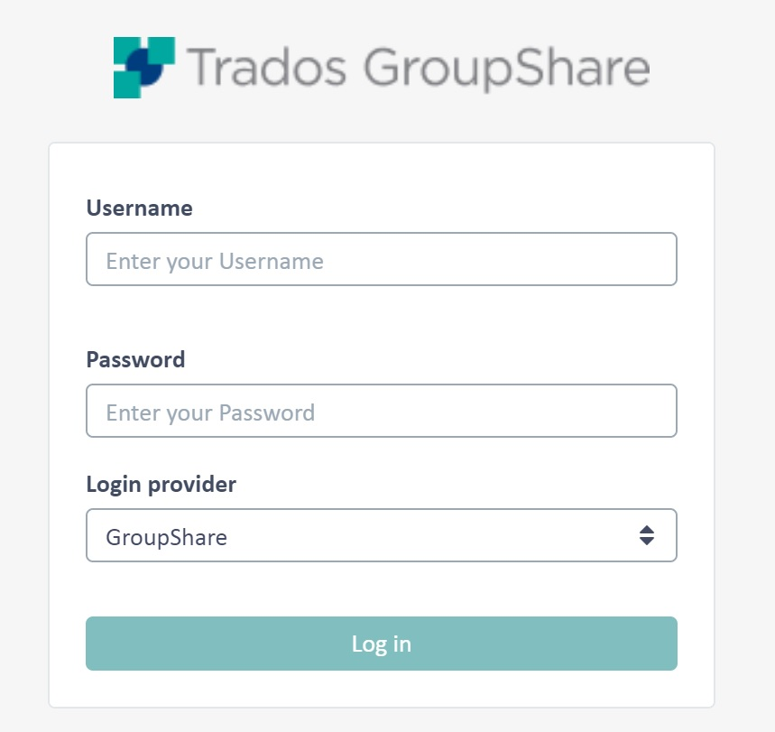

Connecting to a TM Server
=====
In this chapter you will learn how to establish a connection to an SDL TM Server programmatically.

Add a New Class
------
Start by adding a class called ServerConnector to your project. Then add a public function called Connect. In this function you create a translation service provider object using the TranslationProviderServer method, which requires the following parameters:

* The server URI (e.g. http://tmserv)
* A boolean flag to indicate whether the user that is logging in is a Windows user (i.e. a user taken from Active Directory) or not
* The user name
* The password

Example:

```
/// <summary>
/// Connects to TranslationProviderServer.
/// </summary>
public TranslationProviderServer Connect()
{
    return new TranslationProviderServer(this.GetUri(), false, _userName, _password);
}
```

The user credentials are provided by the following helper function: In the above example we provide the credentials of a custom user (i.e. not an Active Directory user). TM Server supports Windows users (i.e. users derived from Active Directory or LDAP) as well as custom users. These users are not derived from any existing LDAP source, but are created specifically for use in TM Server or MultiTerm Server. Additionally, you may allow for anonymous access, i.e. organizations in TM Server can be configured for anonymous access, so that users do not have to enter a login.
Below you see the logon screen of the TM Server manager, which reflects the various user types supported by the system:



Last, create a function that returns the SDL TM Server URI string. The example below connects to an SDL TM test server:

```
/// <summary>
/// Gets adress of a test server to connect to.
/// </summary>
/// <returns>Adress of the test server.</returns>
private Uri GetUri()
{
    return new Uri(_serverUri);
}
```
