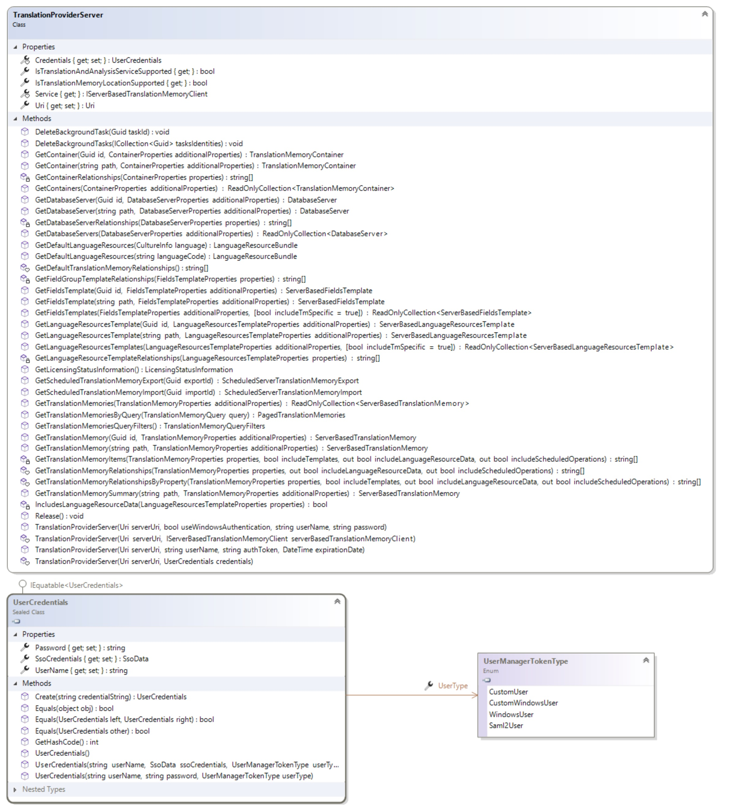

Connecting to TM Server
=====
This section describes how to connect to a TM server.

Connecting to TM Server
----
The central class that allows connecting to TM server is [TranslationProviderServer](../../api/translationmemory/Sdl.LanguagePlatform.TranslationMemoryApi.TranslationProviderServer.yml). The constructor of [TranslationProviderServer](../../api/translationmemory/Sdl.LanguagePlatform.TranslationMemoryApi.TranslationProviderServer.yml) accepts two parameters:

* **Uri**: the Uri representing the server. This should always be of the form http://SERVERNAME:PORT, where SERVERNAME is the IP address or DNS name of the web server that serves as the access point for the TM Server. The initial communication is always done via HTTP, but the system automatically detects the most optimal protocol and uses a TCP connection if that is possible in that particular scenario.
* **Credentials**: one of the supported types of credentials, representing a valid user, defined on the TM Server.
The [TranslationProviderServer](../../api/translationmemory/Sdl.LanguagePlatform.TranslationMemoryApi.TranslationProviderServer.yml) class provides a number of methods to get the following objects by id (Guid) or name or to get a list of all available objects (visible to the current user) of that type:

* [DatabaseServer](../../api/translationmemory/Sdl.LanguagePlatform.TranslationMemoryApi.DatabaseServer.yml)
* [TranslationMemoryContainer](../../api/translationmemory/Sdl.LanguagePlatform.TranslationMemoryApi.TranslationMemoryContainer.yml)
* [ServerBasedTranslationMemory](../../api/translationmemory/Sdl.LanguagePlatform.TranslationMemoryApi.ServerBasedTranslationMemory.yml)
* [ServerBasedFieldsTemplate](../../api/translationmemory/Sdl.LanguagePlatform.TranslationMemoryApi.ServerBasedFieldsTemplate.yml)
* [ServerBasedLanguageResourcesTemplate](../../api/translationmemory/Sdl.LanguagePlatform.TranslationMemoryApi.ServerBasedLanguageResourcesTemplate.yml)

Each method that retrieves one of these objects accepts an `additionalProperties` parameter. This parameter allows the caller to specify how much data to retrieve about the object or objects that are being retrieved. Any data that is not initially retrieved, will be retrieved on demand through lazily initialized properties, but it is generally advisable to retrieve all the necessary data upfront to reduce the number of roundtrips to the server if it is known in advance that all that data will be required. For example the [GetDatabaseServers](../../api/translationmemory/Sdl.LanguagePlatform.TranslationMemoryApi.TranslationProviderServer.yml#Sdl_LanguagePlatform_TranslationMemoryApi_TranslationProviderServer_GetDatabaseServers_Sdl_LanguagePlatform_TranslationMemoryApi_DatabaseServerProperties_)  method accepts a parameter of type [DatabaseServerProperties](../../api/translationmemory/Sdl.LanguagePlatform.TranslationMemoryApi.DatabaseServerProperties.yml) which allows the caller to specify whether to just retrieve the data for the database servers themselves, or to also return all the containers contained in the every database server and optionally all the translation memories in every container.

Another general feature that reduces the chattiness of the API is saving changes. Each of the top-level objects has a `Save` method. When setting properties on the object, these do not result in the property change being communicated to the server immediately. Only when the called calls `Save` explicitly are all the changes sent back to the server. This allows making a number of changes in one go, without every single change resulting in a roundtrip to the server.

