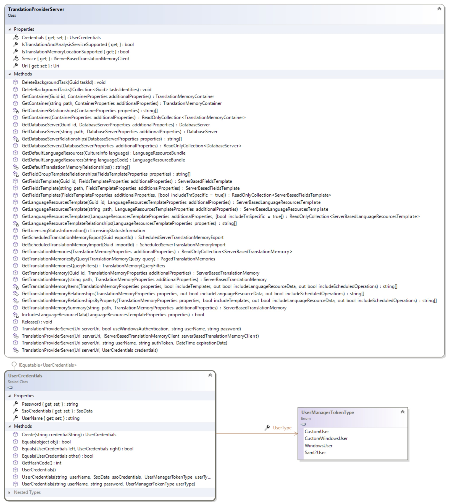

# Connecting to TM Server

This section describes how to connect to a TM Server.

## Connect by Using TranslationProviderServer

The main class for connecting to a TM Server is [TranslationProviderServer](../../api/translationmemory/Sdl.LanguagePlatform.TranslationMemoryApi.TranslationProviderServer.yml). Its constructor accepts two parameters:

* **Uri**: the URI that identifies the server. Use the form `http://SERVERNAME:PORT`, where `SERVERNAME` is the IP address or DNS name of the web server that exposes the TM Server. Initial communication always uses HTTP, but the system automatically selects the most efficient protocol and uses TCP when the scenario allows it.
* **Credentials**: one of the supported credential types for a valid user defined on the TM Server.

The [TranslationProviderServer](../../api/translationmemory/Sdl.LanguagePlatform.TranslationMemoryApi.TranslationProviderServer.yml) class also provides methods for retrieving objects by ID, by name, or as a list of all objects of a given type that are visible to the current user:

* [DatabaseServer](../../api/translationmemory/Sdl.LanguagePlatform.TranslationMemoryApi.DatabaseServer.yml)
* [TranslationMemoryContainer](../../api/translationmemory/Sdl.LanguagePlatform.TranslationMemoryApi.TranslationMemoryContainer.yml)
* [ServerBasedTranslationMemory](../../api/translationmemory/Sdl.LanguagePlatform.TranslationMemoryApi.ServerBasedTranslationMemory.yml)
* [ServerBasedFieldsTemplate](../../api/translationmemory/Sdl.LanguagePlatform.TranslationMemoryApi.ServerBasedFieldsTemplate.yml)
* [ServerBasedLanguageResourcesTemplate](../../api/translationmemory/Sdl.LanguagePlatform.TranslationMemoryApi.ServerBasedLanguageResourcesTemplate.yml)

## Control the Amount of Retrieved Data

Each retrieval method accepts an `additionalProperties` parameter. Use it to control how much data the API returns for the object or objects you request. Properties that are not retrieved initially are loaded on demand through lazy initialization, but it is usually better to retrieve all required data up front. Doing so reduces the number of roundtrips to the server when you know you need the full object graph.

For example, the [GetDatabaseServers](../../api/translationmemory/Sdl.LanguagePlatform.TranslationMemoryApi.TranslationProviderServer.yml#Sdl_LanguagePlatform_TranslationMemoryApi_TranslationProviderServer_GetDatabaseServers) method returns the database servers registered with the TM Server for use as translation memory container hosts.

## Save Changes in a Single Roundtrip

Another feature that reduces API chattiness is saving changes. Each top-level object has a `Save` method. When you set properties on an object, the changes are not sent to the server immediately. The server receives them only when you explicitly call `Save`. This approach lets you make several changes at once without causing a roundtrip for each individual change.

