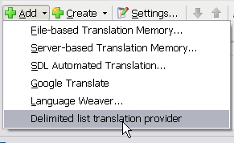
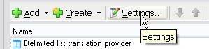
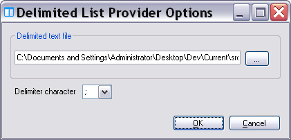
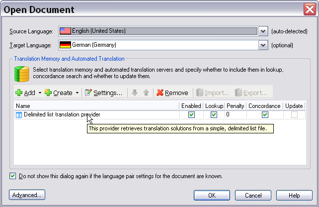
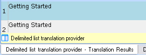

# Controlling the Plug-in User Interface

The translation provider plug-in template includes a component named `MyTranslationProviderWinFormsUI`, which we rename to `ListTranslationProviderWinFormsUI` in this implementation. This component lets you:

* control how the plug-in appears in Var:ProductName, such as its name, icon, and tooltip
* open the plug-in user interface
* collect credentials from the user, which this sample does not require


The class begins with the following declaration. It marks the class as an extension class and makes it available to Var:ProductName through the plug-in manifest *.xml file. See also [Building the Plug-in](building_the_plugin.md).
# [C#](#tab/tabid-1)
```cs
[TranslationProviderWinFormsUi(
    Id = "ListTranslationProviderWinFormsUI",
    Name = "ListTranslationProviderWinFormsUI",
    Description = "ListTranslationProviderWinFormsUI")]
```
***

This class implements the [ITranslationProviderWinFormsUI](../../api/translationmemory/Sdl.LanguagePlatform.TranslationMemoryApi.ITranslationProviderWinFormsUI.yml) interface. The following sections show how this implementation uses its members.

## Browse for the Plug-in

The UI extension lets users browse for and select translation providers in a consistent way. Users do this when they open a document for translation or add translation providers to a project through the **Add** button in Var:ProductName, as shown below:



Some translation providers do not require a user interface for configuration. In this implementation, however, a form collects the required settings, and the [Browse](../../api/translationmemory/Sdl.LanguagePlatform.TranslationMemoryApi.ITranslationProviderWinFormsUI.yml#Sdl_LanguagePlatform_TranslationMemoryApi_ITranslationProviderWinFormsUI_Browse_System_Windows_Forms_IWin32Window_Sdl_LanguagePlatform_Core_LanguagePair___Sdl_LanguagePlatform_TranslationMemoryApi_ITranslationProviderCredentialStore_) method opens it:

# [C#](#tab/tabid-2)
```cs
public ITranslationProvider[] Browse(IWin32Window owner, LanguagePair[] languagePairs, ITranslationProviderCredentialStore credentialStore)
{
    ListProviderConfDialog dialog = new ListProviderConfDialog(new ListTranslationOptions());
    if (dialog.ShowDialog(owner) == DialogResult.OK)
    {
        ListTranslationProvider testProvider = new ListTranslationProvider(dialog.Options);
        return new ITranslationProvider[] { testProvider };   
    }
    return null;
}
```
***

Translation provider plug-ins that include a configuration UI usually let users change settings later. For example, while translating, users might decide that a different list file better matches the text they selected. Var:ProductName provides a **Settings** button for this purpose, and your plug-in can enable or disable it, as shown below.



For this sample plug-in, it makes sense to enable the button and allow settings changes. To do this, set the [SupportsEditing](../../api/translationmemory/Sdl.LanguagePlatform.TranslationMemoryApi.ITranslationProviderWinFormsUI.yml#Sdl_LanguagePlatform_TranslationMemoryApi_ITranslationProviderWinFormsUI_SupportsEditing) property to return `True`:
# [C#](#tab/tabid-3)
```cs
public bool SupportsEditing
{
    get { return true; }
}
```
***
The [Edit](../../api/translationmemory/Sdl.LanguagePlatform.TranslationMemoryApi.ITranslationProviderWinFormsUI.yml#Sdl_LanguagePlatform_TranslationMemoryApi_ITranslationProviderWinFormsUI_Edit_System_Windows_Forms_IWin32Window_Sdl_LanguagePlatform_TranslationMemoryApi_ITranslationProvider_Sdl_LanguagePlatform_Core_LanguagePair___Sdl_LanguagePlatform_TranslationMemoryApi_ITranslationProviderCredentialStore_) method then serves the same purpose as [Browse](../../api/translationmemory/Sdl.LanguagePlatform.TranslationMemoryApi.ITranslationProviderWinFormsUI.yml#Sdl_LanguagePlatform_TranslationMemoryApi_ITranslationProviderWinFormsUI_Browse_System_Windows_Forms_IWin32Window_Sdl_LanguagePlatform_Core_LanguagePair___Sdl_LanguagePlatform_TranslationMemoryApi_ITranslationProviderCredentialStore_): it opens the plug-in user interface.
# [C#](#tab/tabid-4)
```cs
public bool Edit(IWin32Window owner, ITranslationProvider translationProvider, LanguagePair[] languagePairs, ITranslationProviderCredentialStore credentialStore)
{
    ListTranslationProvider editProvider = translationProvider as ListTranslationProvider;
    if (editProvider == null)
    {
        return false;
    }

    ListProviderConfDialog dialog = new ListProviderConfDialog(editProvider.Options);
    if (dialog.ShowDialog(owner) == DialogResult.OK)
    {
        editProvider.Options = dialog.Options;
        return true;
    }

    return false;
}
```
***

The plug-in user interface for this implementation looks like this:



## User Authentication

Use the [GetCredentialsFromUser](../../api/translationmemory/Sdl.LanguagePlatform.TranslationMemoryApi.ITranslationProviderWinFormsUI.yml#Sdl_LanguagePlatform_TranslationMemoryApi_ITranslationProviderWinFormsUI_GetCredentialsFromUser_System_Windows_Forms_IWin32Window_System_Uri_System_String_Sdl_LanguagePlatform_TranslationMemoryApi_ITranslationProviderCredentialStore_) method to collect credentials when the translation provider requires them. For example, a server TM or web-based translation service may require a user name and password. In many cases, you may want to store that information so users do not need to enter it every time they connect.

In this sample implementation, the plug-in accesses only a text file, so no authentication is necessary. The method can therefore always return `True`:
# [C#](#tab/tabid-5)
```cs
public bool GetCredentialsFromUser(IWin32Window owner, Uri translationProviderUri, string translationProviderState, ITranslationProviderCredentialStore credentialStore)
{            
    return true;
}
```
***


## Display the Plug-in Info

Use [GetDisplayInfo](../../api/translationmemory/Sdl.LanguagePlatform.TranslationMemoryApi.ITranslationProviderWinFormsUI.yml#Sdl_LanguagePlatform_TranslationMemoryApi_ITranslationProviderWinFormsUI_GetDisplayInfo_System_Uri_System_String_) to display plug-in information such as the name and icon in the Var:ProductName user interface. Store this information in the resources file. See [The Resources File](the_resources_file.md). The method creates a [TranslationProviderDisplayInfo](../../api/translationmemory/Sdl.LanguagePlatform.TranslationMemoryApi.TranslationProviderDisplayInfo.yml) object and sets the display name, tooltip text, and translation provider icon, as shown below:




The [SearchResultImage](../../api/translationmemory/Sdl.LanguagePlatform.TranslationMemoryApi.TranslationProviderDisplayInfo.yml#Sdl_LanguagePlatform_TranslationMemoryApi_TranslationProviderDisplayInfo_SearchResultImage) property sets the image shown in the **Translation Results** or **Concordance** window of Var:ProductName. This helps users see which provider suggested a translation solution, as shown below:



# [C#](#tab/tabid-6)
```cs
public TranslationProviderDisplayInfo GetDisplayInfo(Uri translationProviderUri, string translationProviderState)
{
    TranslationProviderDisplayInfo info = new TranslationProviderDisplayInfo();
    info.Name = PluginResources.Plugin_NiceName;            
    info.TranslationProviderIcon = PluginResources.band_aid_icon;
    info.TooltipText = PluginResources.Plugin_Tooltip;

    info.SearchResultImage = PluginResources.band_aid_symbol;

    return info;
}
```
***

## Putting it All Together

The complete component should look like this:
# [C#](#tab/tabid-7)
```cs
using System;
using System.Collections.Generic;
using System.Linq;
using System.Text;
using System.Windows.Forms;
using Sdl.LanguagePlatform.Core;
using Sdl.LanguagePlatform.TranslationMemory;
using Sdl.LanguagePlatform.TranslationMemoryApi;

namespace Sdk.LanguagePlatform.Samples.ListProvider
{    
    [TranslationProviderWinFormsUi(
        Id = "ListTranslationProviderWinFormsUI",
        Name = "ListTranslationProviderWinFormsUI",
        Description = "ListTranslationProviderWinFormsUI")] 
    public class ListTranslationProviderWinFormsUI : ITranslationProviderWinFormsUI
    {
        /// <summary>
        /// Show the plug-in settings form when the user is adding the translation provider plug-in
        /// through the GUI of Trados Studio
        /// </summary>
        /// <param name="owner"></param>
        /// <param name="languagePairs"></param>
        /// <param name="credentialStore"></param>
        /// <returns></returns>
        public ITranslationProvider[] Browse(IWin32Window owner, LanguagePair[] languagePairs, ITranslationProviderCredentialStore credentialStore)
        {
            ListProviderConfDialog dialog = new ListProviderConfDialog(new ListTranslationOptions());
            if (dialog.ShowDialog(owner) == DialogResult.OK)
            {
                ListTranslationProvider testProvider = new ListTranslationProvider(dialog.Options);
                return new ITranslationProvider[] { testProvider };   
            }
            return null;
        }
        
        /// <summary>
        /// Determines whether the plug-in settings can be changed
        /// by displaying the Settings button in Trados Studio.
        /// </summary>
        public bool SupportsEditing
        {
            get { return true; }
        }

        /// <summary>
        /// If the plug-in settings can be changed by the user,
        /// Trados Studio will display a Settings button.
        /// By clicking this button, users raise the plug-in user interface,
        /// in which they can modify any applicable settings, in our implementation
        /// the delimiter character and the list file name.
        /// </summary>
        /// <param name="owner"></param>
        /// <param name="translationProvider"></param>
        /// <param name="languagePairs"></param>
        /// <param name="credentialStore"></param>
        /// <returns></returns>
        public bool Edit(IWin32Window owner, ITranslationProvider translationProvider, LanguagePair[] languagePairs, ITranslationProviderCredentialStore credentialStore)
        {
            ListTranslationProvider editProvider = translationProvider as ListTranslationProvider;
            if (editProvider == null)
            {
                return false;
            }

            ListProviderConfDialog dialog = new ListProviderConfDialog(editProvider.Options);
            if (dialog.ShowDialog(owner) == DialogResult.OK)
            {
                editProvider.Options = dialog.Options;
                return true;
            }

            return false;
        }

        /// <summary>
        /// Can be used in implementations in which a user login is required, e.g.
        /// for connecting to an online translation provider.
        /// In our implementation, however, this is not required, so we simply set
        /// this member to return always True.
        /// </summary>
        /// <param name="owner"></param>
        /// <param name="translationProviderUri"></param>
        /// <param name="translationProviderState"></param>
        /// <param name="credentialStore"></param>
        /// <returns></returns>
        public bool GetCredentialsFromUser(IWin32Window owner, Uri translationProviderUri, string translationProviderState, ITranslationProviderCredentialStore credentialStore)
        {            
            return true;
        }

        /// <summary>
        /// Used for displaying the plug-in info such as the plug-in name,
        /// tooltip, and icon.
        /// </summary>
        /// <param name="translationProviderUri"></param>
        /// <param name="translationProviderState"></param>
        /// <returns></returns>
        public TranslationProviderDisplayInfo GetDisplayInfo(Uri translationProviderUri, string translationProviderState)
        {
            TranslationProviderDisplayInfo info = new TranslationProviderDisplayInfo();
            info.Name = PluginResources.Plugin_NiceName;            
            info.TranslationProviderIcon = PluginResources.band_aid_icon;
            info.TooltipText = PluginResources.Plugin_Tooltip;

            info.SearchResultImage = PluginResources.band_aid_symbol;

            return info;
        }

        public bool SupportsTranslationProviderUri(Uri translationProviderUri)
        {
            if (translationProviderUri == null)
            {
                throw new ArgumentNullException("URI not supported by the plug-in.");
            }
            return String.Equals(translationProviderUri.Scheme, ListTranslationProvider.ListTranslationProviderScheme, StringComparison.CurrentCultureIgnoreCase);
        }

        public string TypeDescription
        {
            get { return PluginResources.Plugin_Description; }
        }

        public string TypeName
        {
            get { return PluginResources.Plugin_NiceName; }
        }
    }
}
```
***

# See Also
[Creating the Translation Provider UI Extension](creating_the_translation_provider_ui_extension.md)

[Implementing the Plug-in User Interface](implementing_the_plugin_user_interface.md)

[The Resources File](the_resources_file.md)
