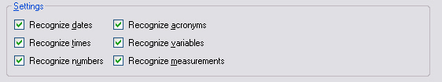

# Creating a File-based Translation Memory

This chapter explains how to create a file-based translation memory programmatically, that is, an *.sdltm* file.

## Add a New Class

Add a new class to your project named `TmCreator`. Then add a public method named `CreateFileBasedTm()`.

The method takes a `tmPath` string parameter that specifies the path and file name of the translation memory to create. Call it as shown below:

# [C#](#tab/tabid-1)
```cs
var tmCreator = new TmCreator();
tmCreator.CreateFileBasedTm(_translationMemoryFilePath);
```
***

Inside the method, create the translation memory object as shown below:

# [C#](#tab/tabid-2)
```cs
public void CreateFileBasedTm(string tmPath)
{
    var tm = new FileBasedTranslationMemory(
        tmPath,
        "This is a sample TM",
        CultureInfo.GetCultureInfo("en-US"),
        CultureInfo.GetCultureInfo("de-DE"),
        this.GetFuzzyIndexes(),
        this.GetRecognizers(),
        TokenizerFlags.BreakOnDash | TokenizerFlags.BreakOnHyphen | TokenizerFlags.BreakOnApostrophe, 
        WordCountFlags.BreakOnTag | WordCountFlags.BreakOnHyphen | WordCountFlags.BreakOnApostrophe | WordCountFlags.BreakOnDash
        );

    tm.LanguageResourceBundles.Clear();

    tm.Save();
}
```
***

When you create the translation memory object, provide these parameters:

1. The full file name and path.
2. The TM description string, which can also be empty.
3. The source and target language. Use [CultureInfo](https://docs.microsoft.com/en-us/dotnet/api/system.globalization.cultureinfo?redirectedfrom=MSDN&view=net-5.0), which you create with [GetCultureInfo](https://docs.microsoft.com/en-us/dotnet/api/system.globalization.cultureinfo.getcultureinfo?redirectedfrom=MSDN&view=net-5.0#overloads). Pass the language locale as a string. To create a TM with the language direction **English (US) -> German**, use **en-US** and **de-DE**. An invalid locale string, such as *en-DE*, throws an exception.
4. The fuzzy indexes to create for the TM. Specify whether to create and maintain a fuzzy index for the source segment, the target segment, or both. The fuzzy index is required for concordance searches, which let translators select words in a source or target segment and search for matching occurrences in the TM. A character-based concordance search can return more results because it is more tolerant. For example, a search for *revolution* might return *revolving*. A word-based search would not return that result because the words differ too much. Character-based searches are significantly slower than word-based searches, especially in large TMs, so use them only for small TMs with a few thousand segments. In most cases, users search both source and target languages. In this example, enable word- and character-based indexing for both segments. Use a helper function that returns all available **FuzzyIndexes** values, as shown below:

# [C#](#tab/tabid-3)
```cs
private FuzzyIndexes GetFuzzyIndexes()
{
    return FuzzyIndexes.SourceCharacterBased |
        FuzzyIndexes.SourceWordBased |
        FuzzyIndexes.TargetCharacterBased |
        FuzzyIndexes.TargetWordBased;
}
```
***

5. The recognition settings identify elements that do not change during translation, such as numbers, dates, and acronyms. When you enable these settings, Studio marks those elements as placeables. Placeables can move directly from the source segment to the target segment without manual entry. When you create a TM in Var:ProductName, Studio enables all recognition settings by default. In this example, a `GetRecognizers` helper function returns all **BuiltinRecognizers** values and enables every recognition type.

# [C#](#tab/tabid-4)
```cs
private BuiltinRecognizers GetRecognizers()
{
    return BuiltinRecognizers.RecognizeAcronyms |
        BuiltinRecognizers.RecognizeDates |
        BuiltinRecognizers.RecognizeNumbers |
        BuiltinRecognizers.RecognizeTimes |
        BuiltinRecognizers.RecognizeVariables |
        BuiltinRecognizers.RecognizeMeasurements |
        BuiltinRecognizers.RecognizeAlphaNumeric;
}
```
***


The screenshot below shows the TM recognition settings in Var:ProductName:



## Putting it All Together

The complete class should now look like this:

# [C#](#tab/tabid-5)
```cs
namespace SDK.LanguagePlatform.Samples.TmAutomation
{
    using System.Globalization;
    using Sdl.LanguagePlatform.Core.Tokenization;
    using Sdl.LanguagePlatform.TranslationMemory;
    using Sdl.LanguagePlatform.TranslationMemoryApi;

    public class TmCreator
    {
        #region "create TM"
        public void CreateFileBasedTm(string tmPath)
        {
            FileBasedTranslationMemory tm = new FileBasedTranslationMemory(
                tmPath,
                "This is a sample TM",
                CultureInfo.GetCultureInfo("en-US"),
                CultureInfo.GetCultureInfo("de-DE"),
                this.GetFuzzyIndexes(),
                this.GetRecognizers(),
                TokenizerFlags.BreakOnDash | TokenizerFlags.BreakOnHyphen | TokenizerFlags.BreakOnApostrophe, 
                WordCountFlags.BreakOnTag | WordCountFlags.BreakOnHyphen | WordCountFlags.BreakOnApostrophe | WordCountFlags.BreakOnDash
                );

            tm.LanguageResourceBundles.Clear();

            tm.Save();
        }
        #endregion

        #region "get fuzzy indexes"
        private FuzzyIndexes GetFuzzyIndexes()
        {
            return FuzzyIndexes.SourceCharacterBased |
                FuzzyIndexes.SourceWordBased |
                FuzzyIndexes.TargetCharacterBased |
                FuzzyIndexes.TargetWordBased;
        }
        #endregion

        #region "get recognizers"
        private BuiltinRecognizers GetRecognizers()
        {
            return BuiltinRecognizers.RecognizeAcronyms |
                BuiltinRecognizers.RecognizeDates |
                BuiltinRecognizers.RecognizeNumbers |
                BuiltinRecognizers.RecognizeTimes |
                BuiltinRecognizers.RecognizeVariables |
                BuiltinRecognizers.RecognizeMeasurements |
                BuiltinRecognizers.RecognizeAlphaNumeric;
        }
        #endregion
    }
}
```
***

## See Also
[Creating Translation Memories](creating_translation_memories.md)

[Performing Translation Memory Lookups](performing_translation_memory_lookups.md)

[Setting and Retrieving TM Properties](setting_and_retrieving_tm_properties.md)

[Adding TM Fields](adding_tm_fields.md)

[Adding Language Resources](adding_language_resources.md)

[Setting Translation Memory Access Rights](setting_translation_memory_access_rights.md)

[Doing Translation Memory Lookups](doing_translation_memory_lookups.md)

[Tuning and Maintaining a Translation Memory](tuning_and_maintaining_a_translation_memory.md)