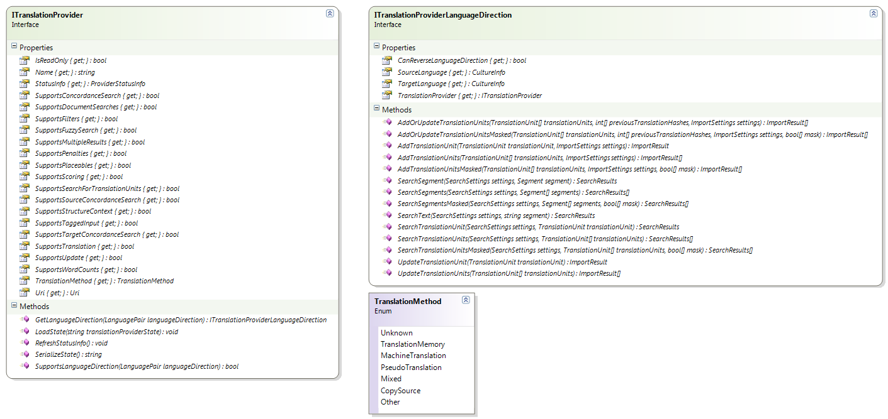

Creating the Translation Provider
======
This section explains how to create a class that implements the [ITranslationProvider](../../api/translationmemory/Sdl.LanguagePlatform.TranslationMemoryApi.ITranslationProvider.yml) interface, which forms the main part of a custom translation provider plug-in implementation.

Overview
-----
The translation provider component represents a translation engine that provides functionality to translate segments. A translation provider is a class that implements [ITranslationProvider](../../api/translationmemory/Sdl.LanguagePlatform.TranslationMemoryApi.ITranslationProvider.yml). This functionality of this class can be categorized as follows:

* **Translation method**: The [TranslationMethod](../../api/translationmemory/Sdl.LanguagePlatform.TranslationMemoryApi.ITranslationProvider.yml#Sdl_LanguagePlatform_TranslationMemoryApi_ITranslationProvider_TranslationMethod) property specifies which translation engine is used for generating translation results. Some search options in <Var:ProductName> can determine whether a translation provider is called or not. This means that if a TM result already exists <Var:ProductName> may no longer looks up for suggestions in the MT provider.
* **Supported features**: The translation provider class also has to indicate which functionality it supports. There are a number of "Supports..." properties, which indicate which features the translation provider supports. Again, these values are used by <Var:ProductName> to determine in which scenarios to use the translation provider and how to use it. See [Supported Features](#supported-features).
* **Language directions**: The translation provider can indicate which language directions it supports, and allows retrieving a language direction ([ITranslationProviderLanguageDirection](../../api/translationmemory/Sdl.LanguagePlatform.TranslationMemoryApi.ITranslationProviderLanguageDirection.yml)) using the [GetLanguageDirection](../../api/translationmemory/Sdl.LanguagePlatform.TranslationMemoryApi.ITranslationProvider.yml#Sdl_LanguagePlatform_TranslationMemoryApi_ITranslationProvider_GetLanguageDirection_Sdl_LanguagePlatform_Core_LanguagePair_) method. See [Language Directions](#language-directions).
* **Serializing and loading state**: When a translation provider is added to an <Var:ProductName> project, two pieces of information are serialized: the URI ([Uri](../../api/translationmemory/Sdl.LanguagePlatform.TranslationMemoryApi.ITranslationProvider.yml#Sdl_LanguagePlatform_TranslationMemoryApi_ITranslationProvider_Uri)) and additional state information. See [Serializing and Loading State](#serializing-and-loading-state).
A translation provider can support one or more language directions, i.e. source-to-target language combinations. The functionality for a specific language direction is provided by a class that implements [ITranslationProviderLanguageDirection](../../api/translationmemory/Sdl.LanguagePlatform.TranslationMemoryApi.ITranslationProviderLanguageDirection.yml).

Supported Features
-----
For more information on each of the properties that indicate whether the translation provider supports certain functionality or content, see [ITranslationProvider](../../api/translationmemory/Sdl.LanguagePlatform.TranslationMemoryApi.ITranslationProvider.yml).

Language Directions
-----
A translation provider language direction is defined by a source and target language, both of which should be a region-qualified culture. The interface has two method related to language directions:

* [SupportsLanguageDirection](../../api/translationmemory/Sdl.LanguagePlatform.TranslationMemoryApi.ITranslationProvider.yml#Sdl_LanguagePlatform_TranslationMemoryApi_ITranslationProvider_SupportsLanguageDirection_Sdl_LanguagePlatform_Core_LanguagePair_): This method checks whether the translation provider supports the specified region-qualified source-target language combination.
* [GetLanguageDirection](../../api/translationmemory/Sdl.LanguagePlatform.TranslationMemoryApi.ITranslationProvider.yml#Sdl_LanguagePlatform_TranslationMemoryApi_ITranslationProvider_GetLanguageDirection_Sdl_LanguagePlatform_Core_LanguagePair_): If the translation provider supports a given language direction, a [ITranslationProviderLanguageDirection](../../api/translationmemory/Sdl.LanguagePlatform.TranslationMemoryApi.ITranslationProviderLanguageDirection.yml) can be retrieved using this method. The [ITranslationProviderLanguageDirection](../../api/translationmemory/Sdl.LanguagePlatform.TranslationMemoryApi.ITranslationProviderLanguageDirection.yml) contains language-direction specific methods for performing translation unit lookups and updates. Depending on which features are supported by the translation provider, some or all of these methods can be used.

Serializing and Loading State
-----
When a translation provider is added to an <Var:ProductName> project, two pieces of information are serialized: the URI and the additional state. The additional state can take the form of additional settings required by the translation provider.

Serialization of state is done using the [SerializeState](../../api/translationmemory/Sdl.LanguagePlatform.TranslationMemoryApi.ITranslationProvider.yml#Sdl_LanguagePlatform_TranslationMemoryApi_ITranslationProvider_SerializeState) method. The translation provider implementation is free to determine the format that it serializes its state in. <Var:ProductName> will only store this state information in the project. Also, the state information is included in packages, so it is not recommended to include sensitive information like credentials in there. There is a separate mechanism for credentials and other user specific settings. For more details on this mechanism, refer to the Authentication section in [Creating the Translation Provider Factory](creating_the_translation_provider_factory.md).