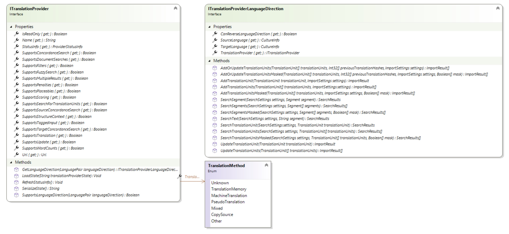

# Creating the Translation Provider

This section explains how to create a class that implements the [ITranslationProvider](../../api/translationmemory/Sdl.LanguagePlatform.TranslationMemoryApi.ITranslationProvider.yml) interface. This class forms the core of a custom translation provider plug-in.

## Overview

A translation provider represents a translation engine that translates segments. It implements [ITranslationProvider](../../api/translationmemory/Sdl.LanguagePlatform.TranslationMemoryApi.ITranslationProvider.yml) and exposes the following areas of behavior:

- **Translation method**: The [TranslationMethod](../../api/translationmemory/Sdl.LanguagePlatform.TranslationMemoryApi.ITranslationProvider.yml#Sdl_LanguagePlatform_TranslationMemoryApi_ITranslationProvider_TranslationMethod) property identifies the translation engine that generates results. Some search options in Var:ProductName determine whether Var:ProductName calls a provider. If a TM result already exists, Var:ProductName may not query the MT provider for additional suggestions.
- **Supported features**: The provider reports which functionality it supports through a set of `Supports...` properties. Var:ProductName uses these values to decide when and how to use the provider. See [Supported Features](#supported-features).
- **Language directions**: The provider indicates which language directions it supports and returns a language direction ([ITranslationProviderLanguageDirection](../../api/translationmemory/Sdl.LanguagePlatform.TranslationMemoryApi.ITranslationProviderLanguageDirection.yml)) through the [GetLanguageDirection](../../api/translationmemory/Sdl.LanguagePlatform.TranslationMemoryApi.ITranslationProvider.yml#Sdl_LanguagePlatform_TranslationMemoryApi_ITranslationProvider_GetLanguageDirection_Sdl_LanguagePlatform_Core_LanguagePair_) method. See [Language Directions](#language-directions).
- **Serializing and loading state**: When Var:ProductName adds a provider to a project, it serializes two values: the URI ([Uri](../../api/translationmemory/Sdl.LanguagePlatform.TranslationMemoryApi.ITranslationProvider.yml#Sdl_LanguagePlatform_TranslationMemoryApi_ITranslationProvider_Uri)) and additional state information. See [Serializing and Loading State](#serializing-and-loading-state).

A translation provider can support one or more language directions, or source-target language combinations. A class that implements [ITranslationProviderLanguageDirection](../../api/translationmemory/Sdl.LanguagePlatform.TranslationMemoryApi.ITranslationProviderLanguageDirection.yml) provides the functionality for a specific language direction.

## Supported Features

For more information about the properties that indicate whether a translation provider supports specific functionality or content, see [ITranslationProvider](../../api/translationmemory/Sdl.LanguagePlatform.TranslationMemoryApi.ITranslationProvider.yml).

## Language Directions

A translation provider language direction uses a source language and a target language. Both should be region-qualified cultures. The interface defines two methods related to language directions:

- [SupportsLanguageDirection](../../api/translationmemory/Sdl.LanguagePlatform.TranslationMemoryApi.ITranslationProvider.yml#Sdl_LanguagePlatform_TranslationMemoryApi_ITranslationProvider_SupportsLanguageDirection_Sdl_LanguagePlatform_Core_LanguagePair_): Checks whether the translation provider supports the specified region-qualified source-target language pair.
- [GetLanguageDirection](../../api/translationmemory/Sdl.LanguagePlatform.TranslationMemoryApi.ITranslationProvider.yml#Sdl_LanguagePlatform_TranslationMemoryApi_ITranslationProvider_GetLanguageDirection_Sdl_LanguagePlatform_Core_LanguagePair_): Returns a [ITranslationProviderLanguageDirection](../../api/translationmemory/Sdl.LanguagePlatform.TranslationMemoryApi.ITranslationProviderLanguageDirection.yml) for a supported language pair. The [ITranslationProviderLanguageDirection](../../api/translationmemory/Sdl.LanguagePlatform.TranslationMemoryApi.ITranslationProviderLanguageDirection.yml) exposes language-direction-specific methods for translation unit lookups and updates. Depending on the features that the provider supports, you can use some or all of these methods.

## Serializing and Loading State

When Var:ProductName adds a translation provider to a project, it serializes two pieces of information: the URI and the additional state. The additional state can include settings that the translation provider requires.

Serialize state by using the [SerializeState](../../api/translationmemory/Sdl.LanguagePlatform.TranslationMemoryApi.ITranslationProvider.yml#Sdl_LanguagePlatform_TranslationMemoryApi_ITranslationProvider_SerializeState) method. The translation provider implementation can choose the format it uses to serialize state. Var:ProductName stores this state information in the project. Because packages include the state information, avoid storing sensitive data such as credentials there. Use the separate mechanism for credentials and other user-specific settings. For more information, see the Authentication section in [Creating the Translation Provider Factory](creating_the_translation_provider_factory.md).
