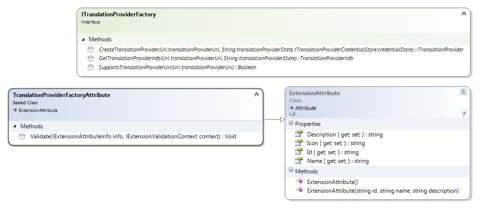

# Creating the Translation Provider Factory

This section explains how to create a translation provider factory. A factory lets applications like Var:ProductName create translation provider instances from a specific URI.

## Overview

The translation provider factory instantiates translation providers. It must implement the [ITranslationProviderFactory](../../api/translationmemory/Sdl.LanguagePlatform.TranslationMemoryApi.ITranslationProviderFactory.yml) interface, which defines three methods:

- [SupportsTranslationProviderUri](../../api/translationmemory/Sdl.LanguagePlatform.TranslationMemoryApi.ITranslationProviderFactory.yml#Sdl_LanguagePlatform_TranslationMemoryApi_ITranslationProviderFactory_SupportsTranslationProviderUri_System_Uri_): Determines whether the factory supports the specified translation provider URI. See [The Translation Provider URI Scheme](#the-translation-provider-uri-scheme).
- [CreateTranslationProvider](../../api/translationmemory/Sdl.LanguagePlatform.TranslationMemoryApi.ITranslationProviderFactory.yml#Sdl_LanguagePlatform_TranslationMemoryApi_ITranslationProviderFactory_CreateTranslationProvider_System_Uri_System_String_Sdl_LanguagePlatform_TranslationMemoryApi_ITranslationProviderCredentialStore_): Creates a new translation provider identified by the specified URI and loads previously serialized state information.
- [GetTranslationProviderInfo](../../api/translationmemory/Sdl.LanguagePlatform.TranslationMemoryApi.ITranslationProviderFactory.yml#Sdl_LanguagePlatform_TranslationMemoryApi_ITranslationProviderFactory_GetTranslationProviderInfo_System_Uri_System_String_): Provides a lightweight way to determine the translation method used by translation providers created by the factory without creating a translation provider instance.

## Registering the Extension

To make the translation provider factory available to host applications such as Var:ProductName, mark it with a [TranslationProviderFactoryAttribute](../../api/translationmemory/Sdl.LanguagePlatform.TranslationMemoryApi.TranslationProviderFactoryAttribute.yml). This plug-in framework extension attribute is extracted into the plug-in manifest.

The Name, Description, and Icon values are informational only and are not used in Var:ProductName at this time.

## The Translation Provider URI Scheme

The host application determines which factory to use for a translation provider by calling [SupportsTranslationProviderUri](../../api/translationmemory/Sdl.LanguagePlatform.TranslationMemoryApi.ITranslationProviderFactory.yml#Sdl_LanguagePlatform_TranslationMemoryApi_ITranslationProviderFactory_SupportsTranslationProviderUri_System_Uri_). For this reason, each translation provider implementation should define a unique URI protocol. The factory can then determine support by checking whether the specified URI matches that protocol.
Var:ProductName can sequence translation providers so users can perform lookups across all providers in the sequence. This sequence cannot contain duplicate translation providers. Two translation providers are duplicates if they have the same [Uri](../../api/translationmemory/Sdl.LanguagePlatform.TranslationMemoryApi.ITranslationProvider.yml#Sdl_LanguagePlatform_TranslationMemoryApi_ITranslationProvider_Uri) and state (see [SerializeState](../../api/translationmemory/Sdl.LanguagePlatform.TranslationMemoryApi.ITranslationProvider.yml#Sdl_LanguagePlatform_TranslationMemoryApi_ITranslationProvider_SerializeState)). If you want users to add multiple instances of your translation provider to the same sequence, for example with different settings, make sure those settings are serialized as part of the state.

## Authentication

Most translation providers require authentication. For this reason, [CreateTranslationProvider](../../api/translationmemory/Sdl.LanguagePlatform.TranslationMemoryApi.ITranslationProviderFactory.yml#Sdl_LanguagePlatform_TranslationMemoryApi_ITranslationProviderFactory_CreateTranslationProvider_System_Uri_System_String_Sdl_LanguagePlatform_TranslationMemoryApi_ITranslationProviderCredentialStore_) includes a `credentialStore` parameter. This [ITranslationProviderCredentialStore](../../api/translationmemory/Sdl.LanguagePlatform.TranslationMemoryApi.ITranslationProviderCredentialStore.yml) object is passed by the host application and can be used by the factory to retrieve or store credentials. Credential management is the host application's responsibility. For example, Var:ProductName stores credentials in a file on the user's machine, but does not send credentials in packages for security reasons.

The credential store is effectively a dictionary that maps URIs to credentials. The API makes no assumptions about credential format and represents credentials as a string. The translation provider implementation handles conversion to and from its chosen string representation.

By the time [CreateTranslationProvider](../../api/translationmemory/Sdl.LanguagePlatform.TranslationMemoryApi.ITranslationProviderFactory.yml#Sdl_LanguagePlatform_TranslationMemoryApi_ITranslationProviderFactory_CreateTranslationProvider_System_Uri_System_String_Sdl_LanguagePlatform_TranslationMemoryApi_ITranslationProviderCredentialStore_) is called, the caller or host application should already have populated the credential store. Throw a [TranslationProviderAuthenticationException](../../api/translationmemory/Sdl.LanguagePlatform.TranslationMemoryApi.TranslationProviderAuthenticationException.yml) if no suitable credentials are available for this translation provider. In Var:ProductName, this prompts the user to provide credentials, after which [CreateTranslationProvider](../../api/translationmemory/Sdl.LanguagePlatform.TranslationMemoryApi.ITranslationProviderFactory.yml#Sdl_LanguagePlatform_TranslationMemoryApi_ITranslationProviderFactory_CreateTranslationProvider_System_Uri_System_String_Sdl_LanguagePlatform_TranslationMemoryApi_ITranslationProviderCredentialStore_) is called again. Under no circumstances should [CreateTranslationProvider](../../api/translationmemory/Sdl.LanguagePlatform.TranslationMemoryApi.ITranslationProviderFactory.yml#Sdl_LanguagePlatform_TranslationMemoryApi_ITranslationProviderFactory_CreateTranslationProvider_System_Uri_System_String_Sdl_LanguagePlatform_TranslationMemoryApi_ITranslationProviderCredentialStore_) attempt to show a logon user interface. For information on providing a custom logon user interface for your translation provider, see [Creating the Translation Provider UI Extension](creating_the_translation_provider_ui_extension.md).

## See Also
[Instantiating the Plug-in](instantiating_the_plugin.md)
