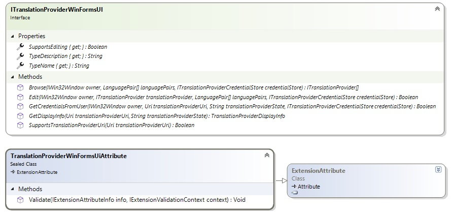

# Creating the Translation Provider UI Extension

This section explains how to create a translation provider UI extension. It lets Var:ProductName browse for translation providers, edit provider settings, display providers consistently, and prompt users for credentials.

## Overview

The translation provider UI extension is a plug-in framework component that lets Var:ProductName browse for translation providers, edit provider settings, display providers in a consistent way, and prompt users for credentials.

The UI extension is optional in some scenarios. A full Var:ProductName translation provider implementation requires a UI extension, but a server-only scenario can implement only a translation provider factory.

The UI extension must implement the [ITranslationProviderWinFormsUI](../../api/translationmemory/Sdl.LanguagePlatform.TranslationMemoryApi.ITranslationProviderWinFormsUI.yml) interface.

## Registering the Extension

To make the UI extension available to host applications such as Var:ProductName, mark it with a [TranslationProviderWinFormsUiAttribute](../../api/translationmemory/Sdl.LanguagePlatform.TranslationMemoryApi.TranslationProviderWinFormsUiAttribute.yml). The plug-in framework extracts this extension attribute into the plug-in manifest.

The Name, Description, and Icon values provide information only. Var:ProductName does not use them at this time.

## Browsing for Translation Providers

One responsibility of the UI extension is to let users select translation providers through the user interface. Var:ProductName calls the [Browse](../../api/translationmemory/Sdl.LanguagePlatform.TranslationMemoryApi.ITranslationProviderWinFormsUI.yml#Sdl_LanguagePlatform_TranslationMemoryApi_ITranslationProviderWinFormsUI_Browse_System_Windows_Forms_IWin32Window_Sdl_LanguagePlatform_Core_LanguagePair___Sdl_LanguagePlatform_TranslationMemoryApi_ITranslationProviderCredentialStore_) method when the user selects the corresponding *"Use... -> Translation provider X..."* menu item in the translation providers list.

## Editing Translation Provider Settings

After a user adds a translation provider to the translation providers list in Var:ProductName, the UI extension can let the user change its properties or settings. If the [SupportsEditing](../../api/translationmemory/Sdl.LanguagePlatform.TranslationMemoryApi.ITranslationProviderWinFormsUI.yml#Sdl_LanguagePlatform_TranslationMemoryApi_ITranslationProviderWinFormsUI_SupportsEditing) property returns True, Var:ProductName shows a *"Settings..."* button when the user selects a provider that the UI extension supports. When the user clicks the button, Var:ProductName calls the [Edit](../../api/translationmemory/Sdl.LanguagePlatform.TranslationMemoryApi.ITranslationProviderWinFormsUI.yml#Sdl_LanguagePlatform_TranslationMemoryApi_ITranslationProviderWinFormsUI_Edit_System_Windows_Forms_IWin32Window_Sdl_LanguagePlatform_TranslationMemoryApi_ITranslationProvider_Sdl_LanguagePlatform_Core_LanguagePair___Sdl_LanguagePlatform_TranslationMemoryApi_ITranslationProviderCredentialStore_) method.

## Displaying Translation Providers

Var:ProductName persists the translation provider list by storing the URI and state information. To display providers in the user interface, Var:ProductName does not necessarily instantiate each provider. For that reason, the UI extension must also supply display information for a translation provider URI and state. This approach lets the UI extension generate display data without instantiating the provider itself, which might otherwise require connecting to a server.

## Prompting for User Credentials

The final responsibility of the UI extension is to ask users for credentials when needed. Var:ProductName does not necessarily persist credentials stored in the credential store ([ITranslationProviderCredentialStore](../../api/translationmemory/Sdl.LanguagePlatform.TranslationMemoryApi.ITranslationProviderCredentialStore.yml)), so it may need to prompt users for credentials. To do that, Var:ProductName calls the appropriate UI extension, which can show a logon user interface for the translation provider and then add the credentials to the translation provider credential store. The factory can then use those credentials to create the translation provider and perform authentication.

## See Also

[Controlling the Plug-in User Interface](controlling_the_plugin_user_interface.md)
