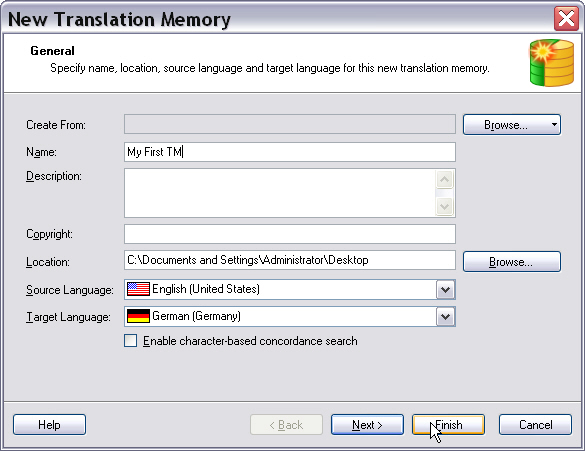
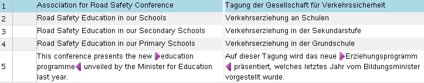

## Creating Translation Memories
Translation memories (TMs) store bilingual content as source and target sentence pairs, called translation units (TUs). When users translate a sentence that already exists in the TM, they can retrieve the translation and avoid translating the same content twice. TMs identify identical sentences (exact matches) and similar sentences (fuzzy matches). In TM contexts, users often call a sentence a *segment*.

In addition to linguistic content, TMs store formatting details (for example, bold, italics, and underline) and segment context information, such as whether a segment appears in a headline, paragraph, footnote, or table cell.

Users of Var:ProductName can create TMs in the application by using a wizard.

When creating a TM, users provide a name, which also becomes the file name. File-based TMs use the *.sdltm extension and run on SQLite. Users can also add an optional description and copyright statement. Each TM requires a source language and a target language that define the translation direction.

The following image shows TM content in a side-by-side view in Var:ProductName.

Server-based TMs are stored in a database system such as Microsoft SQL Server. They include multiple tables stored in a container database on the backend. Only users with the required credentials can create server TMs. To create a server TM, provide the server URI, container database, and TM name.

File-based TMs currently support only one language direction, for example *English* to *German*. Server TMs can support multiple language directions, which end users can select as needed.

## See Also
[Creating a File-based Translation Memory](creating_a_file_based_translation_memory.md)

[Setting and Retrieving TM Properties](setting_and_retrieving_tm_properties.md)