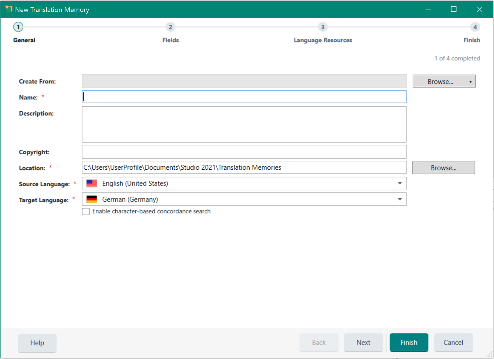

Creating Translation Memories
====
Translation memories (TMs) are databases that store bilingual content as source and target sentence pairs. These sentence pairs are called translation units (TUs). When a user needs to translate a sentence that is already stored in the TM, the translation can be retrieved from the TM database. That way, the same sentence does not have to be translated twice. A TM recognizes identical sentences (exact matches) and similar sentences (fuzzy matches). Note that instead of sentence usually the term segment is used in the context of TMs.

Apart from the linguistic content, TMs also store formatting information (e.g. bold, italics, underline) as well as the information on whether a given segment occurred in a headline, paragraph, footnote, table cell, etc.

Users of <Var:ProductName> can create TMs from the application using a wizard.

When creating a TM users need to provide a name, which is also the file name. File-based TMs have the extension *.sdltm, and are based on SQLite. In addition, users can provide an optional description and a copyright statement. A TM needs to have source and a target language, i.e. the language that this TM is used to translate from, and the language that the TM is used to translate into.

Below you see an example of what the content of a TM looks like in a side-by-side view in <Var:ProductName>.

Server-based TMs are stored in a database system such as Microsoft SQL Server. Server TMs are comprised of a number of tables that are stored within a so-called container database, which resides on the database backend. Creating server TMs is only possible for users with the required credentials. When creating a server TM, the server URI, as well as the container database and the TM name needs to be provided as parameters.

File-based TMs can currently only have one language direction, e.g. *English* to *German*. However, server TMs can be created with multiple language directions, which can later be selected by the end user on the fly.

See Also
------
[Creating a File-based Translation Memory](creating_a_file_based_translation_memory.md)

[Setting and Retrieving TM Properties](setting_and_retrieving_tm_properties.md)

[Creating a Server Translation Memory](creating_a_server_translation_memory.md)