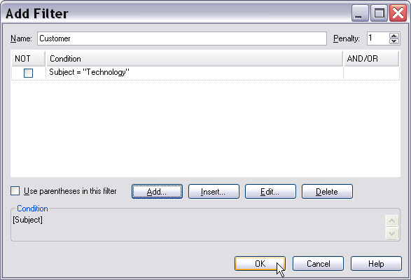
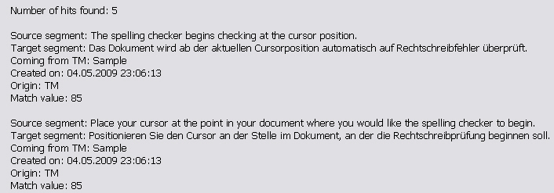

# Doing Translation Memory Lookups

The most common TM operations involve looking up whole segments or searching for single words and expressions with a concordance search. This chapter explains how to perform TM lookups programmatically. The goal is to build a simple application that searches a selected TM for a specific string. You can configure the application to run either a normal segment search or a concordance search.

## Add a New Class

Add a new class named `TmLookup` to your project. Then implement a method named `SearchForText()` that takes the TM path, the search text, and the search mode as parameters. Call it as shown below:

# [C#](#tab/tabid-1)
```cs
var search = new TmLookup();
search.SearchForText(_translationMemoryFilePath, "To run the Spelling Checker:", SearchMode.NormalSearch);
```
***

## Execute the Search and Configure the Search Settings

After you open the TM, run the search by calling the [SearchText](../../api/translationmemory/Sdl.LanguagePlatform.TranslationMemoryApi.AbstractMachineTranslationProviderLanguageDirection.yml#Sdl_LanguagePlatform_TranslationMemoryApi_AbstractMachineTranslationProviderLanguageDirection_SearchText_Sdl_LanguagePlatform_TranslationMemory_SearchSettings_System_String_) method on the TM language direction. This returns a results object that contains the search results, if any.

# [C#](#tab/tabid-2)
```cs
var tm = new FileBasedTranslationMemory(tmPath);
var results = tm.LanguageDirection.SearchText(this.GetSearchSettings(mode), searchText);
```
***

The [SearchText](../../api/translationmemory/Sdl.LanguagePlatform.TranslationMemoryApi.AbstractMachineTranslationProviderLanguageDirection.yml#Sdl_LanguagePlatform_TranslationMemoryApi_AbstractMachineTranslationProviderLanguageDirection_SearchText_Sdl_LanguagePlatform_TranslationMemory_SearchSettings_System_String_) method requires the search text and the search settings as parameters. Configure the search settings in a separate helper method:

# [C#](#tab/tabid-3)
```cs
private SearchSettings GetSearchSettings(SearchMode mode)
{
    var settings = new SearchSettings();

    settings.MaxResults = 5;
    settings.MinScore = 70;
    settings.Mode = mode;
    settings.FindPenalty(PenaltyType.FilterPenalty);

    return settings;
}
```
***

Here, you can set the minimum fuzziness score (**MinScore**) that a TU must reach before it can appear in the results. Var:ProductName uses a default minimum fuzziness value of 70%. You can choose a higher value to restrict the search to higher-quality matches. You can also limit the maximum number of results that are returned (**MaxResults**).

Var:ProductName uses a default maximum results count of 5. This means that if the TM contains 10 potential matches, only the first five best matches are returned. Setting the minimum fuzziness score and the maximum number of results can affect search performance. The more results the search must consider, the longer it may take. It usually takes longer to retrieve a low fuzzy match, such as 60%, than an exact match or a high fuzzy match.

Another parameter in this implementation is the search mode. You can use it to run a concordance search, which returns all segments that contain a specific string. You can run a concordance search in the source or target segment if you configured the TM to index the target segments during creation ([Creating a File-based Translation Memory](creating_a_file_based_translation_memory.md)). You can also set the mode to perform a segment lookup by using the values of the **SearchMode** enumerator. By default, Var:ProductName performs a **NormalSearch**. This means that fuzzy matches are returned only if no exact or context match was found. **FullSearch** also returns fuzzy matches even when an exact match exists. In most cases, translators insert the exact matches into the target document. In rare cases, a fuzzy match may be more useful. Retrieving fuzzy matches even when exact matches exist can also affect lookup performance.

## Run a Filtered Search

Var:ProductName lets you define one or more filter criteria for a TM search. For example, you can focus on TUs associated with the customer *Microsoft*, where the *Customer* field contains the value *Microsoft*. TUs that do not match the filter can still appear in the results, but the search applies a penalty to them. For example, if a TU matches a segment exactly and scores 100%, a 1% penalty reduces the score to 99%. This helps signal that the suggested translation might not fit the current context.

The following screenshot shows a filter that applies a 1% penalty to any TUs not created by *User1*:



To apply a filter to your search, extend the `GetSearchSettings()` helper method by adding these lines:

# [C#](#tab/tabid-4)
```cs
var filter = new Filter(this.GetFilter(), "Microsoft", 1);
settings.AddFilter(filter);
```
***

First, create a new filter object by calling a helper method named `GetFilter()`, which defines the filter expression. Then provide a descriptive filter name and the penalty value. Finally, add the filter to the settings object by using the **AddFilter** method.

Next, add the helper method that returns the **FilterExpression** object. In this example, the search should focus on TUs where the *Customer* field equals *Microsoft*. Because *Customer* is a picklist field that allows multiple values, the following sample code shows how to set the field name and value and build the filter criterion:

# [C#](#tab/tabid-5)
```cs
var fieldName = new PicklistItem("Customer");
var fieldValue = new MultiplePicklistFieldValue("Microsoft");
fieldValue.Add(fieldName);
```
***

Next, use the **AtomicExpression** class to create the filter expression that the search settings method returns. Pass the field value and the operator. In this case, the filter uses **Equal**. Other possible values include **Contains**, **Greater**, and **Smaller**.

# [C#](#tab/tabid-6)
```cs
var filter = new AtomicExpression(fieldValue, AtomicExpression.Operator.Equal);
return filter;
```
***

The full helper method for returning the filter expression looks like this:

# [C#](#tab/tabid-7)
```cs
private FilterExpression GetFilter()
{
    #region "SimpleCriterion"
    var fieldName = new PicklistItem("Customer");
    var fieldValue = new MultiplePicklistFieldValue("Microsoft");
    fieldValue.Add(fieldName);
    #endregion

    #region "SimpleFilter"
    var filter = new AtomicExpression(fieldValue, AtomicExpression.Operator.Equal);
    return filter;
    #endregion
}
```
***

>[!NOTE]
>
>Filter names must not contain spaces.

## Output the Search Results

After you execute the search, output the results, if any. In this simple implementation, use a message box that includes:

* The hit count.
* The source and target segments of the matching TUs.
* The match score, so users can quickly judge the match quality.
* The origin. In this example, the origin is **TM** because the search runs against a TM. If translators also use other translation providers, such as online machine translation engines, the origin may be different.
* The TU creation date, which helps users see how current a TU is.

The following code loops through the search results and compiles a string with the information above.

# [C#](#tab/tabid-8)
```cs
string hitList = "Number of hits found: " + results.Count.ToString() + "\n\n";

foreach (SearchResult result in results)
{
    hitList += "Source segment: " + result.MemoryTranslationUnit.SourceSegment.ToPlain() + "\n";
    hitList += "Target segment: " + result.MemoryTranslationUnit.TargetSegment.ToPlain() + "\n";
    hitList += "Created on: " + result.MemoryTranslationUnit.SystemFields.CreationDate.ToString() + "\n";
    hitList += "Origin: " + result.MemoryTranslationUnit.Origin.ToString() + "\n";
    hitList += "Match value: " + result.ScoringResult.Match.ToString() + "\n\n";
}

MessageBox.Show(hitList);
```
***

The following screenshot shows an example of the result in the message box:



## Search for Segment or TU

In the example above, you passed a plain string to the [SearchText](../../api/translationmemory/Sdl.LanguagePlatform.TranslationMemoryApi.AbstractMachineTranslationProviderLanguageDirection.yml#Sdl_LanguagePlatform_TranslationMemoryApi_AbstractMachineTranslationProviderLanguageDirection_SearchText_Sdl_LanguagePlatform_TranslationMemory_SearchSettings_System_String_) method. Alternatively, you can search for a segment or TU object by using [SearchSegment](../../api/translationmemory/Sdl.LanguagePlatform.TranslationMemoryApi.ITranslationProviderLanguageDirection.yml#Sdl_LanguagePlatform_TranslationMemoryApi_ITranslationProviderLanguageDirection_SearchSegment_Sdl_LanguagePlatform_TranslationMemory_SearchSettings_Sdl_LanguagePlatform_Core_Segment_) or [SearchTranslationUnit](../../api/translationmemory/Sdl.LanguagePlatform.TranslationMemoryApi.ITranslationProviderLanguageDirection.yml#Sdl_LanguagePlatform_TranslationMemoryApi_ITranslationProviderLanguageDirection_SearchTranslationUnit_Sdl_LanguagePlatform_TranslationMemory_SearchSettings_Sdl_LanguagePlatform_TranslationMemory_TranslationUnit_). The following sample method shows how to create and use a **Segment** object for a TM search:

# [C#](#tab/tabid-9)
```cs
public void SearchForSegment(string tmPath)
{
    var tm = new FileBasedTranslationMemory(tmPath);
    var settings = new SearchSettings();
    settings.MaxResults = 5;

    var srcSegment = new Segment(tm.LanguageDirection.SourceLanguage);
    srcSegment.Add("Configure the spelling checker as shown below:");
    SearchResults results = tm.LanguageDirection.SearchSegment(settings, srcSegment);

    foreach (SearchResult result in results)
    {
        MessageBox.Show(result.TranslationProposal.TargetSegment.ToPlain());
    }
}
```
***

The following sample method shows how to create and use a **TranslationUnit** object for a TM search:

# [C#](#tab/tabid-10)
```cs
public void SearchForTu(string tmPath)
{
    var tm = new FileBasedTranslationMemory(tmPath);
    var settings = new SearchSettings();
    settings.MaxResults = 5;

    var tu = new TranslationUnit();
    tu.SourceSegment = new Segment(tm.LanguageDirection.SourceLanguage);
    tu.TargetSegment = new Segment(tm.LanguageDirection.TargetLanguage);

    tu.SourceSegment.Add("Configure the spelling checker as shown below:");
    tu.TargetSegment.Add("Konfigurieren Sie die Rechtschreibprüfung wie unten gezeigt:");

    SearchResults results = tm.LanguageDirection.SearchTranslationUnit(settings, tu);

    foreach (SearchResult result in results)
    {
        MessageBox.Show(result.TranslationProposal.TargetSegment.ToPlain());
    }
}
```
***

## Putting it All Together

The complete class should now look like this:

# [C#](#tab/tabid-11)
```cs
namespace SDK.LanguagePlatform.Samples.TmAutomation
{
    using System.Windows.Forms;
    using Sdl.LanguagePlatform.Core;
    using Sdl.LanguagePlatform.TranslationMemory;
    using Sdl.LanguagePlatform.TranslationMemoryApi;

    public class TmLookup
    {
        #region "searchTU"
        public void SearchForText(string tmPath, string searchText, SearchMode mode)
        {
            #region "ExecuteSearch"
            var tm = new FileBasedTranslationMemory(tmPath);
            SearchResults results = tm.LanguageDirection.SearchText(this.GetSearchSettings(mode), searchText);
            #endregion

            #region "histlist"
            string hitList = "Number of hits found: " + results.Count.ToString() + "\n\n";

            foreach (SearchResult result in results)
            {
                hitList += "Source segment: " + result.MemoryTranslationUnit.SourceSegment.ToPlain() + "\n";
                hitList += "Target segment: " + result.MemoryTranslationUnit.TargetSegment.ToPlain() + "\n";
                hitList += "Created on: " + result.MemoryTranslationUnit.SystemFields.CreationDate.ToString() + "\n";
                hitList += "Origin: " + result.MemoryTranslationUnit.Origin.ToString() + "\n";
                hitList += "Match value: " + result.ScoringResult.Match.ToString() + "\n\n";
            }

            MessageBox.Show(hitList);
            #endregion
        }
        #endregion

        #region "settings"
        private SearchSettings GetSearchSettings(SearchMode mode)
        {
            var settings = new SearchSettings();

            settings.MaxResults = 5;
            settings.MinScore = 70;
            settings.Mode = mode;
            settings.FindPenalty(PenaltyType.FilterPenalty);

            return settings;
        }
        #endregion

        #region "SettingsWithFilter"
        private SearchSettings GetSearchSettingsWithFilter(SearchMode mode)
        {
            var settings = new SearchSettings();

            settings.MaxResults = 5;
            settings.MinScore = 70;
            settings.Mode = mode;

            #region "SettingFilter"
            Filter filter = new Filter(this.GetFilter(), "Microsoft", 1);
            settings.AddFilter(filter);
            #endregion

            return settings;
        }
        #endregion

        #region "GetFilter"
        private FilterExpression GetFilter()
        {
            #region "SimpleCriterion"
            var fieldName = new PicklistItem("Customer");
            var fieldValue = new MultiplePicklistFieldValue("Microsoft");
            fieldValue.Add(fieldName);
            #endregion

            #region "SimpleFilter"
            var filter = new AtomicExpression(fieldValue, AtomicExpression.Operator.Equal);
            return filter;
            #endregion
        }
        #endregion

        #region "SearchForSegment"
        public void SearchForSegment(string tmPath)
        {
            var tm = new FileBasedTranslationMemory(tmPath);
            var settings = new SearchSettings();
            settings.MaxResults = 5;

            var srcSegment = new Segment(tm.LanguageDirection.SourceLanguage);
            srcSegment.Add("Configure the spelling checker as shown below:");
            SearchResults results = tm.LanguageDirection.SearchSegment(settings, srcSegment);

            foreach (SearchResult result in results)
            {
                MessageBox.Show(result.TranslationProposal.TargetSegment.ToPlain());
            }
        }
        #endregion

        #region "SearchForTu"
        public void SearchForTu(string tmPath)
        {
            var tm = new FileBasedTranslationMemory(tmPath);
            var settings = new SearchSettings();
            settings.MaxResults = 5;

            var tu = new TranslationUnit();
            tu.SourceSegment = new Segment(tm.LanguageDirection.SourceLanguage);
            tu.TargetSegment = new Segment(tm.LanguageDirection.TargetLanguage);

            tu.SourceSegment.Add("Configure the spelling checker as shown below:");
            tu.TargetSegment.Add("Konfigurieren Sie die Rechtschreibprüfung wie unten gezeigt:");

            SearchResults results = tm.LanguageDirection.SearchTranslationUnit(settings, tu);

            foreach (SearchResult result in results)
            {
                MessageBox.Show(result.TranslationProposal.TargetSegment.ToPlain());
            }
        }
        #endregion
    }
}
```
***

## See Also
[Performing Translation Memory Lookups](performing_translation_memory_lookups.md)

[Introduction to the TM Lookup Tool](introduction_to_the_tm_lookup_tool.md)

[Exporting to a TMX File](exporting_to_a_tmx_file.md)

[Updating Translation Memories](updating_translation_memories.md)
