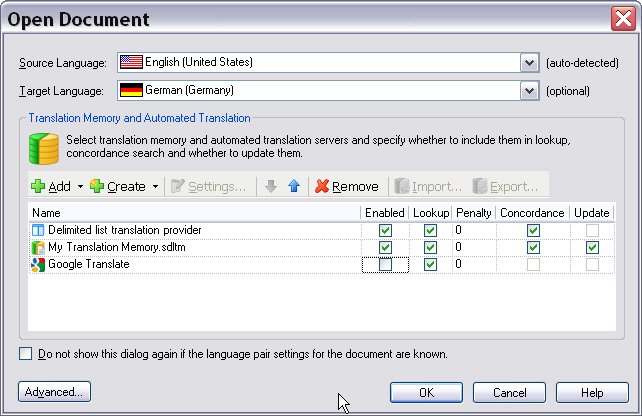
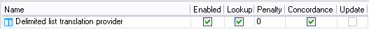

# Enabling the Required Translation Provider Features

Not all features that translation memories typically support make sense for every translation provider. For example, a machine translation provider usually does not offer concordance search, and it is not updated during translation. This sample plug-in should support segment lookup and concordance search in the source and target language. However, the delimited list that contains translation solutions should not be updated, so the list remains read-only while it is in use.

## Implement the Class for Enabling the Provider Features

In the project template, the class that controls which features the plug-in supports is named `MyTranslationProvider`. For this sample provider, rename the class to `ListTranslationProvider`.

This class implements the [ITranslationProvider](../../api/translationmemory/Sdl.LanguagePlatform.TranslationMemoryApi.ITranslationProvider.yml) interface, which actually forms the main part of a custom translation provider plug-in implementation.

This interface includes members such as [SupportsConcordanceSearch](../../api/translationmemory/Sdl.LanguagePlatform.TranslationMemoryApi.ITranslationProvider.yml#Sdl_LanguagePlatform_TranslationMemoryApi_ITranslationProvider_SupportsConcordanceSearch), which you can set to return `True` or `False` depending on whether your implementation supports concordance search.

If you set [SupportsConcordanceSearch](../../api/translationmemory/Sdl.LanguagePlatform.TranslationMemoryApi.ITranslationProvider.yml#Sdl_LanguagePlatform_TranslationMemoryApi_ITranslationProvider_SupportsConcordanceSearch) to `True`, Var:ProductName enables the **Concordance** check box for the selected provider. This sample implementation should do that. Users can clear the option at run time if they do not want the provider included in a concordance search. For example, a user might find that the concordance matches from one provider are not useful for a project and decide to rely on another provider instead.

The screenshot below shows an example in which a file TM has been selected for lookup, concordance, and updating. This sample provider is enabled only for lookup and concordance search.



This chapter does not describe every member of the interface. It focuses on the members relevant to this implementation.

* **Concordance search**: Because this implementation supports concordance search, the [SupportsConcordanceSearch](../../api/translationmemory/Sdl.LanguagePlatform.TranslationMemoryApi.ITranslationProvider.yml#Sdl_LanguagePlatform_TranslationMemoryApi_ITranslationProvider_SupportsConcordanceSearch) member returns `True`:
    # [C#](#tab/tabid-1)
    ```cs
    public bool SupportsConcordanceSearch
    {
        get { return true; }
    }
    ```
    ***

* **Source and target concordance search**: Concordance search can be divided into source-language and target-language search. Because this implementation supports both, the following members also return `True`:
    
    ```cs
    public bool SupportsSourceConcordanceSearch
    {
        get { return true; }
    }

    public bool SupportsTargetConcordanceSearch
    {
        get { return true; }
    }
    ```
    
* **Translation unit search**: This implementation supports matching translation units to segments in the source document. Therefore, [SupportsSearchForTranslationUnits](../../api/translationmemory/Sdl.LanguagePlatform.TranslationMemoryApi.ITranslationProvider.yml#Sdl_LanguagePlatform_TranslationMemoryApi_ITranslationProvider_SupportsSearchForTranslationUnits) returns `True`. In this implementation, a translation unit corresponds to a delimited line in the list file.
   
    ```cs
    public bool SupportsSearchForTranslationUnits
    {
        get { return true; }
    }
    ```

## Examples of Features that the Sample Implementation Does Not Support

The following examples show members of the [ITranslationProvider](../../api/translationmemory/Sdl.LanguagePlatform.TranslationMemoryApi.ITranslationProvider.yml) interface that you might need in other implementations but that this simple delimited list provider does not use.

Because this sample plug-in looks up and returns plain text only, it does not support tagged input. Set the [SupportsTaggedInput](../../api/translationmemory/Sdl.LanguagePlatform.TranslationMemoryApi.ITranslationProvider.yml#Sdl_LanguagePlatform_TranslationMemoryApi_ITranslationProvider_SupportsTaggedInput) property to return `False`:
# [C#](#tab/tabid-2)
```cs
public bool SupportsTaggedInput
{
    get { return false; }
}
```
***

The delimited lists are also read-only. For that reason, set [SupportsUpdate](../../api/translationmemory/Sdl.LanguagePlatform.TranslationMemoryApi.ITranslationProvider.yml#Sdl_LanguagePlatform_TranslationMemoryApi_ITranslationProvider_SupportsUpdate) to return `False`:

# [C#](#tab/tabid-3)
```cs
public bool SupportsUpdate
{
    get { return false; }
}
```
***

Returning `False` directly affects the Var:ProductName user interface because it disables the **Update** check box, as shown below:



This plug-in component also determines whether the selected translation provider list supports the selected language combination. The next chapter explains this in more detail; see [Verifying the Language Pair Support](verifying_the_language_pair_support.md).
