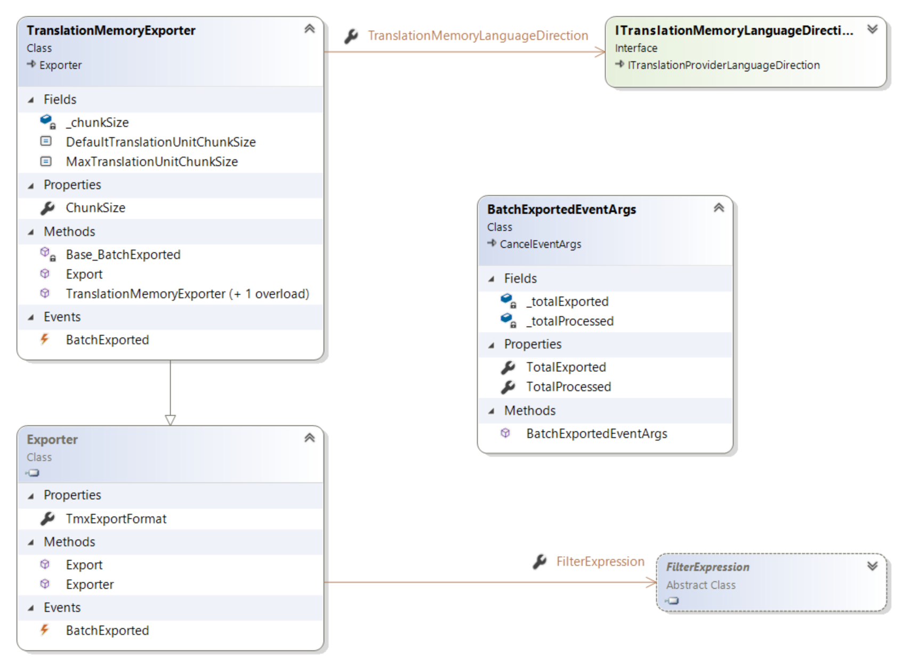

Exporting Content from a Translation Memory
======
This section describes how to export content from a translation memory.

Export
-----
Any translation memory allows exporting translation units to a bilingual TMX file.

The export functionality is exposed by the [TranslationMemoryExporter](../../api/translationmemory/Sdl.LanguagePlatform.TranslationMemoryApi.TranslationMemoryExporter.yml) class. In order to export content from a translation memory, create a [TranslationMemoryExporter](../../api/translationmemory/Sdl.LanguagePlatform.TranslationMemoryApi.TranslationMemoryExporter.yml) object and specify the [ITranslationMemoryLanguageDirection](../../api/translationmemory/Sdl.LanguagePlatform.TranslationMemoryApi.ITranslationMemoryLanguageDirection.yml) to export from and the TMX file to export into. Optionally specify a filter ([FilterExpression](../../api/translationmemory/Sdl.LanguagePlatform.TranslationMemory.FilterExpression.yml), see [Working with Filters](working_with_filters.md)) and subsequently call [Export](../../api/translationmemory/Sdl.LanguagePlatform.TranslationMemoryApi.TranslationMemoryExporter.yml#Sdl_LanguagePlatform_TranslationMemoryApi_TranslationMemoryExporter_Export_System_String_System_Boolean_).

The [BatchExported](../../api/translationmemory/Sdl.Core.TM.ImportExport.Exporter.yml#Sdl_Core_TM_ImportExport_Exporter_BatchExported) event is raised repeatedly during export (after evey batch of translation units has been exported, see [ChunkSize](../../api/translationmemory/Sdl.LanguagePlatform.TranslationMemoryApi.TranslationMemoryExporter.yml#Sdl_LanguagePlatform_TranslationMemoryApi_TranslationMemoryExporter_ChunkSize)). The export can be canceled.

See Also
------------
[Exporting to a TMX File](exporting_to_a_tmx_file.md)

[Introduction](working_with_translation_memories.md)

[Performing a Scheduled Import or Export](performing_a_scheduled_import_or_export.md)