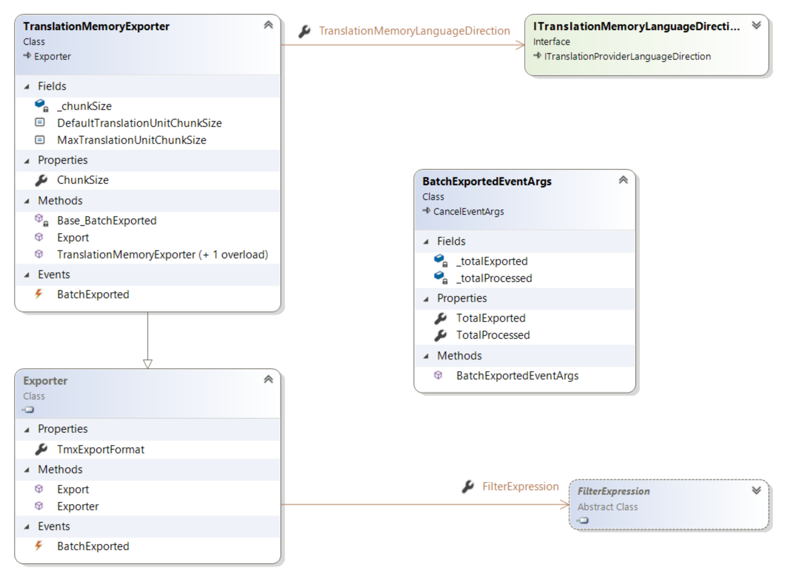

# Exporting Content from a Translation Memory

This section explains how to export content from a translation memory.

## Export

You can export translation units from any translation memory to a bilingual TMX file.

The export functionality is exposed by the [TranslationMemoryExporter](../../api/translationmemory/Sdl.LanguagePlatform.TranslationMemoryApi.TranslationMemoryExporter.yml) class. To export content from a translation memory, create a [TranslationMemoryExporter](../../api/translationmemory/Sdl.LanguagePlatform.TranslationMemoryApi.TranslationMemoryExporter.yml) object, specify the [ITranslationMemoryLanguageDirection](../../api/translationmemory/Sdl.LanguagePlatform.TranslationMemoryApi.ITranslationMemoryLanguageDirection.yml) to export from and the TMX file to export into, optionally specify a filter ([FilterExpression](../../api/translationmemory/Sdl.LanguagePlatform.TranslationMemory.FilterExpression.yml); see [Working with Filters](working_with_filters.md)), and then call [Export](../../api/translationmemory/Sdl.LanguagePlatform.TranslationMemoryApi.TranslationMemoryExporter.yml#Sdl_LanguagePlatform_TranslationMemoryApi_TranslationMemoryExporter_Export_System_String_System_Boolean_) method.

The [BatchExported](../../api/translationmemory/Sdl.Core.TM.ImportExport.Exporter.yml#Sdl_Core_TM_ImportExport_Exporter_BatchExported) event is raised repeatedly during export, after each batch of translation units has been exported. See [ChunkSize](../../api/translationmemory/Sdl.LanguagePlatform.TranslationMemoryApi.TranslationMemoryExporter.yml#Sdl_LanguagePlatform_TranslationMemoryApi_TranslationMemoryExporter_ChunkSize). You can cancel the export at any time.

## See also

* [Exporting to a TMX File](exporting_to_a_tmx_file.md)

* [Introduction](working_with_translation_memories.md)
