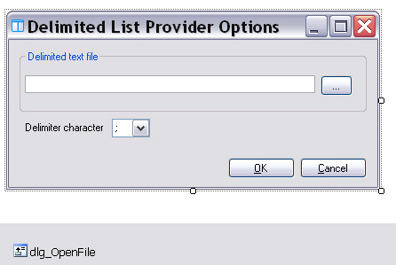

# Implementing the Plug-in User Interface

The plug-in user interface must let users select the delimited list text file and specify the delimiter character at run time.

Add a form named `ListProviderConfDialog` to your project. This form is not part of the project template, and it should include the following controls:

* **txt_ListFile**: text box for entering the list file name and path.
* **combo_Delimiter**: combo box for selecting the delimiter character. Add the following items: ; : = \t.
* **btn_Browse**: button for opening the file selection dialog.
* **dlg_OpenFile**: dialog for selecting the list file. Leave the `FileName` property empty, and set the `Filter` property to *List text files (*.txt)|(*.txt)*.
* **btn_Cancel**: button for closing the form without applying changes.
* **btn_OK**: button for closing the form and applying changes.



## Implement the User Interface Functionality

Use the following steps to implement the basic user interface behavior:

* **Selecting the delimited text file**: The `btn_Browse` button should open the **Open File** dialog and place the selected file name in `txt_ListFile`:
# [C#](#tab/tabid-1)
```cs
private void btn_Browse_Click(object sender, EventArgs e)
{
    this.dlg_OpenFile.ShowDialog();
    string fileName = dlg_OpenFile.FileName;

    if (fileName != "")
    {
        txt_ListFile.Text = fileName;
    }
}
```
***

* **Applying the settings**: The `btn_OK` button should close the form and apply the plug-in settings, including the text file name and path and the delimiter character.
  
# [C#](#tab/tabid-2)
```cs
private void bnt_OK_Click(object sender, EventArgs e)
{
    Options.Delimiter = this.combo_delimiter.Text;
    Options.ListFileName = this.txt_ListFile.Text;
}
```
***
> [!NOTE]
>
> The form should also configure the plug-in settings. To do that, you must implement the separate `ListTranslationOptions` class, which the next chapter covers. See [Storing and Retrieving the Plug-in Settings](storing_and_retrieving_the_plugin_settings.md).

# See Also
[Controlling the Plug-in User Interface](controlling_the_plugin_user_interface.md)

[Storing and Retrieving the Plug-in Settings](storing_and_retrieving_the_plugin_settings.md)
