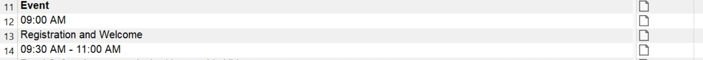
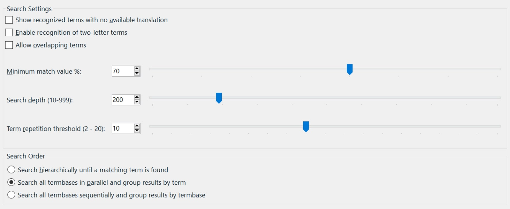
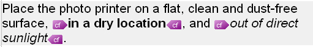
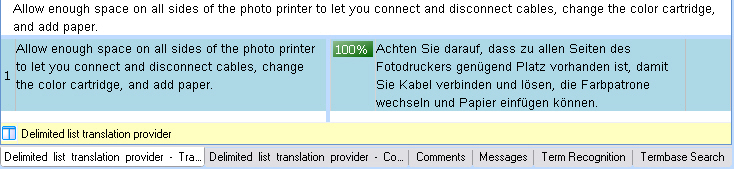
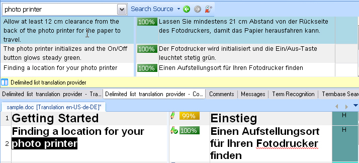
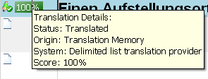
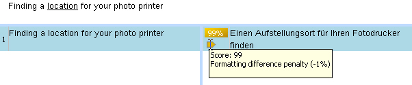

## Implementing the Search Logic

The search functionality lives in a separate component. The plug-in template includes a class named `MyTranslationProviderLanguageDirection`, which we rename to `ListTranslationProviderLanguageDirection` in this sample. This class implements `ITranslationProviderLanguageDirection`, which exposes many members. Here, we focus on the members required for the search functionality. We do not need the members for adding or updating translation units.

## Implement the Private Class Members

The class that contains the search logic needs access to the plug-in options, including the list file path, file name, and delimiter. Create an object based on the `ListTranslationOptions` class (see [Storing and Retrieving the Plug-in Settings](storing_and_retrieving_the_plugin_settings.md)).

The `ListTranslationProviderElementVisitor` helper class, which we implement in the next chapter (see [Implementing the Element Visitor](implementing_the_element_visitor.md)), extracts the plain segment text required for searches in the delimited list.

Declare a `_listOfTranslations` object based on `Dictionary<string, string>`. Later, we load the contents of the delimited list file into this object. At the beginning of the class, declare the following private members:
# [C#](#tab/tabid-1)
```cs
private ListTranslationProvider _provider;
private LanguagePair _languageDirection;
private ListTranslationOptions _options;
private ListTranslationProviderElementVisitor _visitor;
private Dictionary<string, string> _listOfTranslations;
```
***

Instantiate these members in the `ListTranslationProviderLanguageDirection` constructor, which also creates the `_listOfTranslations` object to store the segment pairs:
# [C#](#tab/tabid-2)
```cs
_provider = provider;
_languageDirection = languages;
_options = _provider.Options;
_visitor = new ListTranslationProviderElementVisitor(_options);
_listOfTranslations = new Dictionary<string, string>();
```
***

Next, open the list file. The plug-in options provide both the file path and the delimiter character. The first line contains the language direction and should not be added to the collection, so read and skip that line before processing the segment pairs.

Inside the loop, split each line into a source and target segment. If the split succeeds, add the pair to the collection.
# [C#](#tab/tabid-3)
```cs
// Load the content of the specified list file and fill it
// into the multiple identical sources are not allowed
using (StreamReader sourceFile = new StreamReader(_options.ListFileName))
{   
    sourceFile.ReadLine(); // Skip the first line as it contains the language direction.

    char fileDelimiter = Convert.ToChar(_options.Delimiter);
    while (!sourceFile.EndOfStream)
    {
        string[] currentPair = sourceFile.ReadLine().Split(fileDelimiter);
        if (currentPair.Count<string>() != 2)
        { 
            // The current line does not contain a proper source/target segment pair.
            continue;
        }

        // Add the source/target segment pair to the collection
        // after checking that the current source segment does not
        // already exist in the Dictionary.
        if (!_listOfTranslations.ContainsKey(currentPair[0]))
        { 
            _listOfTranslations.Add(currentPair[0] ,currentPair[1]);
        }
    }
    sourceFile.Close();
}
```
***
The complete constructor should now look like this:
# [C#](#tab/tabid-4)
```cs
public ListTranslationProviderLanguageDirection(ListTranslationProvider provider, LanguagePair languages)
{    
    _provider = provider;
    _languageDirection = languages;
    _options = _provider.Options;
    _visitor = new ListTranslationProviderElementVisitor(_options);
    _listOfTranslations = new Dictionary<string, string>();
 
    // Load the content of the specified list file and fill it
    // into the multiple identical sources are not allowed
    using (StreamReader sourceFile = new StreamReader(_options.ListFileName))
    {   
        sourceFile.ReadLine(); // Skip the first line as it contains the language direction.

        char fileDelimiter = Convert.ToChar(_options.Delimiter);
        while (!sourceFile.EndOfStream)
        {
            string[] currentPair = sourceFile.ReadLine().Split(fileDelimiter);
            if (currentPair.Count<string>() != 2)
            { 
                // The current line does not contain a proper source/target segment pair.
                continue;
            }

            // Add the source/target segment pair to the collection
            // after checking that the current source segment does not
            // already exist in the Dictionary.
            if (!_listOfTranslations.ContainsKey(currentPair[0]))
            { 
                _listOfTranslations.Add(currentPair[0] ,currentPair[1]);
            }
        }
        sourceFile.Close();
    }
}
```
***

## Search the Current Segment

By default, Var:ProductName triggers a segment lookup when the user moves the cursor into a target cell. The application then searches the selected translation provider for a match to the current source segment. The screenshot below shows two source segments in the editor and the empty target cells beside them:



When the user moves into a target cell, Var:ProductName invokes the [SearchSegment](../../api/translationmemory/Sdl.LanguagePlatform.TranslationMemoryApi.ITranslationProviderLanguageDirection.yml#Sdl_LanguagePlatform_TranslationMemoryApi_ITranslationProviderLanguageDirection_SearchSegment_Sdl_LanguagePlatform_TranslationMemory_SearchSettings_Sdl_LanguagePlatform_Core_Segment_) method on the [ITranslationProviderLanguageDirection](../../api/translationmemory/Sdl.LanguagePlatform.TranslationMemoryApi.ITranslationProviderLanguageDirection.yml) interface. The method accepts the current segment and the search settings as parameters. Search settings include values such as the maximum number of matches to return. Users configure these settings at runtime. For example, if a user limits concordance matches to 5, your provider must return no more than 5 hits. You do not need to implement the settings logic yourself.

> [!NOTE]
> 
> Depending on your translation provider, some search settings in Var:ProductName may not apply to your implementation. For example, this provider supports only exact matches, so the **Minimum match value** setting is not relevant for the delimited list provider.

This implementation supports plain-text searches only. The segment pairs in the delimited list files contain plain text, and documents opened in Var:ProductName may contain inline tags, such as character formatting, as shown below:



Loop through all elements in the current segment and return only plain text. The logic that extracts the plain source segment text lives in a separate component, which we add later (see [Implementing the Element Visitor](implementing_the_element_visitor.md)).
# [C#](#tab/tabid-5)
```cs
_visitor.Reset();
foreach (var element in segment.Elements)
{
    element.AcceptSegmentElementVisitor(_visitor);
}
```
***

## Create the Search Results Object

Next, create an object based on the [SearchResults](../../api/translationmemory/Sdl.LanguagePlatform.TranslationMemory.SearchResults.yml) class. This object stores the search results and any information returned by the list translation provider. A search result usually includes source and target segments, and may also include context data or TM fields such as Client and Project. This simplified implementation does not use those extra fields.

Set the [SourceSegment](../../api/translationmemory/Sdl.LanguagePlatform.TranslationMemory.SearchResults.yml#Sdl_LanguagePlatform_TranslationMemory_SearchResults_SourceSegment) property to the current segment, as shown below:
# [C#](#tab/tabid-6)
```cs
SearchResults results = new SearchResults();
results.SourceSegment = segment.Duplicate();
```
***

Note that we use the [Duplicate](../../api/translationmemory/Sdl.LanguagePlatform.Core.Segment.yml#Sdl_LanguagePlatform_Core_Segment_Duplicate) method to create a deep copy of the segment object.

## The Search Types Supported by the Plug-in

The plug-in must support the following search types:

* Source segment lookup
* Source concordance search
* Target concordance search

A concordance search can be triggered by selecting a source or target string in the editor and pressing **F3**. Use the `SearchMode` property, available through the search settings object, to determine which search type the user invoked.

## Implement the Segment Lookup

The following code snippet shows the normal segment lookup. When the search mode equals **NormalSearch** and the provider finds a match for the plain-text version of the current source segment, create a target segment from the matching value in the segment-pair collection. Use the current source segment and the target segment to construct a search result, which appears in the **Translation Results** window of Var:ProductName. The result comes from the `CreateSearchResult` helper function, which we implement later.
# [C#](#tab/tabid-7)
```cs
if (settings.Mode == SearchMode.NormalSearch &&
    _listOfTranslations.ContainsKey(_visitor.PlainText))
{
    Segment translation = new Segment(_languageDirection.TargetCulture);
    translation.Add(_listOfTranslations[_visitor.PlainText]);
    results.Add(CreateSearchResult(segment, translation, _visitor.PlainText, segment.HasTags));
}
```
***

## Implement the Concordance Search

Implement source and target concordance searches in the same way. When the search mode equals **ConcordanceSearch**, loop through the segment-pair collection. If an item contains the search string, generate a search result for each match. Concordance searches can return multiple hits.

For concordance searches, the segment returned from the editor is usually only part of a segment: the string the user selected for the search. In this implementation, apply `ToLower()` to both the search string and the value from the segment-pair collection to make the search case-insensitive:
# [C#](#tab/tabid-8)
```cs
if (settings.Mode == SearchMode.ConcordanceSearch)
{
    foreach (var item in _listOfTranslations.Keys)
    {
        if (item.ToLower().Contains(_visitor.PlainText.ToLower()))
        {
            Segment translation = new Segment(_languageDirection.TargetCulture);
            translation.Add(_listOfTranslations[item]);
            results.Add(CreateSearchResult(segment, translation, item, false));
        }
    }
}
```
***
Target concordance search works almost the same way. The only difference is that you check for **TargetConcordanceSearch** and test whether the current search string appears in any target segment from the collection:
# [C#](#tab/tabid-9)
```cs
if (settings.Mode == SearchMode.TargetConcordanceSearch)
{
    foreach (var item in _listOfTranslations.Keys)
    {
        if (_listOfTranslations[item].ToLower().Contains(_visitor.PlainText.ToLower()))
        {
            Segment translation = new Segment(_languageDirection.TargetCulture);
            translation.Add(_listOfTranslations[item]);
            results.Add(CreateSearchResult(segment, translation, item, false));
        }
    }
}
```
***

Return the search results at the end of the method:
# [C#](#tab/tabid-10)
```cs
return results;
```
***

The complete function should now look like this:
# [C#](#tab/tabid-11)
```cs
public SearchResults SearchSegment(SearchSettings settings, Segment segment)
{
    // Loop through segment elements to 'filter out' e.g. tags in order to 
    // make certain that only plain text information is retrieved for
    // this simplified implementation.            
    _visitor.Reset();
    foreach (var element in segment.Elements)
    {
        element.AcceptSegmentElementVisitor(_visitor);
    }
        
    SearchResults results = new SearchResults();
    results.SourceSegment = segment.Duplicate();
    
    // Look up the currently selected segment in the collection (normal segment lookup).    
    if (settings.Mode == SearchMode.NormalSearch &&
        _listOfTranslations.ContainsKey(_visitor.PlainText))
    {
        Segment translation = new Segment(_languageDirection.TargetCulture);
        translation.Add(_listOfTranslations[_visitor.PlainText]);
        results.Add(CreateSearchResult(segment, translation, _visitor.PlainText, segment.HasTags));
    }   

    // Source concordance search
    // In this implementation the concordance search should be case-insensitive,
    // therefore ToLower() is applied.
    if (settings.Mode == SearchMode.ConcordanceSearch)
    {
        foreach (var item in _listOfTranslations.Keys)
        {
            if (item.ToLower().Contains(_visitor.PlainText.ToLower()))
            {
                Segment translation = new Segment(_languageDirection.TargetCulture);
                translation.Add(_listOfTranslations[item]);
                results.Add(CreateSearchResult(segment, translation, item, false));
            }
        }
    }
   
    // Target concordance search
    // In this implementation the concordance search should be case-insensitive,
    // therefore ToLower() is applied.
    if (settings.Mode == SearchMode.TargetConcordanceSearch)
    {
        foreach (var item in _listOfTranslations.Keys)
        {
            if (_listOfTranslations[item].ToLower().Contains(_visitor.PlainText.ToLower()))
            {
                Segment translation = new Segment(_languageDirection.TargetCulture);
                translation.Add(_listOfTranslations[item]);
                results.Add(CreateSearchResult(segment, translation, item, false));
            }
        }
    }

    return results;
}
```
***

## Generate the Search Result Translation Unit

Next, implement the `CreateSearchResult` helper function. It generates a search result when the translation list provider finds a match.

The search result is essentially a translation unit with the following information:

* Source and target segments from the translation provider
* Match value
* Confirmation status, such as **Draft** or **Translated**
* Optional formatting or tag penalty

The function signature looks like this:
# [C#](#tab/tabid-12)
```cs
 private SearchResult CreateSearchResult(Segment searchSegment, Segment translation, string sourceSegment, bool formattingPenalty)
```
***

The function takes the source segment (`searchSegment`) and the target segment (`translation`) as parameters. It also takes the source segment string as it appears in the list file. This extra parameter is not necessary for a normal segment lookup, because the source segment from the list file matches the source segment from the document. However, concordance searches often use only part of a segment. To display the full segment in the **Concordance** window, pass the complete source string from the list file as an additional parameter.

Another parameter, `formattingPenalty`, is a Boolean value. It tells the function whether the original segment contains inline tags (`segment.HasTags`). The simple list provider returns plain text only, so a tagged source segment may be translated with a plain-text target segment. Lowering the match value to 99% and setting the confirmation level to [Draft](../../api/core/Sdl.Core.Globalization.ConfirmationLevel.yml) signals to the translator that the suggestion may require manual tag handling. Otherwise, use [Translated](../../api/core/Sdl.Core.Globalization.ConfirmationLevel.yml).

> [!NOTE]
> 
> For concordance searches, set `formattingPenalty` to `false` because formatting does not affect concordance results in this implementation.

The examples below show how search results appear in Var:ProductName:

The following result appears in the **Translation Results** window when the provider finds an exact 100% match in the delimited list:



The following result appears in the **Concordance** window for the search string `photo printer`. In a translation memory, the search string is usually highlighted in the matching segments. This simplified implementation does not apply that highlighting.



Create the result by constructing a translation unit based on the [TranslationUnit](../../api/translationmemory/Sdl.LanguagePlatform.TranslationMemory.TranslationUnit.yml) class. Apply the source and target segments to the `tu` object, as shown below. To ensure that concordance searches display the full source segment instead of only the search string, create a new [Segment](../../api/translationmemory/Sdl.LanguagePlatform.Core.Segment.yml) object from the full source string in the list file:
# [C#](#tab/tabid-13)
```cs
TranslationUnit tu = new TranslationUnit();
Segment orgSegment = new Segment();
orgSegment.Add(sourceSegment);
tu.SourceSegment = orgSegment;
tu.TargetSegment = translation;
```
***
Next, set the following translation-unit properties:

* Match value. Start at 100, but reduce it to 99% when a penalty applies so that users know tags or inline formatting are missing.
* [TranslationUnitOrigin](../../api/translationmemory/Sdl.LanguagePlatform.TranslationMemory.TranslationUnitOrigin.yml), which identifies the source of the translation. TU origins can include translation memories, machine translation providers, Context TM, or aligned documents. A delimited list behaves like a very simple translation memory, so we use **TM** as the TU origin value. Information such as the provider name and TU origin is stored in the SDLXliff document, as shown below. Users can display that information in a tooltip.




* [ConfirmationLevel](../../api/core/Sdl.Core.Globalization.ConfirmationLevel.yml), which can be draft, signed-off, translated, and so on. Because an exact match from a delimited list is usually reliable, set the status to `Translated`, or to `Draft` when the suggested translation is missing tags. The confirmation status appears in the editor, as shown above. The code snippet below shows how to apply the draft status to the TU:

    ```cs
    tu.ConfirmationLevel = ConfirmationLevel.Draft;
    ```

* If the Boolean `formattingPenalty` parameter equals `true`, apply a 1% formatting penalty. First create a penalty object based on the [Penalty](../../api/translationmemory/Sdl.LanguagePlatform.TranslationMemory.Penalty.yml) class. Then apply it to the scoring result by using the [ApplyPenalty](../../api/translationmemory/Sdl.LanguagePlatform.TranslationMemory.ScoringResult.yml#Sdl_LanguagePlatform_TranslationMemory_ScoringResult_ApplyPenalty_Sdl_LanguagePlatform_TranslationMemory_Penalty_) method. This method accepts a [Penalty](../../api/translationmemory/Sdl.LanguagePlatform.TranslationMemory.Penalty.yml) as a parameter. In this example, the penalty comes from missing formatting tags, so the appropriate penalty type is [TagMismatch](../../api/translationmemory/Sdl.LanguagePlatform.TranslationMemory.PenaltyType.yml). The malus, or percentage points to subtract from the base score, is 1, as shown below:

    ```cs
    Penalty penalty = new Penalty(PenaltyType.TagMismatch, 1);
    searchResult.ScoringResult.ApplyPenalty(penalty);
    ```

* When a formatting, or tag, penalty applies to a TU, Var:ProductName displays it as shown below:

    

The complete function should now look like this:

# [C#](#tab/tabid-14)
```cs
private SearchResult CreateSearchResult(Segment searchSegment, Segment translation, 
    string sourceSegment, bool formattingPenalty)
{                        
        TranslationUnit tu = new TranslationUnit();
        Segment orgSegment = new Segment();
        orgSegment.Add(sourceSegment);
        tu.SourceSegment = orgSegment;
        tu.TargetSegment = translation;                    

        tu.ResourceId = new PersistentObjectToken(tu.GetHashCode(), Guid.Empty);
              
        int score = 100;
        tu.Origin = TranslationUnitOrigin.TM;           

        SearchResult searchResult = new SearchResult(tu);
        searchResult.ScoringResult = new ScoringResult();
        searchResult.ScoringResult.BaseScore = score;

        if (formattingPenalty)
        {            
            tu.ConfirmationLevel = ConfirmationLevel.Draft;
            
            Penalty penalty = new Penalty(PenaltyType.TagMismatch, 1);
            searchResult.ScoringResult.ApplyPenalty(penalty);            
        }
        else
        {
            tu.ConfirmationLevel = ConfirmationLevel.Translated;
        }
        
        return searchResult;
}
```
***

## See Also

[Implementing the Element Visitor](implementing_the_element_visitor.md)
[Performing Translation Memory Lookups](performing_translation_memory_lookups.md)
[Doing Translation Memory Lookups](doing_translation_memory_lookups.md)
