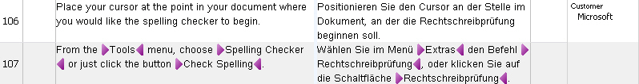

# Importing a TMX File

You can import bilingual content stored in TMX (Translation Memory Exchange) files into a translation memory. TMX is a standard XML-based exchange format for translation memories.

## Add a New Class

Add a new class named `TmImporter` to your project.

Then implement a method named `ImportTMXFile()` in the class. Call it as shown below:

# [C#](#tab/tabid-1)
```cs
var tmImporter = new TmImporter();
tmImporter.ImportTMXFile(_translationMemoryFilePath, _importFilePath);
```
***

The method requires the TM path and the TMX file path as string parameters.

First open the TM into which you want to import the TMX content. Then create an importer object and pass the TM language direction. Like a TM, a TMX file is bilingual and uses a language direction that must match the TM direction. Pass the TM language direction to the `TranslationMemoryImporter` object, as shown below:

# [C#](#tab/tabid-2)
```cs
var tm = new FileBasedTranslationMemory(tmPath);
var importer = new TranslationMemoryImporter(tm.LanguageDirection);
```
***

Next, define the import chunk size. The chunk size determines the maximum number of units read from the TMX file at one time. If the import file is on a local disk, a larger chunk size is usually fine. If the import runs over a network, keep the chunk size smaller to reduce latency. In this example, set the chunk size to 20, which roughly matches the number of TUs in the sample file. The default chunk size is 50 ([DefaultTranslationUnitChunkSize](../../api/translationmemory/Sdl.Core.TM.ImportExport.Importer.yml#Sdl_Core_TM_ImportExport_Importer_DefaultTranslationUnitChunkSize)), and the maximum is 200 ([MaxTranslationUnitChunkSize](../../api/translationmemory/Sdl.Core.TM.ImportExport.Importer.yml#Sdl_Core_TM_ImportExport_Importer_MaxTranslationUnitChunkSize)).

# [C#](#tab/tabid-3)
```cs
importer.ChunkSize = 20;
```
***

## Configure the Import Settings

You can configure several settings for an import operation. In this example, call a helper method to apply the settings:

# [C#](#tab/tabid-4)
```cs
this.GetImportSettings(importer.ImportSettings);
```
***

Add a helper method named `GetImportSettings()` that takes the importer settings as a parameter. The following examples show common import options:

Use **CheckMatchingSublanguages** to determine whether the import should distinguish sublanguages. For example, if the TM uses English (US) as the source language but the TMX file contains English (UK) TUs, setting this property to `false` treats US and UK English as the same language. If you enable sublanguage checking, the UK units are not added to the US TM.

# [C#](#tab/tabid-5)
```cs
importSettings.CheckMatchingSublanguages = false;
```
***

Use **ExistingFieldsUpdateMode** to control what happens to TM fields on existing TUs. For example, if the TM already contains a TU with the field *Customer* set to *Microsoft*, and the TMX file contains the same TU with *Customer* set to *SAP*, **FieldUpdateMode** lets you overwrite the existing value, leave it unchanged, or merge both values. If a field allows only one value, the import value overwrites the existing value by default unless you set the mode to **LeaveUnchanged**.

# [C#](#tab/tabid-6)
```cs
importSettings.ExistingFieldsUpdateMode = ImportSettings.FieldUpdateMode.Merge;
```
***

You can also configure the import to accept only TUs with specific confirmation status values. For example, you can exclude draft TUs or TUs without a confirmation status. The following example shows a TU in a TMX file with the **ApprovedTranslation** confirmation level.

# [Xml](#tab/tabid-7)
```xml
<tu creationdate="20100507T161524Z" creationid="Ziad" changedate="20100507T161524Z" changeid="PEGASUS\Administrator" lastusagedate="20100507T161524Z">
  <prop type="x-Origin">TM</prop>
  <prop type="x-ConfirmationLevel">ApprovedTranslation</prop>
  <prop type="x-Customer:MultiplePicklist">Microsoft</prop>
  <tuv xml:lang="en-US">
    <seg>A dialog box will open.</seg>
  </tuv>
  <tuv xml:lang="de-DE">
    <seg>Es öffnet sich ein Dialogfenster.</seg>
  </tuv>
</tu>
```
***

The following example configures the import to accept only TUs with the confirmation status values [ApprovedTranslation](../../api/core/Sdl.Core.Globalization.ConfirmationLevel.yml#fields) and [Translated](../../api/core/Sdl.Core.Globalization.ConfirmationLevel.yml#fields).

# [C#](#tab/tabid-8)
```cs
ConfirmationLevel[] levels = { ConfirmationLevel.ApprovedTranslation, ConfirmationLevel.Translated };
importSettings.ConfirmationLevels = levels;
```
***

During import, you may encounter invalid TUs in the TMX file. To write those units to an exclusion file for later analysis, specify a path and file name for the file that should contain the failed imports, as shown below:

# [C#](#tab/tabid-9)
```cs
importSettings.InvalidTranslationUnitsExportPath = @"c:\temp\invalid.tmx";
```
***

You can also decide whether the import may overwrite TUs that already exist in the TM. For example, if the TM already contains a TU and the TMX file contains the same TU with a different target segment, **OverwriteExistingTUs** controls whether the import replaces the existing translation (`true`) or leaves it unchanged (`false`).

# [C#](#tab/tabid-10)
```cs
importSettings.ExistingTUsUpdateMode = ImportSettings.TUUpdateMode.Overwrite;
```
***

You can also import TMX content as plain text only. In that case, all tags, such as inline formatting information, are stripped from the TUs. Set the [PlainText](../../api/translationmemory/Sdl.LanguagePlatform.TranslationMemory.ImportSettings.yml#Sdl_LanguagePlatform_TranslationMemory_ImportSettings_PlainText) property to `true` to enable this behavior. This option is useful when you import TMX files from third-party systems that handle inline tags differently from Var:ProductName. Keeping incompatible formatting can reduce matching quality and clutter the TM with information that Var:ProductName cannot handle properly.

Importing plain text also lets you start fresh with existing linguistic content. For example, if your source documentation moved from Microsoft Word 2000 (RTF) to XML, the inline tags in those formats are likely to differ. Stripping the old tags helps you handle the current and future XML files more efficiently.

If you import text with tags, you can also set a tag count limit (**TagCountLimit**). For example, setting the property to 10 prevents TUs with a higher tag count from entering the TM. This helps avoid TUs with excessive formatting, such as segments where each letter uses different formatting.

# [C#](#tab/tabid-11)
```cs
importSettings.PlainText = false;
importSettings.TagCountLimit = 10;
```
***

The following screenshot shows TUs that contain inline tags:




You can also choose whether the import should increment the usage count of the imported TUs after they are added to the TM. A TU is counted as used when a translator retrieves it from the TM and inserts the translation into a document, which increments the usage counter.

# [C#](#tab/tabid-12)
```cs
importSettings.IncrementUsageCount = true;
```
***

The following example shows a TU with a usage counter. Note the **usagecount** attribute on the **tu** element.

# [Xml](#tab/tabid-13)
```xml
<tu creationdate="20090504T230613Z" creationid="Ziad" changedate="20100507T161030Z" changeid="PEGASUS\Ziad" lastusagedate="20090630T172121Z" usagecount="2">
  <prop type="x-Context">0, 0</prop>
  <prop type="x-Origin">TM</prop>
  <prop type="x-Customer:MultiplePicklist">Microsoft</prop>
  <tuv xml:lang="en-US">
    <seg>The Check Spelling Command</seg>
  </tuv>
  <tuv xml:lang="de-DE">
    <seg>Der Befehl Rechtschreibung</seg>
  </tuv>
</tu>
```
***

## Executing the Import

Before you run the import, subscribe to an event that fires after each batch, or chunk, is imported:

# [C#](#tab/tabid-14)
```cs
importer.BatchImported += new EventHandler<BatchImportedEventArgs>(this.importer_BatchImported);
```
***

Add the following member to your class to output statistics after each imported batch, which is limited by the chunk size you set:

# [C#](#tab/tabid-15)
```cs
private void importer_BatchImported(object sender, BatchImportedEventArgs e)
{
    string info;
    var stats = e.Statistics;

    info = "Total read: " + stats.TotalRead + "\n";
    info += "Total imported: " + stats.TotalImported + "\n";
    info += "TUs added: " + stats.AddedTranslationUnits + "\n";
    info += "TUs discarded: " + stats.DiscardedTranslationUnits + "\n";
    info += "TUs merged: " + stats.MergedTranslationUnits + "\n";
    info += "Errors: " + stats.Errors + "\n";

    MessageBox.Show(info, "Import statistics of current chunk");
    e.Cancel = false;
}
```
***

The statistics include the total number of TUs read and the number of TUs actually imported. The imported count is often lower than the read count because some TUs may be invalid, duplicated, or merged with other TUs.

Finally, call the `Import()` method and pass the TMX file path:

# [C#](#tab/tabid-16)
```cs
importer.Import(importFilePath);
```
***

The complete `ImportTMXFile()` method looks like this:

# [C#](#tab/tabid-17)
```cs
public void ImportTMXFile(string tmPath, string importFilePath)
{
    #region "CreateImporter"
    var tm = new FileBasedTranslationMemory(tmPath);
    var importer = new TranslationMemoryImporter(tm.LanguageDirection);
    #endregion

    #region "chunk"
    importer.ChunkSize = 20;
    #endregion

    #region "GetSettings"
    this.GetImportSettings(importer.ImportSettings);
    #endregion

    #region "FireEvent"
    importer.BatchImported += new EventHandler<BatchImportedEventArgs>(this.importer_BatchImported);
    #endregion

    #region "execute"
    importer.Import(importFilePath);
    #endregion
}
```
***

## Putting it All Together

The complete class should now look like this:

# [C#](#tab/tabid-18)
```cs
namespace SDK.LanguagePlatform.Samples.TmAutomation
{
    using System;
    using System.Windows.Forms;
    using Sdl.Core.Globalization;
    using Sdl.LanguagePlatform.TranslationMemory;
    using Sdl.LanguagePlatform.TranslationMemoryApi;

    public class TmImporter
    {
        #region "import"
        public void ImportTMXFile(string tmPath, string importFilePath)
        {
            #region "CreateImporter"
            var tm = new FileBasedTranslationMemory(tmPath);
            var importer = new TranslationMemoryImporter(tm.LanguageDirection);
            #endregion

            #region "chunk"
            importer.ChunkSize = 20;
            #endregion

            #region "GetSettings"
            this.GetImportSettings(importer.ImportSettings);
            #endregion

            #region "FireEvent"
            importer.BatchImported += new EventHandler<BatchImportedEventArgs>(this.importer_BatchImported);
            #endregion

            #region "execute"
            importer.Import(importFilePath);
            #endregion
        }
        #endregion

        #region "event"
        private void importer_BatchImported(object sender, BatchImportedEventArgs e)
        {
            string info;
            var stats = e.Statistics;

            info = "Total read: " + stats.TotalRead + "\n";
            info += "Total imported: " + stats.TotalImported + "\n";
            info += "TUs added: " + stats.AddedTranslationUnits + "\n";
            info += "TUs discarded: " + stats.DiscardedTranslationUnits + "\n";
            info += "TUs merged: " + stats.MergedTranslationUnits + "\n";
            info += "Errors: " + stats.Errors + "\n";

            MessageBox.Show(info, "Import statistics of current chunk");
            e.Cancel = false;
        }
        #endregion

        #region "settings"
        private void GetImportSettings(ImportSettings importSettings)
        {
            #region "sublanguages"
            importSettings.CheckMatchingSublanguages = false;
            #endregion

            #region "update"
            importSettings.ExistingFieldsUpdateMode = ImportSettings.FieldUpdateMode.Merge;
            #endregion

            #region "ConfirmationLevels"
            ConfirmationLevel[] levels = { ConfirmationLevel.ApprovedTranslation, ConfirmationLevel.Translated };
            importSettings.ConfirmationLevels = levels;
            #endregion

            #region "InvalidPath"
            importSettings.InvalidTranslationUnitsExportPath = @"c:\temp\invalid.tmx";
            #endregion

            #region "overwrite"
            importSettings.ExistingTUsUpdateMode = ImportSettings.TUUpdateMode.Overwrite;
            #endregion

            #region "PlainText"
            importSettings.PlainText = false;
            importSettings.TagCountLimit = 10;
            #endregion

            #region "UsageCount"
            importSettings.IncrementUsageCount = true;
            #endregion
        }
        #endregion
    }
}
```
***

## See Also
[Exporting to a TMX File](exporting_to_a_tmx_file.md)

[Introduction to the Batch Import Tool](introduction_to_the_tm_batch_import_tool.md)

