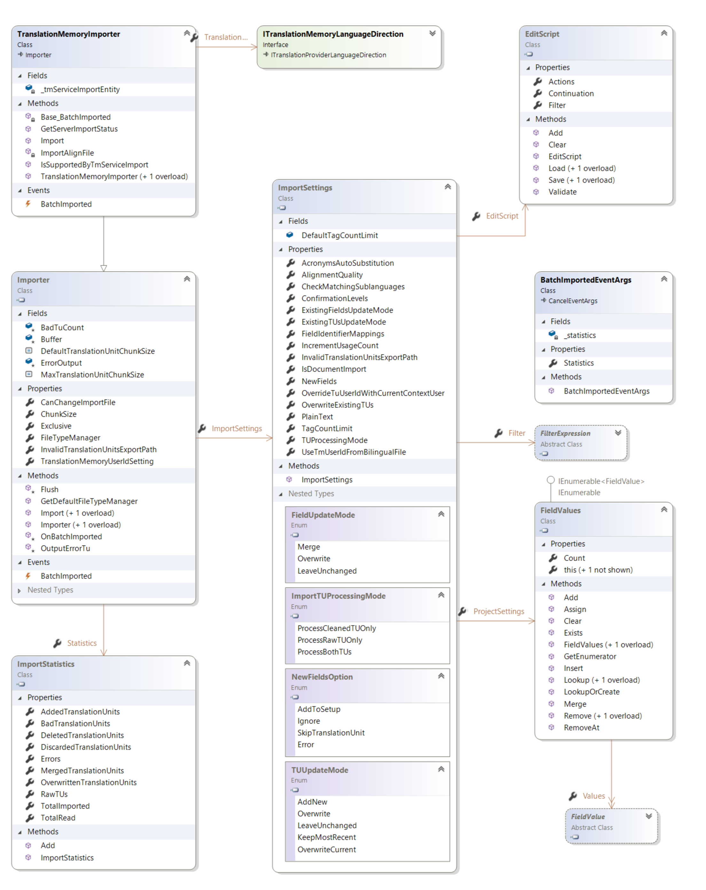

Importing Content into a Translation Memory
=====
This section describes how to import content into a translation memory.

Import
----
Any translation memory allows importing translation units from the following file formats:

* TMX or TMX.GZ (compressed TMX)
* Supported bilingual document formats: SDLXLIFF, TTX and ITD.
Only bilingual formats are supported, which means in effect the import happens into a specific translation memory language direction ([ITranslationMemoryLanguageDirection](../../api/translationmemory/Sdl.LanguagePlatform.TranslationMemoryApi.ITranslationMemoryLanguageDirection.yml)). Multilingual TMX files are not supported.

The import functionality is available through the [TranslationMemoryImporter](../../api/translationmemory/Sdl.LanguagePlatform.TranslationMemoryApi.TranslationMemoryImporter.yml) class. To import a file into a translation memory, set the language direction into which to import ([ITranslationMemoryLanguageDirection](../../api/translationmemory/Sdl.LanguagePlatform.TranslationMemoryApi.ITranslationMemoryLanguageDirection.yml)), specify the import settings ([ImportSetting](../../api/translationmemory/Sdl.LanguagePlatform.TranslationMemory.ImportSettings.yml)) and call the [Import](../../api/translationmemory/Sdl.LanguagePlatform.TranslationMemoryApi.TranslationMemoryImporter.yml#Sdl_LanguagePlatform_TranslationMemoryApi_TranslationMemoryImporter_Import_System_String_) method.

The [OnBatchImported](../../api/translationmemory/Sdl.Core.TM.ImportExport.Importer.yml#Sdl_Core_TM_ImportExport_Importer_OnBatchImported_Sdl_LanguagePlatform_TranslationMemory_ImportResults_Sdl_LanguagePlatform_TranslationMemory_ImportStatistics_) event is raised repeatedly during import (after evey batch of translation units has been imported, see [ChunkSize](../../api/translationmemory/Sdl.Core.TM.ImportExport.Importer.yml#Sdl_Core_TM_ImportExport_Importer_ChunkSize)). The import can be canceled.

When the import is complete, the results are available through the Statistics property. This indicates how many of the translation units were read, added, discarded, merged, overwritten or failed to import. When you set the [InvalidTranslationUnitsExportPath](../../api/translationmemory/Sdl.Core.TM.ImportExport.Importer.yml#Sdl_Core_TM_ImportExport_Importer_InvalidTranslationUnitsExportPath) property, all translation units that failed to export are written to a TMX file in that location.

Server-based translation memories support scheduling an import, which means the file to be imported is uploaded to the server and the server subsequently imports the file. This is often a quicker way to import data because it avoids the network latency and any additional overhead when importing remotely. For more information, see [Performing a Scheduled Import or Export](performing_a_scheduled_import_or_export.md).

See Also
-------
[Importing a TMX File](importing_a_tmx_file.md)

[Introduction](working_with_translation_memories.md)

[Performing a Scheduled Import or Export](performing_a_scheduled_import_or_export.md)
