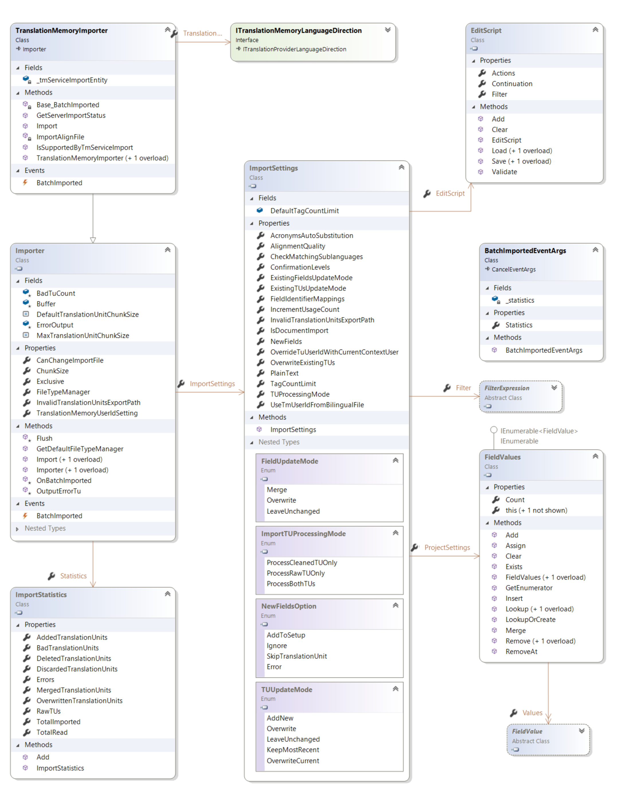

# Importing Content into a Translation Memory

This section explains how to import content into a translation memory.

## Import

You can import translation units into any translation memory from the following file formats:

* TMX or TMX.GZ (compressed TMX)
* Supported bilingual document formats: SDLXLIFF, TTX and ITD.

Only bilingual formats are supported. In practice, the import targets a specific translation memory language direction ([ITranslationMemoryLanguageDirection](../../api/translationmemory/Sdl.LanguagePlatform.TranslationMemoryApi.ITranslationMemoryLanguageDirection.yml)). Multilingual TMX files are not supported.

The import functionality is available through the [TranslationMemoryImporter](../../api/translationmemory/Sdl.LanguagePlatform.TranslationMemoryApi.TranslationMemoryImporter.yml) class. To import a file into a translation memory, set the target language direction ([ITranslationMemoryLanguageDirection](../../api/translationmemory/Sdl.LanguagePlatform.TranslationMemoryApi.ITranslationMemoryLanguageDirection.yml)), specify the import settings ([ImportSetting](../../api/translationmemory/Sdl.LanguagePlatform.TranslationMemory.ImportSettings.yml)), and call the [Import](../../api/translationmemory/Sdl.LanguagePlatform.TranslationMemoryApi.TranslationMemoryImporter.yml#Sdl_LanguagePlatform_TranslationMemoryApi_TranslationMemoryImporter_Import_System_String_) method.

The [OnBatchImported](../../api/translationmemory/Sdl.Core.TM.ImportExport.Importer.yml#Sdl_Core_TM_ImportExport_Importer_OnBatchImported_Sdl_LanguagePlatform_TranslationMemory_ImportResults_Sdl_LanguagePlatform_TranslationMemory_ImportStatistics_) event is raised repeatedly during import, after each batch of translation units has been imported. See [ChunkSize](../../api/translationmemory/Sdl.Core.TM.ImportExport.Importer.yml#Sdl_Core_TM_ImportExport_Importer_ChunkSize). You can cancel the import at any time.

When the import completes, the results are available through the Statistics property. This shows how many translation units were read, added, discarded, merged, overwritten, or failed to import. When you set the [InvalidTranslationUnitsExportPath](../../api/translationmemory/Sdl.Core.TM.ImportExport.Importer.yml#Sdl_Core_TM_ImportExport_Importer_InvalidTranslationUnitsExportPath) property, all translation units that failed to import are written to a TMX file in that location.

## See also

* [Importing a TMX File](importing_a_tmx_file.md)

* [Introduction](working_with_translation_memories.md)
