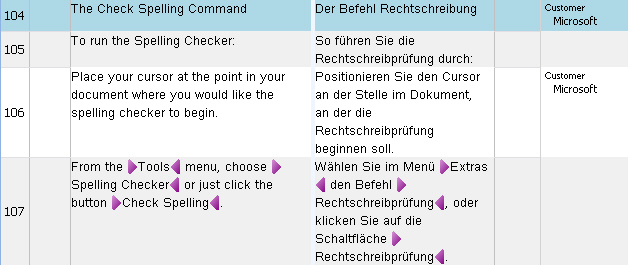

## Maintaining Translation Memories
Users occasionally need to perform maintenance tasks on a TM.

Typical maintenance tasks include:

* Browse through a TM to review translation units
* Perform global find/replace operations, for example to replace outdated terminology with up-to-date terms
* Apply specific field values to multiple TUs, for example add the field value Customer > Microsoft to several TUs in one go
* Delete outdated or incorrect TUs
* Tune a TM for better performance
* Identify and remove potential duplicate units that clutter the TM
* Filter a subset of the TM, for example all units created on or after a specific date
  
  
	In Var:ProductName, users typically perform maintenance work in a side-by-side TM view.

  

## See Also
[Tuning and Maintaining a Translation Memory](tuning_and_maintaining_a_translation_memory.md)

[Looping through Translation Memories](looping_through_translation_memories.md)
