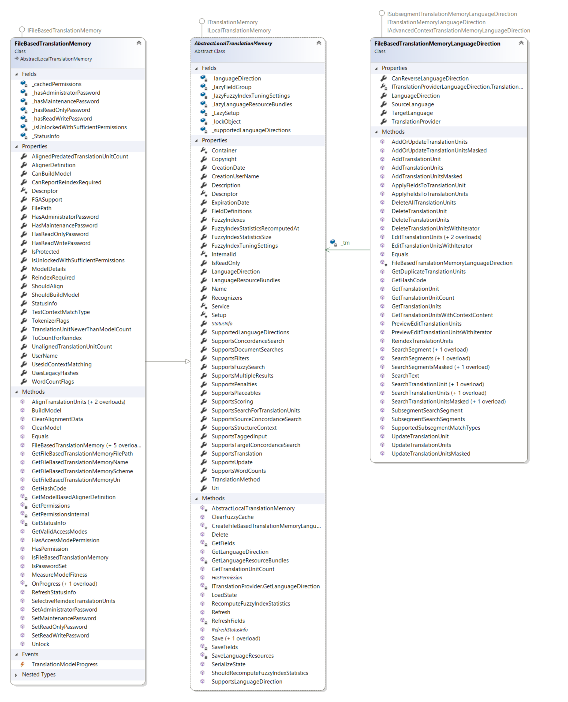

# Performing Translation Memory Lookups

The most common operation on a translation memory is looking up whole segments or searching for individual words and expressions through a concordance search.

You can perform these lookups by calling one of the following methods on the LanguageDirection property of the translation memory, depending on the input parameters and search type:

* **SearchSegment** - Looks up a whole segment in the translation memory and returns the best matching translation unit, if any.
* **SearchSegmentsMasked** - Looks up a whole segment in the translation memory, but allows certain parts of the segment to be masked out to provide context, and returns the best matching translation unit, if any.
* **SearchText** - Looks up text in the translation memory and returns the best matching translation unit, if any.
* **SearchTranslationUnitsMasked** - Looks up translation units in the translation memory, but allows certain parts of the translation units to be masked out to provide context, and returns the best matching translation unit, if any.

## See also

* [Doing Translation Memory Lookups](doing_translation_memory_lookups.md)
	