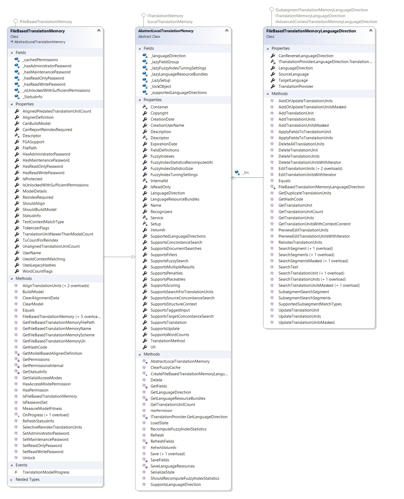

Performing Translation Memory Lookups
========================
The most common operation performed on a translation memory involves looking up whole segments or searching single words/expressions through a concordance search. This can done by calling either of the following methods on the LanguageDirection property of the TM (depending on the input parameters we want to pass and the type of search we want to perform): SearchSegment, SubsegmentSearchSegments, SearchSegmentsMasked, SearchText or SearchTranslationUnit.

See Also
--------------
[Doing Translation Memory Lookups](doing_translation_memory_lookups.md)