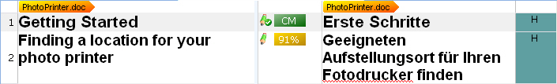
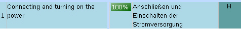
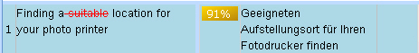
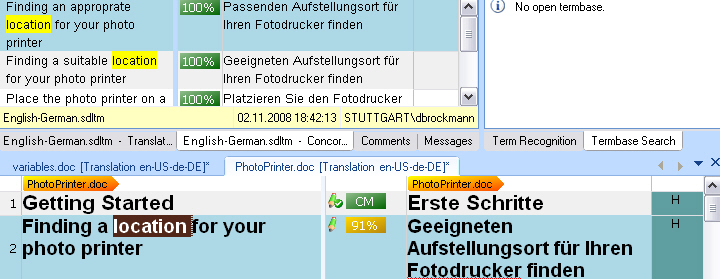

Performing Translation Memory Lookups
=====
Translation memories can be used for looking up entire segments as well as particular words or expressions that occur within a segment.

Segment Look-up
----
When opening a file in <Var:ProductName>, the document is split up into segments, which are then presented in a side-by-side editor view. Note that a segment corresponds in most cases to a sentence. During translation users can use the application to look for any suitable segment matches in the selected TM(s). If the same or a similar segment is found in the TM, the corresponding translation will be suggested. Users can then accept the translation suggestion as is, or modify it as required by the current context.

The screenshot below shows a number of sample segments as they are presented in the side-by-side editor of <Var:ProductName>:

The screenshot below shows an example of a 100% segment match (exact match) that was found found in a TM:

The screenshot below shows an example of a 91% fuzzy match as it was found in a TM. The differences between the segment from the document and the (similar) segment that was found in the TM are highlighted using colors and underline/strikethrough formatting.

TMs offer the following match types:

1. **No match (new segment)**: No equivalent for the segment that you are translating exists in the TM. In this case, the segment needs to be translated from scratch.
2. **Exact match (100% match)**: In the TM a segment was found that is identical to the current segment from the document.
3. **Context match**: Basically, this is the same as an exact match. However, a context match (CM) is even more reliable than an exact match, as the segment was encountered in the same sequence as in a previous document. A CM is given if the current document segment is identical to a segment found in the TM and if it is preceded by the same segment as in another document that was translated before and if the translation of the preceding segment is the same as the one used in a previous document.
4. **Fuzzy match**: In the TM, a segment was found that is similar (e.g. by 90%) to the current segment in the document. In this case, translators will usually have to modify the suggested translation as required by the current context.

Concordance Search
-----
The concordance search is used to look up single words or multi-word expressions that occur in a segment. It works like this: Users select one or several words in the source or target segment, and then get a list of all segments that contain the search string (if any). The concordance search can also find derived forms of the search expression. Example: If users enter the expression location, the concordance results might also include segments that contain the plural form, as the concordance search applies a fuzzy algorithm. TMs can be configured to use a word-based or a character-based search matrix. A character-based search is likely to find more derived forms than a word-based search. However, the character-based search is significantly slower than its word-based counterpart. This is why character-based searching is only recommended for small TMs that contain, for example, only a few hundred or a few thousand translation units. The screenshot below shows an example of a concordance search result in <Var:ProductName>:

See Also
-----
[Doing Translation Memory Lookups](doing_translation_memory_lookups.md)

[Introduction the TM Lookup Tool](introduction_to_the_tm_lookup_tool.md)