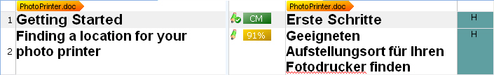
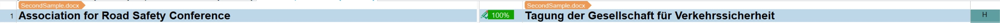
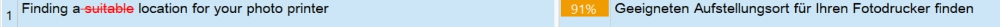
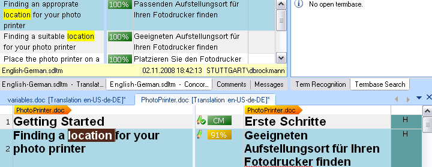

# Performing Translation Memory Lookups
Translation memories help users look up entire segments and specific words or expressions within a segment.

## Segment Look-up
When users open a file in Var:ProductName, the application splits the document into segments and presents them in a side-by-side editor view. In most cases, a segment corresponds to a sentence. During translation, users can search the selected TM(s) for suitable matches. If the TM contains the same or a similar segment, the application suggests the corresponding translation. Users can accept the suggestion as is or modify it for the current context.

The following screenshot shows sample segments in the side-by-side editor of Var:ProductName:

The following screenshot shows a 100% segment match (exact match) found in a TM:

The following screenshot shows a 91% fuzzy match found in a TM. The differences between the document segment and the similar TM segment are highlighted with colors and underline/strikethrough formatting.

TMs offer the following match types:

1. **No match (new segment)**: The TM does not contain an equivalent segment, so users must translate the segment from scratch.
2. **Exact match (100% match)**: The TM contains a segment that is identical to the current segment in the document.
3. **Context match**: A context match (CM) is similar to an exact match but more reliable. A CM is returned when the current segment is identical to a segment in the TM, appears in the same sequence as in a previously translated document, and uses the same translation for the preceding segment.
4. **Fuzzy match**: The TM contains a segment that is similar (for example, 90%) to the current segment in the document. Users usually adjust the suggested translation to fit the current context.

## Concordance Search
Concordance search lets users look up single words or multi-word expressions that occur in a segment. Users select one or more words in the source or target segment and then receive a list of segments that contain the search string, if any.

Concordance search can also find derived forms of the search expression. For example, if users search for location, the results can include segments that contain the plural form because concordance search uses a fuzzy algorithm.

TMs can use either a word-based or character-based search matrix. Character-based search usually finds more derived forms than word-based search, but it is significantly slower. For this reason, use character-based search only for small TMs that contain a few hundred or a few thousand translation units. The following screenshot shows an example concordance search result in Var:ProductName:

## See Also
[Doing Translation Memory Lookups](doing_translation_memory_lookups.md)

[Introduction to the TM Lookup Tool](introduction_to_the_tm_lookup_tool.md)
