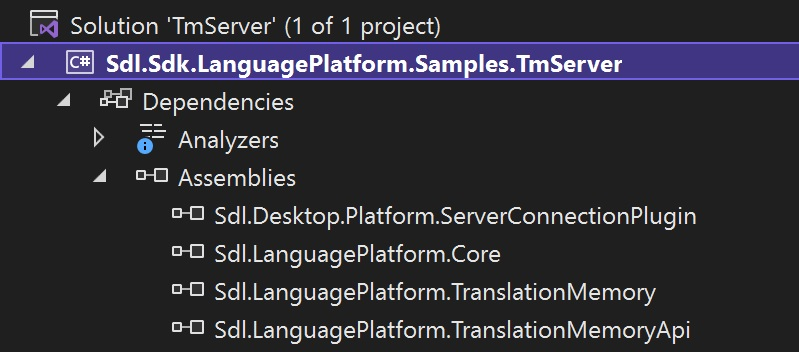

Preparing your Project for Server Access
=====

Using server TMs programmatically requires you to add some more references to your project.

To enable a project for server TM access you need to make sure that the following references are available:

* Sdl.LanguagePlatform.ServerBasedTranslationMemory.Contracts
* Sdl.LanguagePlatform.TranslationMemoryApi
* Sdl.LanguagePlatform.TranslationMemory

See Also
-----
[Required References and Namespaces](required_references_and_namespaces.md)
