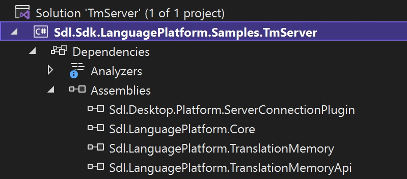

# Preparing Your Project for Server Access

To work with server TMs programmatically, add the required references to your project.

To enable server TM access, make sure that the following references are available:

* Sdl.LanguagePlatform.ServerBasedTranslationMemory.Contracts
* Sdl.LanguagePlatform.TranslationMemoryApi
* Sdl.LanguagePlatform.TranslationMemory

## See Also

[Required References and Namespaces](required_references_and_namespaces.md)
