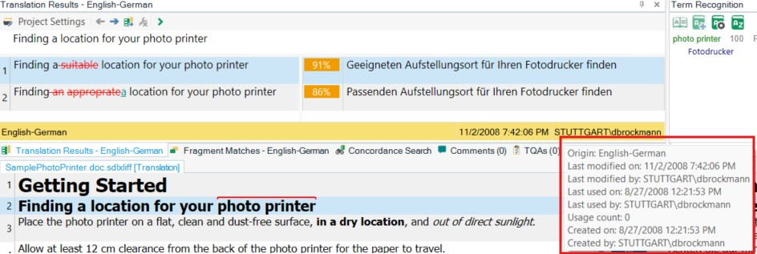

# Reading Translation Unit System Information

Translation units include system information that the system adds automatically during translation and editing. You do not need TM fields to store this information.

## About Translation Unit System Information

For each TU, the system stores the creation date and time, the last change date and time, the user who created or changed the TU, the user who last used the TU, and the last usage time, if applicable. The system also maintains a usage counter to track how often a TU has been used. A TU counts as used when a lookup returns it and the translator inserts the suggested translation into the document. You can use this information, for example, to find TUs that have never been used and remove them to keep the TM lean and efficient. The screenshot below shows an example of TU system information in Var:ProductName:




## Add a New Class

This example shows how to retrieve TU system information programmatically. Start by adding a new class named `TuSystemInfo`. Then implement a public method named `GetInfo()` that takes the TM path as a string parameter. First open the TM and search for a segment, as shown below:

# [C#](#tab/tabid-1)
```cs
var tm = new FileBasedTranslationMemory(tmPath);

SearchResults results = tm.LanguageDirection.SearchText(this.GetSearchSettings(), "A dialog box will open.");
```
***

Then use the search result to access the TU and its system fields. Build a string that contains the TU system information:

# [C#](#tab/tabid-2)
```cs
string tuInfo = string.Empty;
foreach (SearchResult item in results)
{
    if (item.ScoringResult.Match == 100)
    {
        TranslationUnit tu = item.MemoryTranslationUnit;
        SystemFields sysFields = tu.SystemFields;

        tuInfo = "Creation date: " + sysFields.CreationDate + "\n";
        tuInfo += "Creation user: " + sysFields.CreationUser + "\n";
        tuInfo += "Change date: " + sysFields.ChangeDate + "\n";
        tuInfo += "Change user: " + sysFields.ChangeUser + "\n";
        tuInfo += "Usage count: " + sysFields.UseCount + "\n";
        tuInfo += "Last used on: " + sysFields.UseDate + "\n";
        tuInfo += "Last used by: " + sysFields.UseUser + "\n";
        break;
    }
}

MessageBox.Show(tuInfo, "TU Information");
```
***

## Putting it All Together

The complete class should now look like this:

# [C#](#tab/tabid-3)
```cs
namespace SDK.LanguagePlatform.Samples.TmAutomation
{
    using System.Windows.Forms;
    using Sdl.LanguagePlatform.TranslationMemory;
    using Sdl.LanguagePlatform.TranslationMemoryApi;

    public class TuSystemInfo
    {
        #region "GetInfo"
        public void GetInfo(string tmPath)
        {
            #region "open"
            var tm = new FileBasedTranslationMemory(tmPath);

            SearchResults results = tm.LanguageDirection.SearchText(this.GetSearchSettings(), "A dialog box will open.");
            #endregion

            #region "output"
            string tuInfo = string.Empty;
            foreach (SearchResult item in results)
            {
                if (item.ScoringResult.Match == 100)
                {
                    TranslationUnit tu = item.MemoryTranslationUnit;
                    SystemFields sysFields = tu.SystemFields;

                    tuInfo = "Creation date: " + sysFields.CreationDate + "\n";
                    tuInfo += "Creation user: " + sysFields.CreationUser + "\n";
                    tuInfo += "Change date: " + sysFields.ChangeDate + "\n";
                    tuInfo += "Change user: " + sysFields.ChangeUser + "\n";
                    tuInfo += "Usage count: " + sysFields.UseCount + "\n";
                    tuInfo += "Last used on: " + sysFields.UseDate + "\n";
                    tuInfo += "Last used by: " + sysFields.UseUser + "\n";
                    break;
                }
            }

            MessageBox.Show(tuInfo, "TU Information");
            #endregion
        }
        #endregion

        #region "settings"
        private SearchSettings GetSearchSettings()
        {
            var settings = new SearchSettings();
            settings.MinScore = 100;
            return settings;
        }
        #endregion
    }
}
```
***
