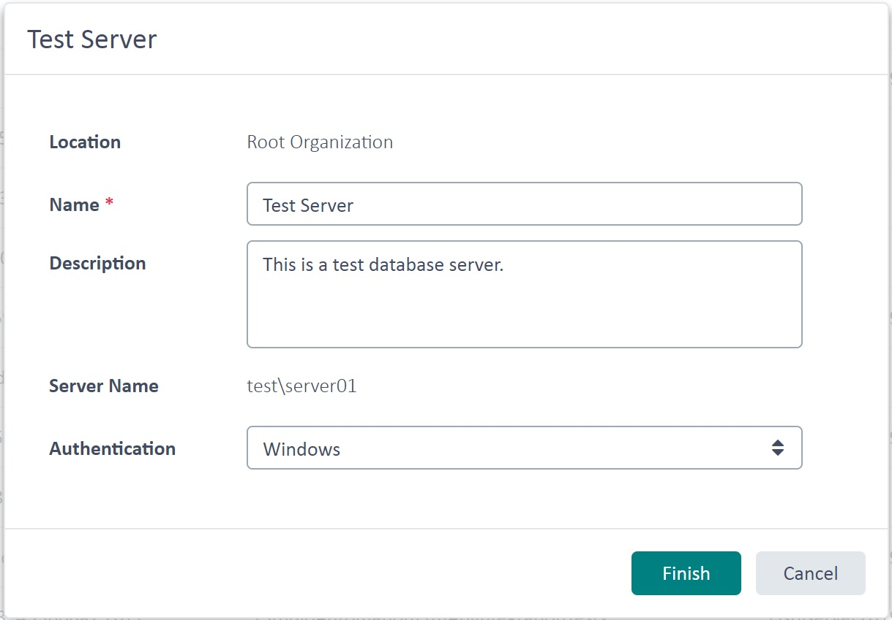

Retrieving Database Servers
===

In this chapter you will learn how to get programmatic access to the database server(s) that is/are used by the TM Server.

Add a New Class
----

Start by adding a new class called `DatabaseServersProvider` to your project. Add a public function called `GetDBServers`, which takes a [TranslationProviderServer](../../api/translationmemory/Sdl.LanguagePlatform.TranslationMemoryApi.TranslationProviderServer.yml) object as parameter. Call this function from Connect as shown below:

# [C#](#tab/tabid-1)
```cs
var serverProvider = new DataBaseServersProvider();
serverProvider.GetDBServers(tmServer);
```
****
In the `GetDBServers` function the [GetDatabaseServers](../../api/translationmemory/Sdl.LanguagePlatform.TranslationMemoryApi.TranslationProviderServer.yml#Sdl_LanguagePlatform_TranslationMemoryApi_TranslationProviderServer_GetDatabaseServers) method is applied to the server object. Then the function loops through the database servers that are registered for the given TM server. Although most setups involve only a single database server, it is conceivable that the TM Server connects to several DB servers.
# [C#](#tab/tabid-2)
```cs
public void GetDBServers(TranslationProviderServer tmServer)
{
    string serverInfo = string.Empty;

    foreach (DatabaseServer dbServer in tmServer.GetDatabaseServers(DatabaseServerProperties.None))
    {
        serverInfo += "Server name: " + dbServer.ServerName + "\n";
        serverInfo += "Friendly server name: " + dbServer.Name + "\n";
        serverInfo += "Server description: " + dbServer.Description + "\n";
        serverInfo += "Server type: " + dbServer.ServerType + "\n\n";
    }

    MessageBox.Show(serverInfo, "Container Information");
}
```
****
In the `foreach` loop we build up the string that contains all DB servers and their properties. [ServerName](../../api/translationmemory/Sdl.LanguagePlatform.TranslationMemoryApi.DatabaseServer.yml#Sdl_LanguagePlatform_TranslationMemoryApi_DatabaseServer_ServerName) gets the full DNS name or IP address of the DB server, while [Name](../../api/translationmemory/Sdl.LanguagePlatform.TranslationMemoryApi.DatabaseServer.yml#Sdl_LanguagePlatform_TranslationMemoryApi_DatabaseServer_Name) is used to retrieve the friendly DB server name. Note that when registering a DB server, the administrator can enter the actual server name (e.g. sqlserv\sqlexpress) and assign a friendly name like in the current example, *Test Server*. Among other things, you can retrieve a server [Description](../../api/translationmemory/Sdl.LanguagePlatform.TranslationMemoryApi.DatabaseServer.yml#Sdl_LanguagePlatform_TranslationMemoryApi_DatabaseServer_Description) (which is optional) as well the [Authentification](../../api/translationmemory/Sdl.LanguagePlatform.TranslationMemoryApi.DatabaseServer.yml#Sdl_LanguagePlatform_TranslationMemoryApi_DatabaseServer_ServerType), which can be Windows or Database authentification type.
Below you see an example of a box containing information on a particular DB server in the GroupShare Web UI:



Putting it All Together
----
The complete class looks as shown below:
# [C#](#tab/tabid-3)
```cs
namespace SDK.LanguagePlatform.Samples.TmAutomation
{
    using System.Windows.Forms;
    using Sdl.LanguagePlatform.TranslationMemoryApi;

    public class DataBaseServersProvider
    {
        #region "get"
        public void GetDBServers(TranslationProviderServer tmServer)
        {
            string serverInfo = string.Empty;

            foreach (DatabaseServer dbServer in tmServer.GetDatabaseServers(DatabaseServerProperties.None))
            {
                serverInfo += "Server name: " + dbServer.ServerName + "\n";
                serverInfo += "Friendly server name: " + dbServer.Name + "\n";
                serverInfo += "Server description: " + dbServer.Description + "\n";
                serverInfo += "Server type: " + dbServer.ServerType + "\n\n";
            }

            MessageBox.Show(serverInfo, "Container Information");
        }
        #endregion
    }
}
```
****