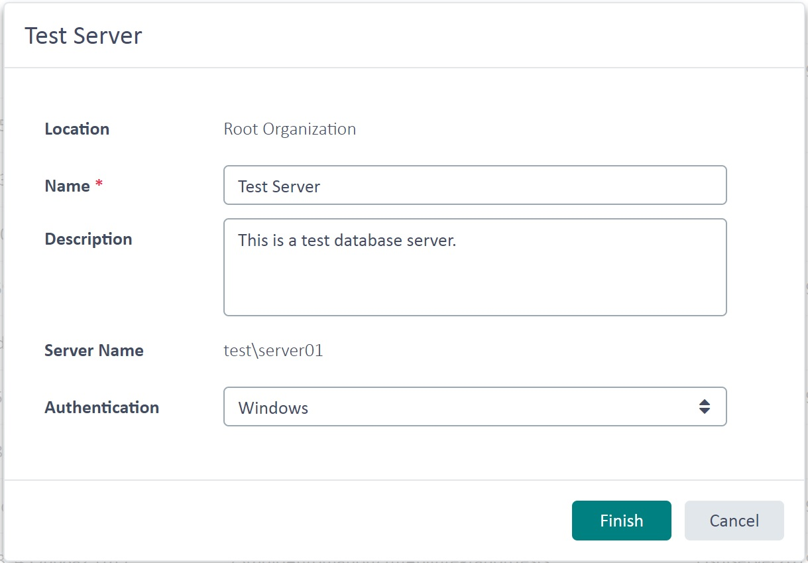

# Retrieving Database Servers

This chapter shows how to access the database servers used by the TM Server programmatically.

## Add a New Class

Start by adding a class called `DatabaseServersProvider` to your project. Add a public function called `GetDBServers`, which takes a [TranslationProviderServer](../../api/translationmemory/Sdl.LanguagePlatform.TranslationMemoryApi.TranslationProviderServer.yml) object as a parameter. Call this function from `Connect` as shown below:

# [C#](#tab/tabid-1)
```cs
var serverProvider = new DatabaseServersProvider();
serverProvider.GetDBServers(tmServer);
```

In `GetDBServers`, call the [GetDatabaseServers](../../api/translationmemory/Sdl.LanguagePlatform.TranslationMemoryApi.TranslationProviderServer.yml#Sdl_LanguagePlatform_TranslationMemoryApi_TranslationProviderServer_GetDatabaseServers) method on the server object. Then loop through the database servers registered for the TM Server. Although most setups use a single database server, TM Server can connect to several database servers.
# [C#](#tab/tabid-2)
```cs
public void GetDBServers(TranslationProviderServer tmServer)
{
    string serverInfo = string.Empty;

    foreach (DatabaseServer dbServer in tmServer.GetDatabaseServers(DatabaseServerProperties.None))
    {
        serverInfo += "Server name: " + dbServer.ServerName + "\n";
        serverInfo += "Friendly server name: " + dbServer.Name + "\n";
        serverInfo += "Server description: " + dbServer.Description + "\n";
        serverInfo += "Server type: " + dbServer.ServerType + "\n\n";
    }

    MessageBox.Show(serverInfo, "Database Server Information");
}
```

In the `foreach` loop, build the string that contains the database server properties. [ServerName](../../api/translationmemory/Sdl.LanguagePlatform.TranslationMemoryApi.DatabaseServer.yml#Sdl_LanguagePlatform_TranslationMemoryApi_DatabaseServer_ServerName) returns the full DNS name or IP address of the database server, while [Name](../../api/translationmemory/Sdl.LanguagePlatform.TranslationMemoryApi.DatabaseServer.yml#Sdl_LanguagePlatform_TranslationMemoryApi_DatabaseServer_Name) returns the friendly database server name. When registering a database server, the administrator can enter the actual server name, such as `sqlserv\sqlexpress`, and assign a friendly name such as *Test Server*. You can also retrieve the optional [Description](../../api/translationmemory/Sdl.LanguagePlatform.TranslationMemoryApi.DatabaseServer.yml#Sdl_LanguagePlatform_TranslationMemoryApi_DatabaseServer_Description) and the [Authentication](../../api/translationmemory/Sdl.LanguagePlatform.TranslationMemoryApi.DatabaseServer.yml#Sdl_LanguagePlatform_TranslationMemoryApi_DatabaseServer_ServerType) type, which can be Windows or database authentication.

The image below shows a box with information about a specific database server in the GroupShare Web UI:



## Putting It All Together

The complete class looks like this:
# [C#](#tab/tabid-3)
```cs
namespace SDK.LanguagePlatform.Samples.TmAutomation
{
    using System.Windows.Forms;
    using Sdl.LanguagePlatform.TranslationMemoryApi;

   public class DatabaseServersProvider
    {
        public void GetDBServers(TranslationProviderServer tmServer)
        {
            string serverInfo = string.Empty;

            foreach (DatabaseServer dbServer in tmServer.GetDatabaseServers(DatabaseServerProperties.None))
            {
                serverInfo += "Server name: " + dbServer.ServerName + "\n";
                serverInfo += "Friendly server name: " + dbServer.Name + "\n";
                serverInfo += "Server description: " + dbServer.Description + "\n";
                serverInfo += "Server type: " + dbServer.ServerType + "\n\n";
            }

            MessageBox.Show(serverInfo, "Database Server Information");
        }
    }
}
```

## See Also

[Required References and Namespaces](required_references_and_namespaces.md)
