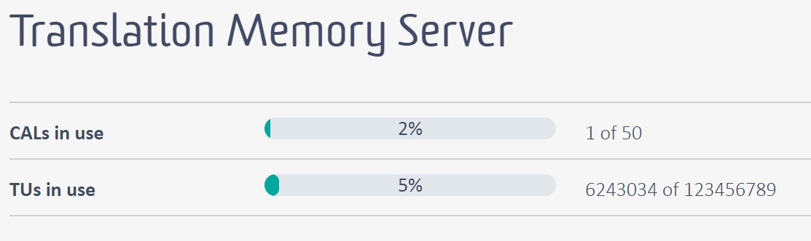

Retrieving Licensing Information
=====
A TM Server is licensed for a certain number of concurrent users and the number of translation units that it can store at maximum. It may sometimes be necessary to retrieve the maximum number of TUs allowed, and the number of TUs currently stored. This chapter provides an example of how to retrieve this information programmatically.

Add a New Class
-----
Start by adding a class called `ServerLicensing` to your project. Then implement a public function called `GetLicensingInformation`, which takes a [TranslationProviderServer](../../api/translationmemory/Sdl.LanguagePlatform.TranslationMemoryApi.TranslationProviderServer.yml) object as parameter. This function can be called as shown below:

# [C#](#tab/tabid-1)
```cs
var license = new ServerLicensing();
license.GetLicensingInformation(tmServer);
```
*****

By applying the `GetLicensingStatusInformation` method to the server you create a [LicensingStatusInformation](../../api/translationmemory/Sdl.LanguagePlatform.TranslationMemoryApi.LicensingStatusInformation.yml) object, through which you retrieve the required information, such as the maximum  number of concurrent users allowed, the maximum numbers of TUs, as well as the current TU count:

# [C#](#tab/tabid-2)
```cs
public void GetLicensingInformation(TranslationProviderServer tmServer)
{
    string licInfo = string.Empty;
    LicensingStatusInformation info;
    info = tmServer.GetLicensingStatusInformation();

    licInfo += "Max. concurrent users: " + info.MaxConcurrentUsers.ToString();
    licInfo += "Max. TU count: " + info.MaxTranslationUnitCount.ToString();
    licInfo += "Current TU count: " + info.CurrentTranslationUnitCount.ToString();
    licInfo += "Current concurrent users: " + info.CurrentConcurrentUsers.ToString();

    MessageBox.Show(licInfo, "Licensing Information");
}
```
******


Putting it All Together
----

The complete class looks as shown below:

# [C#](#tab/tabid-3)
```cs
namespace SDK.LanguagePlatform.Samples.TmAutomation
{
    using System.Windows.Forms;
    using Sdl.LanguagePlatform.TranslationMemoryApi;

    public class ServerLicensing
    {
        #region "get"
        public void GetLicensingInformation(TranslationProviderServer tmServer)
        {
            string licInfo = string.Empty;
            LicensingStatusInformation info;
            info = tmServer.GetLicensingStatusInformation();

            licInfo += "Max. concurrent users: " + info.MaxConcurrentUsers.ToString();
            licInfo += "Max. TU count: " + info.MaxTranslationUnitCount.ToString();
            licInfo += "Current TU count: " + info.CurrentTranslationUnitCount.ToString();
            licInfo += "Current concurrent users: " + info.CurrentConcurrentUsers.ToString();

            MessageBox.Show(licInfo, "Licensing Information");
        }
        #endregion
    }
}
```
******
