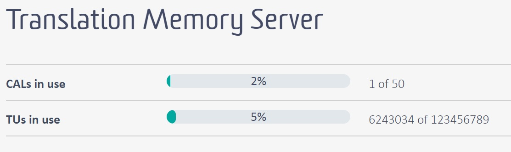

# Retrieving Licensing Information

A TM Server is licensed for a specific number of concurrent users and a maximum number of translation units. Sometimes you need to retrieve the maximum allowed TU count and the number of TUs currently stored. This chapter shows how to retrieve that information programmatically.

## Add a New Class

Start by adding a class called `ServerLicensing` to your project. Then implement a public function called `GetLicensingInformation`, which takes a [TranslationProviderServer](../../api/translationmemory/Sdl.LanguagePlatform.TranslationMemoryApi.TranslationProviderServer.yml) object as a parameter. Call the function as shown below:

# [C#](#tab/tabid-1)
```cs
var license = new ServerLicensing();
license.GetLicensingInformation(tmServer);
```

By calling `GetLicensingStatusInformation` on the server, you create a [LicensingStatusInformation](../../api/translationmemory/Sdl.LanguagePlatform.TranslationMemoryApi.LicensingStatusInformation.yml) object. Use it to retrieve information such as the maximum number of concurrent users, the maximum number of TUs, and the current TU count:

# [C#](#tab/tabid-2)
```cs
public void GetLicensingInformation(TranslationProviderServer tmServer)
{
    string licInfo = string.Empty;
    LicensingStatusInformation info = tmServer.GetLicensingStatusInformation();

    licInfo += "Max. concurrent users: " + info.MaxConcurrentUsers.ToString();
    licInfo += "Max. TU count: " + info.MaxTranslationUnitCount.ToString();
    licInfo += "Current TU count: " + info.CurrentTranslationUnitCount.ToString();
    licInfo += "Current concurrent users: " + info.CurrentConcurrentUsers.ToString();

    MessageBox.Show(licInfo, "Licensing Information");
}
```



## Putting It All Together

The complete class looks like this:

# [C#](#tab/tabid-3)
```cs
namespace SDK.LanguagePlatform.Samples.TmAutomation
{
    using System.Windows.Forms;
    using Sdl.LanguagePlatform.TranslationMemoryApi;

    public class ServerLicensing
    {
        public void GetLicensingInformation(TranslationProviderServer tmServer)
        {
            string licInfo = string.Empty;
            LicensingStatusInformation info = tmServer.GetLicensingStatusInformation();

            licInfo += "Max. concurrent users: " + info.MaxConcurrentUsers.ToString();
            licInfo += "Max. TU count: " + info.MaxTranslationUnitCount.ToString();
            licInfo += "Current TU count: " + info.CurrentTranslationUnitCount.ToString();
            licInfo += "Current concurrent users: " + info.CurrentConcurrentUsers.ToString();

            MessageBox.Show(licInfo, "Licensing Information");
        }
    }
}
```

