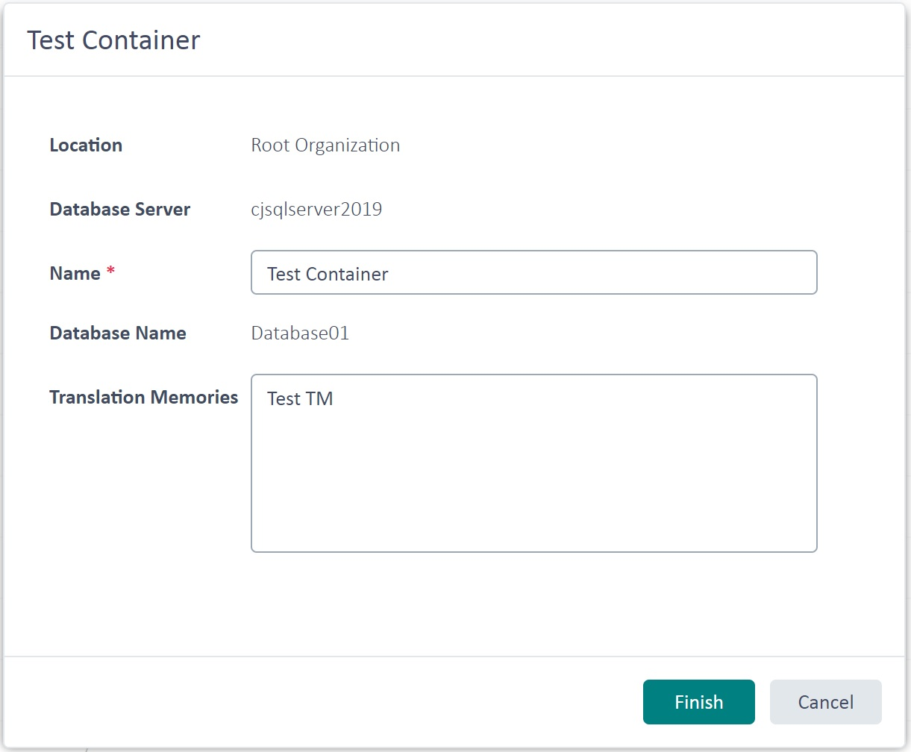

Retrieving TM Containers
====
In this chapter you will learn how to get programmatic access to TM containers. Containers are the actual physical databases that contain one or more TMs. Technically speaking, TMs are tables within a container database. Depending on the number of TMs used you may consolidate all TMs in a single container database, or split the TMs among several container databases. This may be a consideration driven by the maximum physical size of a database. For example, Microsoft SQL Express versions only support databases up to a maximum size (4 GB).

Add a New Class
---
Start by adding a new class called `ServerContainers` to your project. Then implement a public function called `GetDBContainers` in the class, which takes a [TranslationProviderServer](../../api/translationmemory/Sdl.LanguagePlatform.TranslationMemoryApi.TranslationProviderServer.yml) object as parameter. This function can be called from the connector class as shown below:

# [C#](#tab/tabid-1)
```cs
ServerContainers containers = new ServerContainers();
containers.GetDBContainers(tmServer);
```
*****

The `GetDBContainers` function loops through the containers that are associated with the TM Server object and outputs various information in a message box:

# [C#](#tab/tabid-2)
```cs
public void GetDBContainers(TranslationProviderServer tmServer)
{
    string dbInfo = string.Empty;

    foreach (TranslationMemoryContainer container in tmServer.GetContainers(ContainerProperties.None))
    {
        dbInfo += "DB Name: " + container.DatabaseName + "\n";
        dbInfo += "Friendly name: " + container.Name + "\n";
        dbInfo += "DB Server: " + container.DatabaseServer + "\n";
        dbInfo += "Description: " + container.Description + "\n\n";
        dbInfo += "ParentOrganization: " + container.ParentResourceGroupPath + "\n\n";
    }

    MessageBox.Show(dbInfo);
}
```
****

Among the properties you can retrieve are the physical [DatabaseName](../../api/translationmemory/Sdl.LanguagePlatform.TranslationMemoryApi.TranslationMemoryContainer.yml#Sdl_LanguagePlatform_TranslationMemoryApi_TranslationMemoryContainer_DatabaseName) as well as the friendly [Name](../../api/translationmemory/Sdl.LanguagePlatform.TranslationMemoryApi.TranslationMemoryContainer.yml#Sdl_LanguagePlatform_TranslationMemoryApi_TranslationMemoryContainer_Name) assigned by the user during creation of the container database. Apart from that you can also retrieve, for example, the optional container description and the name of the database server on which the container is stored.
Below you see an example of a container information box in SDL TM Server Manager:



Putting it All Together
----
The complete class looks as shown below:

# [C#](#tab/tabid-3)
```cs
namespace Sdl.SDK.LanguagePlatform.Samples.TmAutomation
{
    using System.Windows.Forms;
    using Sdl.LanguagePlatform.TranslationMemoryApi;

    public class ServerContainers
    {
        #region "get"
        public void GetDBContainers(TranslationProviderServer tmServer)
        {
            string dbInfo = string.Empty;

            foreach (TranslationMemoryContainer container in tmServer.GetContainers(ContainerProperties.None))
            {
                dbInfo += "DB Name: " + container.DatabaseName + "\n";
                dbInfo += "Friendly name: " + container.Name + "\n";
                dbInfo += "DB Server: " + container.DatabaseServer + "\n";
                dbInfo += "Description: " + container.Description + "\n\n";
                dbInfo += "ParentOrganization: " + container.ParentResourceGroupPath + "\n\n";
            }

            MessageBox.Show(dbInfo);
        }
        #endregion
    }
}
```
*****

