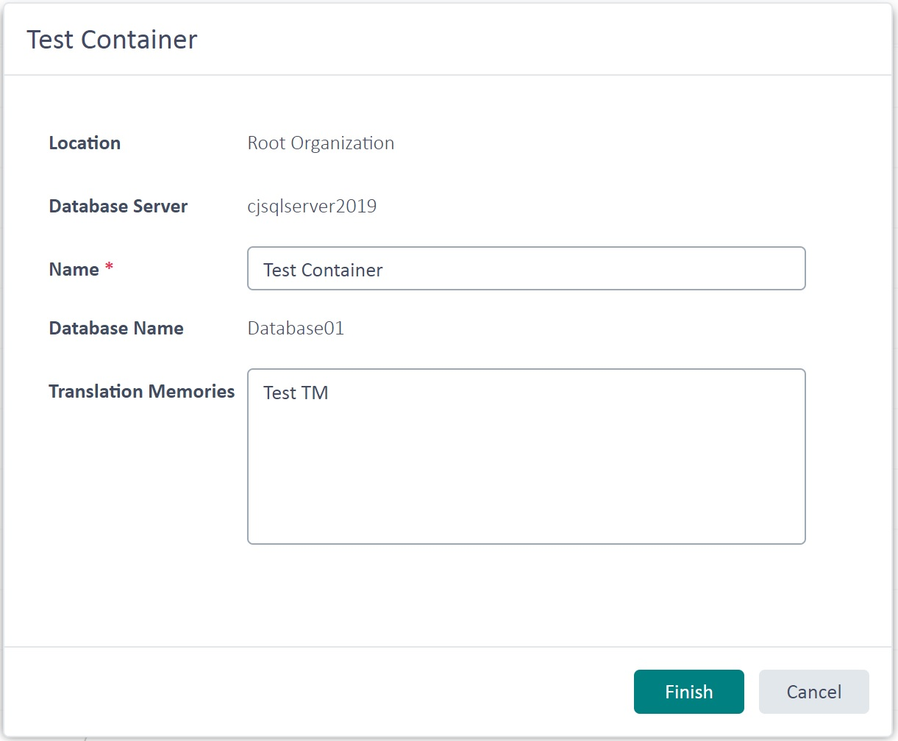

# Retrieving TM Containers

This chapter shows how to access TM containers programmatically. Containers are the physical databases that contain one or more TMs. Depending on how many TMs you use, you can store them in a single container database or split them across several container databases. Database size limits, such as the maximum size supported by Microsoft SQL Express versions, can influence that decision.

## Add a New Class

Start by adding a class called `ServerContainersProvider` to your project. Then implement a public function called `GetDBContainers` in the class, which takes a [TranslationProviderServer](../../api/translationmemory/Sdl.LanguagePlatform.TranslationMemoryApi.TranslationProviderServer.yml) object as a parameter. Call the function from the connector class as shown below:

# [C#](#tab/tabid-1)
```cs
var containersProvider = new ServerContainersProvider();
containersProvider.GetDBContainers(tmServer);
```
The `GetDBContainers` function loops through the containers associated with the TM Server object and displays their details in a message box:

# [C#](#tab/tabid-2)
```cs
public void GetDBContainers(TranslationProviderServer tmServer)
{
    string dbInfo = string.Empty;

    foreach (TranslationMemoryContainer container in tmServer.GetContainers(ContainerProperties.None))
    {
        dbInfo += "DB Name: " + container.DatabaseName + "\n";
        dbInfo += "Friendly name: " + container.Name + "\n";
        dbInfo += "DB Server: " + container.DatabaseServer + "\n";
        dbInfo += "Description: " + container.Description + "\n\n";
        dbInfo += "ParentOrganization: " + container.ParentResourceGroupPath + "\n\n";
    }

    MessageBox.Show(dbInfo);
}
```

The properties you can retrieve include the physical [DatabaseName](../../api/translationmemory/Sdl.LanguagePlatform.TranslationMemoryApi.TranslationMemoryContainer.yml#Sdl_LanguagePlatform_TranslationMemoryApi_TranslationMemoryContainer_DatabaseName) and the friendly [Name](../../api/translationmemory/Sdl.LanguagePlatform.TranslationMemoryApi.TranslationMemoryContainer.yml#Sdl_LanguagePlatform_TranslationMemoryApi_TranslationMemoryContainer_Name) assigned when the container database was created. You can also retrieve the optional container description and the name of the database server that stores the container.

The image below shows a container information box in the GroupShare Web UI:



## Putting It All Together

The complete class looks like this:

# [C#](#tab/tabid-3)
```cs
namespace SDK.LanguagePlatform.Samples.TmAutomation
{
    using System.Windows.Forms;
    using Sdl.LanguagePlatform.TranslationMemoryApi;

    public class ServerContainersProvider
    {
        public void GetDBContainers(TranslationProviderServer tmServer)
        {
            string dbInfo = string.Empty;

            foreach (TranslationMemoryContainer container in tmServer.GetContainers(ContainerProperties.None))
            {
                dbInfo += "DB Name: " + container.DatabaseName + "\n";
                dbInfo += "Friendly name: " + container.Name + "\n";
                dbInfo += "DB Server: " + container.DatabaseServer + "\n";
                dbInfo += "Description: " + container.Description + "\n\n";
                dbInfo += "ParentOrganization: " + container.ParentResourceGroupPath + "\n\n";
            }

            MessageBox.Show(dbInfo);
        }
    }
}
```


