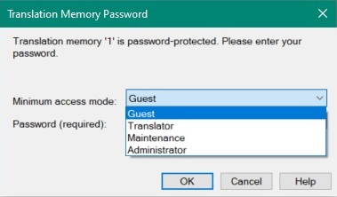

# Setting Translation Memory Access Rights

By default, anyone who has Var:ProductName can open and use a file-based TM. If you do not assign passwords, users have unrestricted access to the translation memory, including read/write and import/export operations. You can also protect a TM with passwords that restrict access to specific functionality.

## Access Levels

File-based TMs support four access levels:

* **Administrator**: Can perform any TM-related operation, including read/write, settings changes, and import/export.
* **Maintenance**: Can perform tasks such as global find and replace, but cannot change TM settings or use import/export.
* **Read/Write**: Typically used by translators who need to add or change TUs and search the TM.
* **Read-only**: Guest access that allows users to perform only TM lookups.

When a user opens a password-protected TM in Var:ProductName, the following prompt lets the user select an access level and enter the corresponding password:



## Setting Passwords Programmatically

Add a new class named `TmProtector` to your project. Then add a public method named `AssignPasswords()` that takes the TM file path as a parameter. Call it as shown below:

# [C#](#tab/tabid-1)
```cs
var tmProtector = new TmProtector();
tmProtector.AssignPasswords(_translationMemoryFilePath);
```
***


The API provides four methods for setting passwords, one for each access level. Pass each password as a string. When you set passwords, follow the required order. For example, set the read-only password only after you set the read/write password. The method can look like this:

# [C#](#tab/tabid-2)
```cs
public void AssignPasswords(string tmPath)
{
    var tm = new FileBasedTranslationMemory(tmPath);

    tm.SetAdministratorPassword("super");
    tm.SetMaintenancePassword("maintain");
    tm.SetReadWritePassword("translator");
    tm.SetReadOnlyPassword("guest");
    tm.Save();

    this.OpenProtectedTm(tmPath, "super");
}
```
***

The password-setting method calls a separate helper method to open the protected TM.

## Open a Password-Protected TM

Add the following method to open the TM with the administrator password. Pass the password as a string parameter and catch exceptions for cases such as an invalid password.

# [C#](#tab/tabid-3)
```cs
private void OpenProtectedTm(string tmPath, string password)
{
    try
    {
        var tm = new FileBasedTranslationMemory(tmPath, password);
    }
    catch (Exception ex)
    {
        MessageBox.Show(ex.Message);
    }
}
```
***

## Putting it All Together

The complete class should now look like this:

# [C#](#tab/tabid-4)
```cs
namespace SDK.LanguagePlatform.Samples.TmAutomation
{
    using System;
    using System.Windows.Forms;
    using Sdl.LanguagePlatform.TranslationMemoryApi;

    public class TmProtector
    {
        #region "assign"
        public void AssignPasswords(string tmPath)
        {
            var tm = new FileBasedTranslationMemory(tmPath);

            tm.SetAdministratorPassword("super");
            tm.SetMaintenancePassword("maintain");
            tm.SetReadWritePassword("translator");
            tm.SetReadOnlyPassword("guest");
            tm.Save();

            this.OpenProtectedTm(tmPath, "super");
        }
        #endregion

        #region "openTMwithPW"
        private void OpenProtectedTm(string tmPath, string password)
        {
            try
            {
                var tm = new FileBasedTranslationMemory(tmPath, password);
            }
            catch (Exception ex)
            {
                MessageBox.Show(ex.Message);
            }
        }
        #endregion
    }
}
```
***
