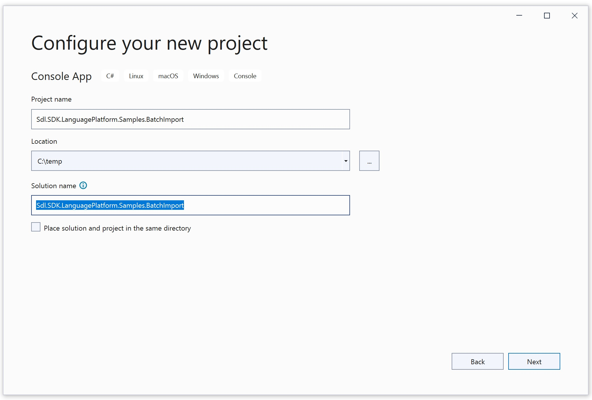
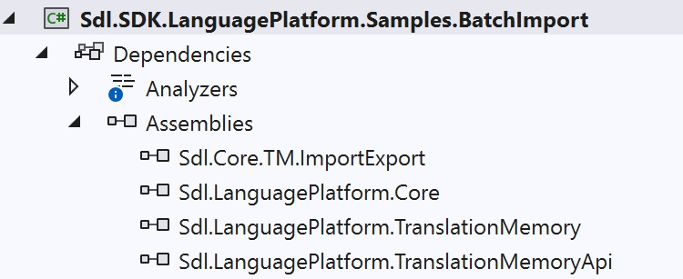

# Setting up the Project

In this chapter, you will create a simple command-line application that creates TMs and imports multiple `.tmx` files in Var:VisualStudioEdition by using C#.

Start by creating a new Console Application named `Sdl.SDK.LanguagePlatform.Samples.BatchImport`.

Add the following libraries as references:

- Sdl.Core.TM.ImportExport
- Sdl.LanguagePlatform.Core
- Sdl.LanguagePlatform.TranslationMemory
- Sdl.LanguagePlatform.TranslationMemoryApi

Use the following namespaces in the project classes:

- System.IO
- System.Xml
- System.Globalization
- Sdl.LanguagePlatform.Core.Tokenization
- Sdl.LanguagePlatform.TranslationMemory
- Sdl.LanguagePlatform.TranslationMemoryApi

> [!NOTE]
> 
> The XML API is required to retrieve information from the `.tmx` files, such as the source and target language locale.

## See Also

- [Looping through the Folder(s)](looping_through_the_folders.md)
- [Importing into the Master Translation Memories](importing_into_the_master_translation_memories.md)
- [Creating the Master Translation Memories](creating_the_master_translation_memories.md)
- [Creating the Log File](creating_a_log_file.md)
