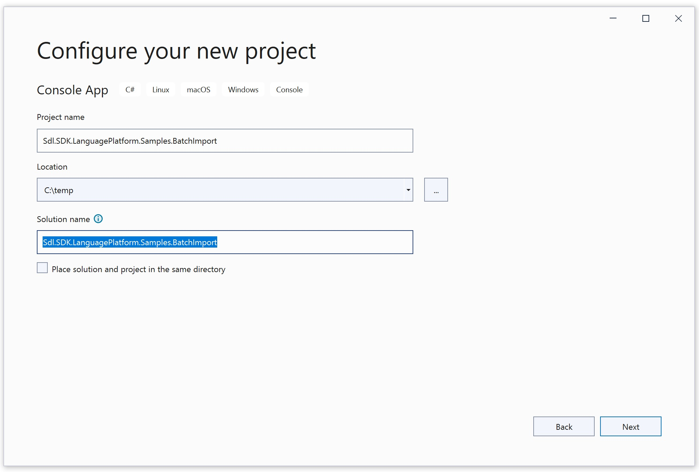

Setting up the Project
=====
In this chapter you will learn how to develop a simple command-line application for creating TMs and importing multiple *.tmx files in <var:VisualStudioEdition> using C#.

Start by creating a new Console Application called Sdl.**SDK.LanguagePlatform.Samples.BatchImport**.

The project requires the following libraries as references:

* Sdl.Core.TM.ImportExport
* Sdl.LanguagePlatform.Core
* Sdl.LanguagePlatform.TranslationMemory
* Sdl.LanguagePlatform.TranslationMemoryApi

The classes in your project should use the following namespaces:

* System.IO
* System.Xml
* System.Globalization
* Sdl.LanguagePlatform.Core.Tokenization
* Sdl.LanguagePlatform.TranslationMemory
* Sdl.LanguagePlatform.TranslationMemoryApi

> [!NOTE]
> 
> We require the XML API to retrieve information from the *.tmx files, i.e. the source and the target language locale.

See Also
-----------
[Looping through the Folder(s)](looping_through_the_folders.md)

[Importing into the Master Translation Memories](importing_into_the_master_translation_memories.md)

[Creating the Master Translation Memories](creating_the_master_translation_memories.md)

[Creating the Log File](creating_a_log_file.md)