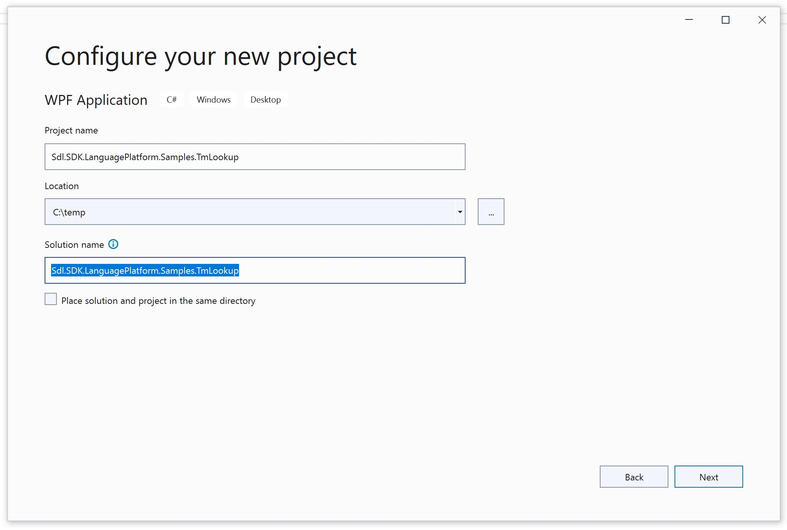
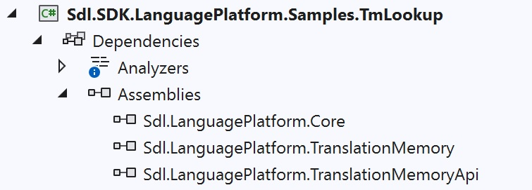

Setting up the Project
=====
On this page you will learn how to set up the project for designing our custom TM lookup application in C#.

Create a new Windows Forms application in Microsoft Visual Studio 2010 called **Sdl.SDK.LanguagePlatform.Samples.TmLookup**.

Then add the following references to your project:

* Sdl.Core.Api
* Sdl.LanguagePlatform.TranslationMemory
* Sdl.LanguagePlatform.TranslationMemoryApi
WindowsBase

>[!Note]
>At the time of writing of this version of the SDK it was required to set the build path folder to the directory that contains the Trados Studio 2017 debug build.