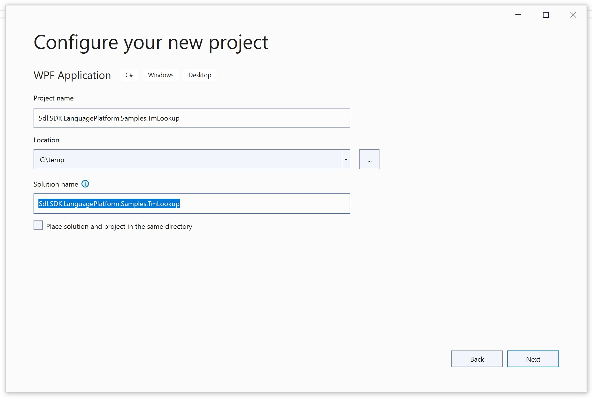
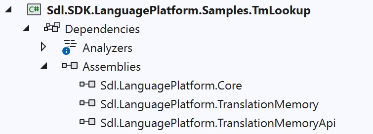

# Setting up the Project

This page explains how to set up the project for a custom TM lookup application in C#.

Create a new WPF application in Var:VisualStudioEdition named `Sdl.SDK.LanguagePlatform.Samples.TmLookup`.

Add the following references to your project:

- Sdl.LanguagePlatform.Core
- Sdl.LanguagePlatform.TranslationMemory
- Sdl.LanguagePlatform.TranslationMemoryApi

> [!NOTE]
> 
> At the time of writing, this SDK version required the build path folder to point to the directory that contains the Var:ProductName installation.

## See Also

- [Adding the Main GUI](adding_the_main_gui.md)
- [Adding the Server TM Selection Form](adding_the_server_tm_selection_form.md)
- [Adding the Search Settings Form](adding_the_search_settings_form.md)
- [Adding the Connector Class](adding_the_connector_class.md)
- [Implementing the Search Functionality](implementing_the_search_functionality.md)
