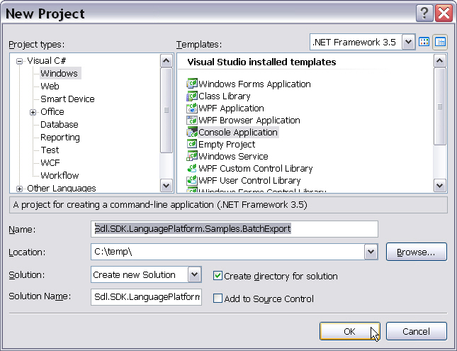
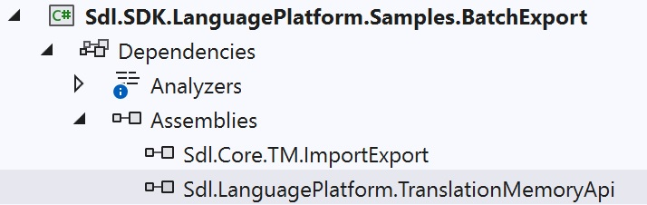

# Setting up the Project

In this chapter, you will create a simple command-line application that batch-exports multiple `.sdltm` files in Var:VisualStudioEdition by using C#.

Start by creating a new Console Application named `Sdl.SDK.LanguagePlatform.Samples.BatchExport`.

Add the following references to the project:

- Sdl.Core.TM.ImportExport
- Sdl.LanguagePlatform.TranslationMemoryApi

Use the following namespaces in the project classes:

- System.IO
- System.Globalization
- Sdl.LanguagePlatform.TranslationMemoryApi

## See Also

- [Looping through the Folder(s)](looping_through_the_folder.md)
- [Exporting to TMX](exporting_to_tmx.md)
